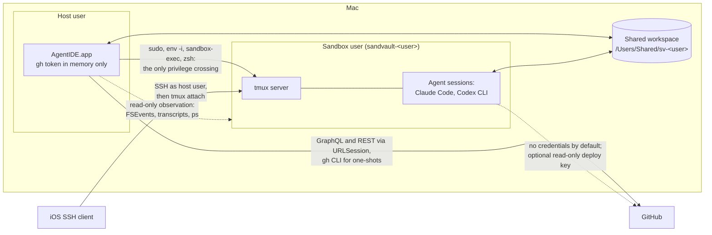
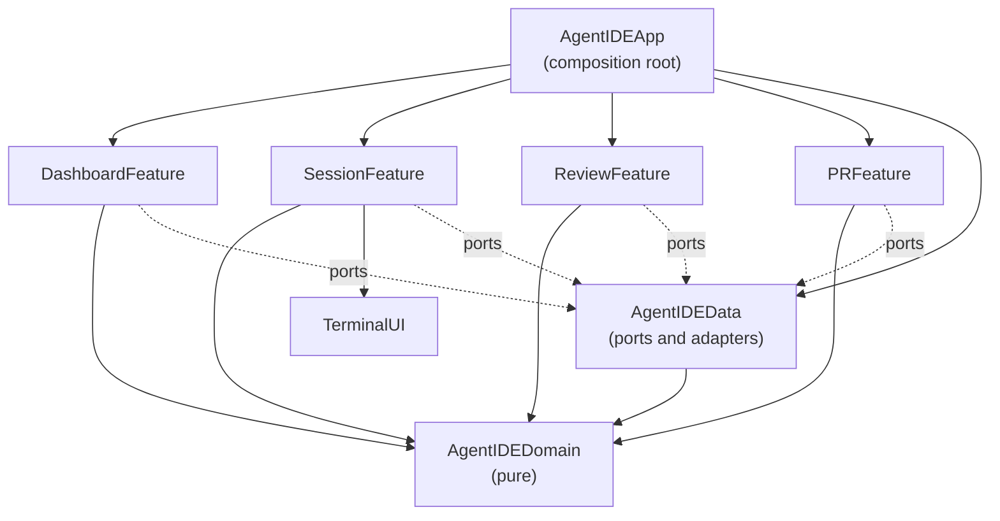

# AgentIDE Architecture

How AgentIDE works under the hood. [README.md](README.md) owns what it does
and why; this document owns the system design. The feature groups referenced
here (Start work, Watch and steer, Review, Ship, Tidy up and Resilience) are
the README's Features subsections.

## Overview

AgentIDE is a native SwiftUI macOS app (macOS 27 or later, Swift 6.4,
AGPL-3.0) that runs, steers and reviews sandboxed AI coding agents in
parallel git worktrees. It is developed readme-first: this document describes
the target system and slices of it land in the order given in the README's
Status section.

The architectural thesis, referenced throughout: **AgentIDE holds no
session-critical state**. Agents run as the sandvault sandbox user inside a
tmux server that AgentIDE introduces. The app derives its entire view of the
world from tmux, `ps`, git, agent transcripts and GitHub, and persists only
its own metadata in SQLite. Killing, crashing or updating the app therefore
loses nothing (Resilience).

## System context



Boundary facts the design relies on:

- The sandbox may write only to the shared workspace, its own home, `/tmp`,
  `/var/folders` and `/dev`. The host user's home is unreadable from inside
  and keychains are denied.
- The shared workspace is writable by both users through inheriting ACLs; it
  is the data plane for code, prompts and events.
- The sandbox has no GitHub credentials: `gh` is unauthenticated there, agent
  settings deny `git push` and the only remote access is an optional
  per-repository read-only deploy key. Pushing and everything credentialled
  happens host-side.
- Credentials never cross the boundary in either direction.

## Guiding principles

1. **P1: Derive, don't own.** tmux, git, `ps`, transcripts and GitHub are the
   sources of truth. The app reconciles from them on every launch.
2. **P2: Unprivileged glue.** The only privilege crossing is the sudoers path
   sandvault already configured. AgentIDE never widens it.
3. **P3: Compiler-enforced boundaries.** Clean architecture mapped onto SPM
   targets; an illegal dependency is a build failure, not a review comment.
4. **P4: Approachable strict concurrency.** MainActor by default in UI
   targets, nonisolated core, `@concurrent` for heavy leaf work, structured
   tasks everywhere.
5. **P5: Agents are pluggable.** One `AgentRunner` seam; agent-specific logic
   lives only in adapters. Sessions created elsewhere are still shown.
6. **P6: Native for state, shell for one-shots.** Anything polled or rendered
   uses native URLSession clients; fire-and-forget conveniences shell out.
7. **P7: Agent output is hostile input.** Every host-side touch of
   guest-writable data is hardened accordingly.

## Process model and lifecycles

Two independent lifecycles:

- **The app process** is ephemeral. It can quit, crash or update at any time
  and holds nothing that cannot be rebuilt (P1).
- **Sessions** are tmux sessions owned by the sandbox user. They survive app
  restarts, app updates and host-user logout, but not reboot. Reboot recovery
  is worktree plus transcript plus resume (see State and persistence).

### Launching into the sandbox

sandvault's sudoers rules let the host user run exactly `/bin/zsh`,
`/usr/bin/env` and `/usr/bin/true` as the sandbox user without a password, so
every sandbox interaction is built on one launch shape, assembled in exactly
one place (`SandvaultLauncher`):

```bash
sudo --login --set-home --user="sandvault-${USER}" /usr/bin/env -i \
  HOME="/Users/sandvault-${USER}" USER="sandvault-${USER}" SHELL=/bin/zsh \
  TERM=xterm-256color COLORTERM=truecolor \
  INITIAL_DIR="${WORKTREE}" SHARED_WORKSPACE="/Users/Shared/sv-${USER}" \
  SV_SESSION_ID="$(uuidgen)" AGENTIDE_SESSION="${SESSION_NAME}" \
  LANG=en_US.UTF-8 \
  PATH=/opt/homebrew/bin:/usr/local/bin:/usr/bin:/bin:/usr/sbin:/sbin \
  GIT_CONFIG_COUNT=1 GIT_CONFIG_KEY_0=safe.directory \
  GIT_CONFIG_VALUE_0="/Users/Shared/sv-${USER}/*" \
  /usr/bin/sandbox-exec -f "/var/sandvault/sandbox-sandvault-${USER}.sb" \
  /bin/zsh -c "${PAYLOAD}"
```

This is byte-compatible with how sandvault launches sessions; AgentIDE only
substitutes the payload. Notable parts: `env -i` gives a clean environment,
the `GIT_CONFIG_*` variables inject `safe.directory` (shared repositories are
owned by the other user) and `sandbox-exec` applies sandvault's generated
profile to everything downstream, including the tmux server.

### tmux

tmux is installed by the Brewfile and introduced by AgentIDE; sandvault does
not use it itself. There is no daemon and no launchd unit: the tmux server
starts lazily inside the sandbox the first time a session is created, with a
payload of:

```bash
export TMUX_TMPDIR=~/.agentide/tmux
mkdir -p "${TMUX_TMPDIR}" && chmod 700 "${TMUX_TMPDIR}"
printf 'set -g remain-on-exit on\n...' > "${TMUX_TMPDIR}/agentide.conf"
cd ~ && ~/configure
source ~/.zshenv && source ~/.zprofile && source ~/.zshrc
exec tmux -f "${TMUX_TMPDIR}/agentide.conf" \
  new-session -A -d -s "${SESSION_NAME}" "${AGENT_COMMAND}"
```

- `TMUX_TMPDIR` is pinned to a fixed directory in the sandbox user's home,
  so every invocation finds the same server socket and nothing lives in
  world-writable `/tmp`. Development builds and test runners (anything
  but the installed /Applications/AgentIDE.app) use
  `~/.agentide/tmux-dev` and a `-dev` host shell name prefix instead,
  and tests use throwaway per-run sockets, so building, testing and
  development can never list or kill the installed app's sessions.
  The config is written by that same payload: a
  file written by the host user would be unreadable across the sudo
  boundary. Its newlines travel as printf escapes, because `sudo --login`
  rebuilds the command line and collapses literal newlines.
- The config sets `remain-on-exit on`, so a finished agent leaves a dead
  pane whose exit status and scrollback remain inspectable, `mouse on`,
  so the wheel scrolls tmux's history, and a 50000-line history limit.
- Session names follow `agentide--<repo>--<branch-slug>--<agent>`. Slugs
  collapse `-` runs so the `--` separator stays unambiguous, collisions
  append `-2` to the branch component and tmux's forbidden `.` and `:` are
  replaced. Names are a human-readable fallback for `tmux ls` over SSH; the
  authoritative record is the app's metadata store. Anything not matching
  the full shape is treated as foreign.

### Terminals

Two visually unmistakable flavours, both rendered by SwiftTerm on a local
PTY:

- **Sandbox terminal**: the launch shape with payload
  `exec tmux attach-session -t <name>`. The attaching client runs inside the
  sandbox too; tmux sockets are owner-only, so no attach path can skip sudo.
  Closing the view detaches and never kills the session.
- **Host terminal** (Review): a host tmux session per worktree
  (`new-session -A`, so attach-or-create) as the host user, no sudo, no
  sandbox, full `gh` credentials. Named
  `agentide-shell--<repo>--<branch-slug>`, so `tmux ls` on the host reads
  like the sidebar. tmux starts the user's default login
  shell, and because the server outlives its clients the shell survives
  pane switches and app restarts exactly like agent sessions do. In both,
  scrollback is tmux's: the alternate screen leaves the outer terminal
  nothing to scroll, so the mouse wheel scrolls tmux history (`mouse on`)
  rather than a native scroller; that is the price of sessions that
  outlive the app. Both
  terminals share one theme (black on white in light mode, white on
  black in dark); what separates them visually is position, the agent
  pane on the left and the shell in the utility pane.

Remote access is SSH to the Mac as the host user from an iOS client, then
`script/attach <session>` (which also works from inside sandbox sessions).
Remote Login must be enabled in macOS settings first. An SSH session is
isolated by user permissions rather than sandbox-exec whichever account it
targets, but attaching connects it to the sandboxed tmux server, so agent
processes stay confined either way.

### Reconciliation and notifications

On every launch the app rebuilds state, in order, from: `tmux ls` (through
the launch shape, tolerating "no server running"), a `ps` scan for session
ids in process arguments, `git worktree list` across tracked repositories,
transcript directory scans and finally its own metadata store. Unmatched
sessions surface as foreign rather than being hidden.

There is no separate notification daemon in v1. The app switches to accessory
activation policy when its last window closes, staying resident in the menu
bar with file watchers and `UNUserNotificationCenter` delivery alive. Because
the event spool is durable files, a fully quit app delays notifications
rather than losing them. A login-item helper via `SMAppService` is the
documented later option if delayed notifications prove annoying.

## Package architecture

One root `Package.swift` defines every library target; a thin app shell in
`App/` is generated into an Xcode project by XcodeGen (`project.yml` is
committed, the `.xcodeproj` is gitignored).



- **AgentIDEDomain**: entities (`Repository`, `Worktree`, `AgentSession`,
  `AgentKind`, `SessionEvent`, `PullRequest`, `CheckRun`, `ReviewThread`,
  `DiffFile`, `DiffHunk` and `DiffLine`) and pure logic (`DiffParser`,
  `PatchBuilder`, `SessionName` and transcript event decoding). Foundation
  value types (Date, URL and Data) are allowed; process, file, network and
  database APIs are banned.
- **AgentIDEData**: protocol ports with adapter implementations: `GitClient`,
  `GitHubClient` (`gh` shell-outs today, native URLSession GraphQL for hot
  paths later), `SandvaultLauncher`, `TmuxClient`, `TranscriptReader`,
  `EventSpool`, `MetadataStore` (a JSON file today, GRDB when metadata
  outgrows it), `ProcessRunner` (Foundation `Process` today, Subprocess
  later) and `AgentRunner` with `ClaudeCodeRunner` and `CodexRunner`. One
  module, split only if boundary violations appear.
- **Feature targets** (`DashboardFeature`, `SessionFeature`, `ReviewFeature`
  and `PRFeature`): SwiftUI views and `@Observable` view models, MainActor by
  default, given ports via injection. `SessionFeature` owns the WKWebView
  preview; `ReviewFeature` owns the diff and editor surfaces (SwiftUI text
  and an attributed NSTextView today, STTextView as the review slice
  deepens).
- **TerminalUI**: shared UI components, not a feature: the SwiftTerm
  wrapper (command specification in, PTY view out), the AppKit-backed
  tooltips and the syntax highlighting engine. Highlighting parses with
  tree-sitter grammars and falls back to a pure-Swift line tokenizer in
  the Domain for text without a loaded grammar, such as fragmentary diff
  lines the parser cannot classify.
- **AgentIDEApp**: builds adapters, injects ports, owns navigation and the
  activation-policy switch. No logic.

Third-party imports are confined (P3):

| Dependency | Only importable in |
|---|---|
| GRDB, Subprocess | AgentIDEData |
| SwiftTerm | TerminalUI |
| STTextView, SwiftTreeSitter and grammars | ReviewFeature |
| Sparkle | AgentIDEApp |
| WebKit | SessionFeature |

### The AgentRunner seam

`AgentRunner` (P5) covers exactly: building the launch payload for a
worktree, prompt file and optional resume token; locating and decoding the
agent's transcript into `SessionEvent` values; detecting completion and
stalls (capability flags `supportsHooks` and `supportsResume` select
hook-based or polling strategies); building the resume command; and
extracting the final message for review. Each runner also declares its
model listing command: at startup the app asks the installed CLI what
models it offers and falls back to a curated list when the command
fails, so the pickers track the binaries rather than hardcoded names. `ClaudeCodeRunner` uses hooks and
cwd-keyed JSONL transcripts; `CodexRunner` proves the seam with
directory-based transcripts and silence-based detection. Discovering foreign
sessions is reconciliation logic in `AgentIDEData`, deliberately outside the
protocol.

## Concurrency model

| Target | Default isolation | Notes |
|---|---|---|
| AgentIDEDomain | nonisolated | Sendable value types by construction |
| AgentIDEData | nonisolated | `@concurrent` on parsing and subprocess work |
| Features, TerminalUI | MainActor | `@Observable` MainActor view models |
| AgentIDEApp | MainActor | wiring only |

All targets build with `SWIFT_DEFAULT_ACTOR_ISOLATION` set per the table,
`SWIFT_APPROACHABLE_CONCURRENCY=YES` and the Swift 6 language mode.

The nuance that matters most: under approachable concurrency, `nonisolated
async` functions run on the caller's actor. Quick awaited I/O (URLSession and
GRDB's async API) therefore stays plain `nonisolated async`; only CPU-bound
or blocking leaf work (JSONL decoding, diff parsing and subprocess output
pumping) is marked `@concurrent` to move off the caller.

Events flow as `AsyncStream`s (file watches, transcript tails, poll ticks and
GitHub results) consumed by view models via `.task`, so cancellation follows
view lifetime. Fan-out uses task groups. Unstructured `Task {}` appears only
at enumerated app-lifecycle roots. Exactly one actor is sanctioned:
`ProcessRegistry` in `AgentIDEData`, owning live PTY and child-process
handles; any further actor needs a written justification here. `@unchecked
Sendable` and `nonisolated(unsafe)` are banned.

## Key data flows

### Create a worktree and launch an agent (Start work)

1. Input: a typed prompt, or an issue or pull request number with optional
   extra context, plus a target repository, agent, model and effort. An
   issue's title and body become the prompt. A pull request instead gets a
   detached worktree that `gh pr checkout` (host-side) turns into the pull
   request's own branch, so pushes and pulls track it directly.
2. The branch name comes from a per-repository template, default
   `agent/<slug>`.
3. Host-side `GitClient` fetches, then runs `git worktree add` under
   `/Users/Shared/sv-<user>/worktrees/<uuid>/<branch>`. This layout is kept
   byte-compatible with what existing tooling already creates: the
   repository's existing `<uuid>` directory is discovered via
   `git worktree list` and reused; a new one is minted only when the
   repository has none. The uuid map is cached in the metadata store and
   always re-derivable.
4. A human-friendly symlink
   `/Users/Shared/sv-<user>/agentide/worktrees/<repo>/<branch>` points at the
   canonical path. Sessions always launch from the resolved real path because
   agent transcripts are keyed by cwd; UUIDs appear nowhere else in
   user-visible naming.
5. The prompt is written to
   `/Users/Shared/sv-<user>/agentide/prompts/<session>.md`, readable in the
   sandbox through the workspace ACLs.
6. Deploy keys: none by default; the agent works offline against the local
   clone. A per-repository opt-in provisions a read-only key through
   sandvault's `sv-clone -k` mechanism. Write keys are never provisioned;
   pushing is host-side.
7. `AgentRunner` builds the agent command, with any per-session extra
   arguments appended verbatim (sandvault's wrappers add the agent's
   permission-skipping flag inside the sandbox), and the session launches
   through the tmux payload above.
8. The prompt is delivered as terminal input, not as a command argument:
   tmux `load-buffer` then `paste-buffer` types the prompt file into the
   agent after launch. The pane's `INITIAL_DIR` is pinned to the worktree so
   the sandbox's zshenv cannot redirect the agent elsewhere.
9. The session is recorded in the metadata store, with the agent-native
   resume id captured as soon as the transcript appears.

### Event pipeline (Watch and steer)

1. AgentIDE manages the Claude Code settings template at
   `/Users/Shared/sv-<user>/user/.claude/settings.json`, which sandvault
   rsyncs into the sandbox home at each session start. AgentIDE adds its hook
   entries alongside any existing notifier hooks (removing others only when
   their app is retired), covering UserPromptSubmit, Stop, StopFailure,
   PostToolUse, PostToolUseFailure, PermissionRequest, SessionStart and
   SessionEnd, each in the defensive `[ -x ... ] && ... || true` shape.
2. The hook command is a small script shipped through the same template
   directory. It appends one JSON line to
   `/Users/Shared/sv-<user>/agentide/events/<session>.jsonl`, keyed by
   `AGENTIDE_SESSION` with `SV_SESSION_ID` as fallback so sessions launched
   outside AgentIDE feed the dashboard too, and it no-ops when neither is
   set. Appends are single-writer and small; the reader tolerates a torn
   last line.
3. Host-side, `EventSpool` watches the events directory with FSEvents and
   tails each file from its stored offset, emitting `SessionEvent` values
   that drive unread state and notifications (on Stop and
   PermissionRequest). A worktree is unread when its spool events, its
   tmux session's activity clock or its transcripts are newer than its
   per-worktree seen time; viewing it records that time, and a context
   menu marks it unread again until next viewed.
4. Agents without hooks, and foreign sessions, fall back to tmux dead-pane
   detection for completion and a transcript-mtime timeout on a 30 second
   tick for stalls. `tmux monitor-silence` is a documented later refinement.
5. If the app is fully quit, events accumulate in the spool and notifications
   arrive on next launch.

### Review and per-line rejection (Review)

1. `GitClient` produces diffs (`git diff`, `git diff --cached` and ranges)
   with rename detection; the pure `DiffParser` turns them into file, hunk
   and line values. The scope toggles between the last commit (or
   uncommitted changes when there are any) and the whole branch against
   its merge base: the open pull request's base branch when one exists,
   otherwise the default branch. Per-line rejection and message
   amendment apply only to the last commit scope.
2. Generated files are hidden by default via
   `git check-attr linguist-generated` plus heuristics (lockfiles and
   per-repository generated globs), one click to reveal.
3. Rendering highlights with tree-sitter grammars (Swift, Ruby and Bash
   today; JavaScript, TypeScript, Markdown, JSON and YAML as the review
   slice deepens, alongside the move to STTextView), with line numbers
   and visible whitespace in both the diff and the editor.
4. Rejecting selected lines builds a minimal reverse patch with
   `PatchBuilder` (pure, with recalculated hunk offsets), validates it with
   `git apply --check`, applies it with `git apply -R --index` so index and
   worktree stay consistent, then runs `git commit --amend` (with `-m` when
   the message was edited too). Failed validation degrades to whole-hunk
   rejection. Uncommitted changes skip the amend.
5. Manual edits happen in the same editor surface; saves trigger a diff
   refresh via file watches.
6. The pre-amend commit remains in the reflog and is surfaced as "revert last
   rejection".

### Pull request dashboard (Ship)

1. The token comes from a one-shot `gh auth token`, held in memory only and
   refreshed on 401 (P6).
2. Each worktree branch is polled with its own narrow query for its open
   pull request's mergeable state, review decision and check rollup;
   repository-wide queries timed out GitHub's gateway on very large
   repositories.
3. Poll cadence is tiered by attention and cached per branch: the selected
   worktree refreshes most often, then its repository's other worktrees,
   then other expanded repositories; repositories collapsed in the sidebar
   poll rarely. Selecting a worktree jumps its branch to the front, and a
   failed poll keeps the cached answer.
4. Native versus shell: polling, dashboards and review threads are native
   URLSession; `gh pr create` (templates and stacking), `gh pr merge --auto`
   and other one-shots shell out as the host user.
5. One-click remediation composes existing flows: fetch failing check logs
   and review comments natively, write them into a prompt file and launch a
   fix agent in the same worktree.

### Cleanup (Tidy up)

1. A merged pull request offers cleanup; the sidebar offers the same
   deletion from a worktree's context menu at any time.
2. Deletion records the session's agent-native resume id, kills the tmux
   session, then runs `git worktree remove`, `git worktree prune` and
   `git branch -D` and removes the friendly symlink. Nothing is archived:
   the branch and any uncommitted files are gone.
3. Canonical transcripts in the sandbox home are never deleted and the
   metadata store keeps the session names it recorded per worktree path,
   so every conversation stays attributed to its repository.
4. The repository page, the main checkout's permanent sidebar entry, lists
   every conversation attributable to the repository, from live and
   deleted worktrees alike, and resumes any of them into a fresh worktree.

### Close and reopen a session

Closing a session kills only the tmux session. The worktree, transcripts and
metadata (including the resume id) remain. Reopening builds the agent's
resume command (`claude --resume <id>`, or the Codex equivalent) through the
normal launch shape in the same canonical cwd, restoring the full prior
conversation. Deleting a worktree composes with this: its conversations stay
listed on the repository page and resume into fresh worktrees.

Beyond the one live session, every earlier conversation in a worktree is
discovered by listing its transcript directory, whoever created it, and
shown as an inactive session tab with a readable log: Markdown rendered,
code fences highlighted and tool steps showing the actual command run.
An inactive session resumes either in place or into a fresh worktree and
branch; in the latter case the transcript is first copied into the new
working directory's transcript directory, because agents look
conversations up by cwd. Only agents whose transcripts are scoped per
working directory participate; Codex's flat session directory cannot be
attributed to one worktree, so its history surfaces through its own
resume flow instead.

Every repository also lists its main checkout as a permanent entry, so a
repository with no worktrees still shows. Selecting it opens the
repository page: every conversation attributable to the repository,
across live and deleted worktrees, newest first, with the selected log
below and a resume button that continues it in a fresh worktree. The
session names recorded at launch attribute each orphaned transcript
directory to its repository, and every transcript directory whose
encoded name extends one of the repository's `worktrees/<uuid>`
containers is scanned too, so conversations from worktrees created and
deleted by other tooling still appear.

## State and persistence

| Fact | Source of truth | The app's role |
|---|---|---|
| Session liveness, scrollback, exit codes | tmux | observe via the launch shape |
| Code, branches, diffs, worktrees | git in the shared workspace | operate host-side, hardened |
| Conversation history, final message | agent transcripts | read-only tail |
| Pull request, CI and review state | GitHub | poll, cache in memory |
| Agent process existence | `ps` | scan |
| Earlier conversations per worktree | agent transcript directories | list and parse read-only |
| Unread markers, spool offsets, prompt history, per-repository settings, repository-to-uuid map, per-worktree session names and resume ids, window state, last sidebar snapshot for instant launch | metadata store (GRDB) | sole owner |

The metadata store lives at
`~/Library/Application Support/AgentIDE/agentide.sqlite` (WAL mode, migrated
with `DatabaseMigrator`), deliberately outside the shared workspace so agents
can neither read nor corrupt it. Deleting it loses only unread state, prompt
history, settings and the attribution of conversations to worktrees that no
longer exist; everything else re-derives from the system (P1).

## Security model

Trust boundaries, numbered:

1. **Host to sandbox**: the sudoers surface is exactly `/bin/zsh`,
   `/usr/bin/env` and `/usr/bin/true` as the sandbox user, plus root-level
   whole-user teardown (`launchctl bootout` of the sandbox uid and `pkill -9`
   of the sandbox user). AgentIDE uses the zsh path for everything; the
   teardown pair backs a confirmed "Emergency stop all agents" action only.
2. **Sandbox to network**: no GitHub credentials, `git push` denied by agent
   settings and optional read-only per-repository deploy keys as the only
   remote path.
3. **App to GitHub**: token from `gh auth token`, in memory only, never on
   disk and never in any launch environment.
4. **Host to guest-written data** (P7): every host git invocation goes
   through `GitClient`, which always prepends
   `-c core.fsmonitor= -c core.sshCommand= -c core.hooksPath=/dev/null -c
   core.pager=cat -c protocol.ext.allow=never` so a compromised repository
   cannot execute code as the host user. Raw `git` outside `GitClient` is
   banned.
5. **Transcript exposure**: sandvault's session export applies inheriting
   group-read ACLs to agent transcript directories; AgentIDE relies on read
   access and never widens it.

The embedded WKWebView browser uses the shared persistent data store,
so a GitHub login survives tab switches and restarts. Agent-authored
pages are untrusted content: the web view holds no app state and no
GitHub API token, only whatever the user logs into it.

Never-do list:

- Never modify sudoers or the sandbox profile.
- Never run credentialled commands inside the sandbox.
- Never write secrets or app-critical state into the shared workspace.
- Never execute agent-suggested commands as the host user without an explicit
  user action.
- Never bypass `GitClient` hardening.
- Never widen transcript ACLs beyond read.

## Dependencies and toolchain

Dependency admission rule: more than 1,000 GitHub stars and a stable release
in 2026, or an explicitly recorded exception for packages owned by an
official language or project organisation.

| Package | Role | Note |
|---|---|---|
| SwiftTerm | terminal emulator views | |
| GRDB | metadata store | planned; a JSON file serves today |
| STTextView | diff and editor text surface | TextKit 2; planned |
| swift-tree-sitter | syntax highlighting runtime | official-organisation exception |
| tree-sitter-ruby, tree-sitter-bash | grammars | official organisation; pinned to the latest ABI 14 releases the runtime accepts |
| tree-sitter-swift (alex-pinkus) | Swift grammar | the grammar the tree-sitter ecosystem standardises on; no official-organisation build exists |
| swift-subprocess | process spawning | official-organisation exception (swiftlang); planned, Foundation `Process` serves today |
| Sparkle | app updates | later slice |

System frameworks (WebKit, UserNotifications and FSEvents) and runtime tools
(tmux, installed by Homebrew and never linked) sit outside the table.
Versions are pinned by `Package.resolved`; the two exceptions are pinned
exactly.

Toolchain: Xcode 27, the macOS 27 SDK and Swift 6.4. XcodeGen generates the
app project from `project.yml`; the `.xcodeproj` is gitignored. SwiftLint and
SwiftFormat run with every rule enabled; disagreements are disabled per line
with a reason, and configuration excludes only rules that conflict with other
enabled rules or tools, each with a recorded reason. SwiftLint requires the
full Xcode toolchain selected via xcode-select; CommandLineTools alone cannot
load SourceKit.

Scripts follow the `script/` convention: `bootstrap` (Homebrew dependencies,
then XcodeGen project generation), `build` (the app via xcodebuild),
`test` (unit and integration tests via `swift test`), `analyze` (static
analysis), `style [--fix]` (all linters) and `attach <session>` (attach the
current terminal to a sandboxed tmux session). Agent-driven builds inside the
sandbox cannot nest macOS sandboxes, so build scripts gate on `SV_SESSION_ID`
and pass `SWIFTPM_DISABLE_SANDBOX=1`, `SWIFT_BUILD_USE_SANDBOX=0` and the
`-IDEPackageSupportDisable*Sandbox` xcodebuild flags, letting agents build
AgentIDE itself.

The guardrails are layered so a mistake is caught as early as possible:
Swift 6 strict concurrency and the type system at compile time; SwiftLint and
SwiftFormat with every rule enabled at `script/style`; SwiftLint's analyzer
(`unused_import`) plus periphery for dead code at `script/analyze`; and a
test suite split into two tiers. Unit tests cover Domain's pure functions
(`DiffParser`, `PatchBuilder`, `SessionName`) and Data decoders over
fixtures. Integration tests exercise the real adapters end to end against
real `git` repositories, a real `tmux` server on a private socket and
temporary workspaces, because the bugs that reach manual testing live in the
seams: worktree listing under path canonicalisation, reverse-patch
application, tmux pane parsing and directory pinning, prompt delivery, and
deletion keeping every conversation attributed to its repository. View rendering is checked with headless
`ImageRenderer` snapshots. periphery drives its own build so it runs on the
host and in CI only, not inside the sandbox.

CI ("GitHub Actions CI" in `.github/workflows/tests.yml`) runs the style
checks on every push and pull request. The build, test and analyze job runs
on GitHub's Xcode 27 public-preview image (`runs-on: xcode-27`, arm64 only)
and asserts Xcode 27 is present, failing rather than skipping, so a green run
always means the app built, the tests passed and static analysis was
clean (R2).

## Risks and open questions

| # | Risk | Mitigation |
|---|---|---|
| R1 | tmux is validated under sandbox-exec on this machine: daemonised server, /tmp socket, separate clients, capture, dead panes with exit statuses, sudo-launched bring-up shared with in-sandbox clients and interactive attach and detach via `script/attach`; only long-run stability remains unobserved | watch stability through the core loop slice; fallback ladder is screen then a minimal PTY-holder process; app-owned PTYs are not acceptable because they forfeit Resilience |
| R2 | the `xcode-27` runner image is a public preview that may change or lag Xcode 27 betas | the build and test job asserts Xcode 27 and fails loudly rather than skipping; a self-hosted runner remains the fallback |
| R3 | per-line selection and diff gutters on STTextView are non-trivial | prototype early in the Review slice; interim read-only diff |
| R4 | agent transcript formats drift across releases | tolerant decoders, per-release fixtures and adapter capability flags |
| R5 | sandvault updates could change paths, profile or sudoers | pin the sandvault version; `SandvaultLauncher` is the single construction point; bootstrap asserts the expected shape |
| R6 | event spool append atomicity | small single-writer lines; readers tolerate a torn tail |
| R7 | the worktree uuid layout is a compatibility choice, not ours | keep byte-compatibility while other tooling uses it; the friendly symlinks isolate everything user-facing; own the layout later |
| R8 | resume ids depend on transcript internals | record defensively; fall back to a fresh session in the same worktree pointing at the old transcript |

Open questions: the iOS SSH account model (host user with a wrapper versus
SSH directly to the sandbox user), the default branch template,
notification preference granularity and how deep stacked pull request
support goes in v1.
