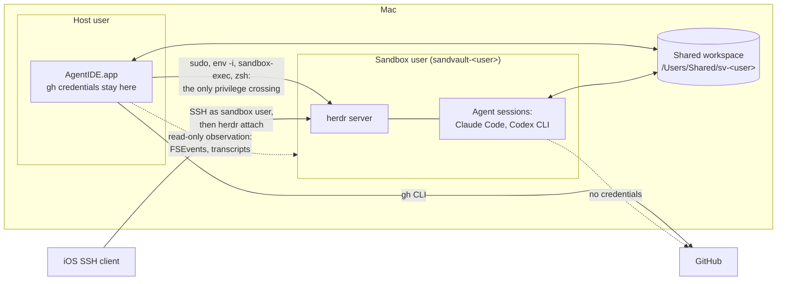
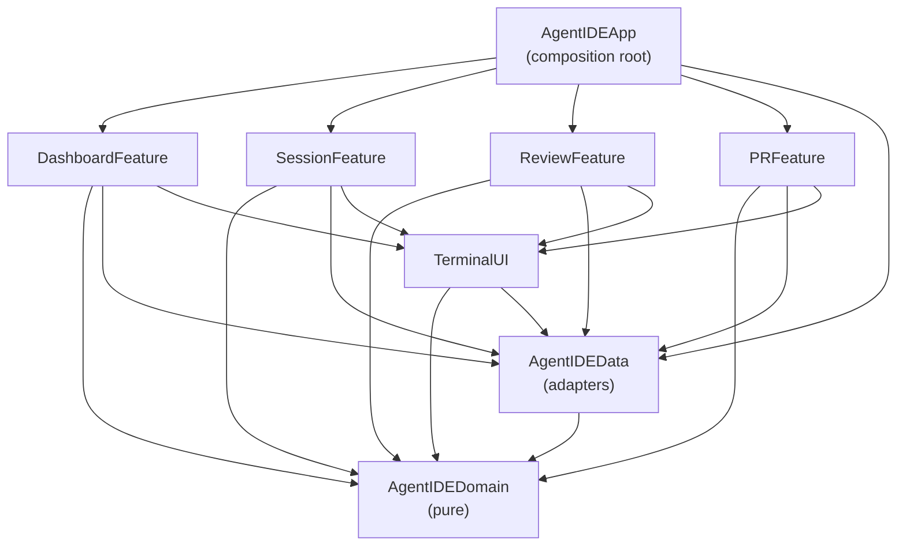

# AgentIDE Architecture

How AgentIDE works under the hood. [README.md](README.md) owns what it
does and why; this document owns the design: what exists, the rules that
keep it working and what is planned. It is written for whoever changes
the code next, human or agent, so each rule says what breaks without it.
Platform quirks (macOS beta, SwiftUI, SwiftFormat, the sandbox toolchain)
live in [AGENTS.md](AGENTS.md); this document does not repeat them.

## Overview

AgentIDE is a native SwiftUI macOS app (macOS 27 or later, Swift 6.4,
AGPL-3.0) that runs, steers and reviews sandboxed AI coding agents in
parallel git worktrees. Its user supervises rather than types, so the
window is arranged around the agent loop, not around an editor.

The architectural thesis, referenced throughout: **AgentIDE holds no
session-critical state**. Agents run as the sandvault sandbox user inside
a [herdr](https://herdr.dev) server that AgentIDE introduces. The app
derives its entire view of the world from herdr, git, agent transcripts
and GitHub, and persists only its own metadata. Killing, crashing or
updating the app loses nothing.

## System context



Boundary facts the design relies on:

- The sandbox may write only to the shared workspace, its own home,
  `/tmp`, `/var/folders` and `/dev`. The host user's home is unreadable
  from inside and keychains are denied.
- The shared workspace is writable by both users through inheriting
  ACLs; it is the data plane for code, prompts and events.
- The sandbox has no GitHub credentials: `gh` is unauthenticated there
  and agent settings deny `git push`. Pushing and everything
  credentialled happens host-side.
- Credentials never cross the boundary in either direction.

## Guiding principles

1. **P1: Derive, don't own.** herdr, git, transcripts and GitHub are the
   sources of truth. The app reconciles from them on every launch.
2. **P2: Unprivileged glue.** The only privilege crossing is the sudoers
   path sandvault already configured. AgentIDE never widens it.
3. **P3: Compiler-enforced boundaries.** Clean architecture mapped onto
   SPM targets; an illegal dependency is a build failure.
4. **P4: Approachable strict concurrency.** MainActor by default in UI
   targets, nonisolated core, `@concurrent` for heavy leaf work,
   structured tasks everywhere.
5. **P5: Agents are pluggable.** One `AgentRunner` seam; agent-specific
   logic lives only in adapters.
6. **P6: One client per external system.** git speaks through
   `GitClient`, GitHub through `gh` in `GitHubClient` and herdr through
   `HerdrClient`; nothing else shells out to them.
7. **P7: Agent output is hostile input.** Every host-side touch of
   guest-writable data is hardened accordingly.

## Process model

Two independent lifecycles: the app process is ephemeral and holds
nothing it cannot rebuild (P1); sessions are herdr workspaces owned by
the sandbox user's herdr server, surviving app restarts, updates and
host logout but not reboot. Reboot recovery is worktree plus transcript
plus resume.

### Launching into the sandbox

sandvault's sudoers rules let the host user run exactly `/bin/zsh`,
`/usr/bin/env` and `/usr/bin/true` as the sandbox user without a
password, so every sandbox interaction uses one launch shape, assembled
in exactly one place (`SandvaultLauncher`):

```bash
sudo --login --set-home --user="sandvault-${USER}" /usr/bin/env -i \
  HOME="/Users/sandvault-${USER}" USER="sandvault-${USER}" SHELL=/bin/zsh \
  TERM=xterm-256color COLORTERM=truecolor \
  INITIAL_DIR="${WORKTREE}" SHARED_WORKSPACE="/Users/Shared/sv-${USER}" \
  SV_SESSION_ID="$(uuidgen)" AGENTIDE_SESSION="${SESSION_NAME}" \
  LANG=en_US.UTF-8 \
  PATH=/opt/homebrew/bin:/usr/local/bin:/usr/bin:/bin:/usr/sbin:/sbin \
  GIT_CONFIG_COUNT=1 GIT_CONFIG_KEY_0=safe.directory \
  GIT_CONFIG_VALUE_0="/Users/Shared/sv-${USER}/*" \
  /usr/bin/sandbox-exec -f "/var/sandvault/sandbox-sandvault-${USER}.sb" \
  /bin/zsh -c "${PAYLOAD}"
```

This is byte-compatible with sandvault's own session launch; AgentIDE
only substitutes the payload. `env -i` gives a clean environment,
`GIT_CONFIG_*` injects `safe.directory` (shared repositories are owned by
the other user) and `sandbox-exec` confines everything downstream,
including the herdr server. Every launch passes through one function
that refuses a path outside the shared workspace: the sandbox user can
often read a host directory and must never be given a reason to write
to one.

### herdr

herdr is a client-server terminal workspace manager: a background server
owns real terminal panes grouped into workspaces, detects the coding
agent running in each pane and exposes everything over a schema'd,
newline-delimited JSON socket API (`herdr api schema`) the `herdr` CLI
wraps. It is pre-1.0 and admitted as an explicit exception to the
dependency rule below: a runtime tool behind one adapter, never linked,
whose agent-state model replaces machinery the app would otherwise
build.

- There is no daemon or launchd unit. The server starts lazily inside
  the sandbox on first use, through zsh's `&!` with output redirected
  to `~/.config/herdr/agentide-server.log`: this launch context has no
  controlling terminal, so `nohup` refuses to run ("can't detach from
  console"). A server that never answers has that log printed before
  the failure.
- `HERDR_SESSION` names the session, whose socket and state live under
  `~/.config/herdr/sessions/<name>/`, owner-only. The installed app
  uses `agentide`; development builds and tests use `agentide-dev`, and
  tests relocate herdr entirely with `XDG_CONFIG_HOME`, so no build or
  test can list or kill the installed app's sessions.
- Each conversation is one workspace whose single pane runs a login
  shell; the agent command is submitted to that shell (`pane run`)
  behind `export TMPDIR="$(mktemp -d)"`, because a server born through
  sudo resolves no usable temporary directory and Codex's execution host
  dies in its handshake without one. `AGENTIDE_SESSION` and
  `INITIAL_DIR` are workspace environment. A finished agent leaves the
  shell at its prompt with the scrollback inspectable; whether an agent
  runs comes from herdr's detection confirmed by the pane's foreground
  process, never from exit codes.
- Workspace labels follow `agentide--<repo>--<branch-slug>--<agent>`
  (`SessionName`): slugs collapse `-` runs so `--` stays unambiguous,
  collisions append `-2`, `.` and `:` are replaced. Labels are a
  readable fallback for herdr's own UI over SSH; the metadata store is
  authoritative. Anything not matching the full shape is foreign and is
  shown only in the session manager, never in the sidebar: a row that
  cannot be entered and steered is noise.
- herdr's official agent integrations are not installed by the app: the
  Codex one flips Codex's hooks feature on, which broke command execution
  in fresh sessions. Hand-installed ones survive; the app neither adds
  nor removes them.
- The app keeps herdr's `[worktrees] directory` pointed at the layout
  below, written once per run only when the config has no such section,
  so `herdr worktree create` lands where the sidebar looks and a hand
  edit wins forever.
- herdr servers outlive the app, so a change to launch commands,
  workspace shapes or server behaviour needs the running session stopped
  (`herdr session stop <name>` as the sandbox user) to take effect.

### Terminals

Agent panes attach to herdr as terminal controllers (`herdr terminal
session control <pane> --takeover`, newline-delimited JSON over pipes)
rather than drawing a remote screen over a PTY. herdr streams
`terminal.frame` records of base64 ANSI bytes, opening with a full
repaint, which the pane decodes (`HerdrTerminal` in Domain,
`HerdrTerminalChannel` in DataAccess) into a local SwiftTerm view;
keystrokes go back as `terminal.input`, resizes as `terminal.resize` and
the wheel as `terminal.scroll`. Rules that follow from that shape:

- **Frames carry the screen, never the modes.** Cursor moves, colours
  and synchronised updates arrive; the private modes an agent set
  (bracketed paste, kitty keyboard) never do. So the local terminal
  never learns bracketed paste is on, and a paste sent as keystrokes
  submits at every newline. A herdr-backed pane wraps a paste in the
  bracketed-paste markers itself (`PaneTerminalView.bracketsPastes`)
  and sends it as one write; a local shell pane owns its PTY, sees the
  modes and needs nothing. A paste goes to herdr whole
  (`HerdrLargeInputIntegrationTests` pushes 180 KiB through one
  command); chunking it as separate commands only moved the loss. The
  remaining limit is herdr's: the PTY master accepts a write only while
  the slave's input queue is under `TTYHOG - 2` (1,022 bytes), and
  herdr 0.8.2 takes a short write as a whole one, so a reader that
  stalls while a large paste is in flight loses about a kibibyte from
  the middle (`HerdrSlowReaderIntegrationTests`, disabled until herdr
  waits or retries). Agents drain fast enough that this has not been
  seen in use; pacing the body inside one pair of markers would be the
  in-app mitigation if it is.
- **Scrollback lives in herdr.** The pane keeps none
  (`changeScrollback(nil)`), since a scroll answers with a repaint and a
  local history filled with replaced screens showed output three times
  over. The wheel pages herdr, the scroll indicator is hidden and Copy
  All Output reads `pane read --source recent-unwrapped`, because a
  selection can never reach what scrolled past. Known limitation: herdr
  does not rewrap scrollback on resize.
- **`--takeover`** replaces a controller leaked by an earlier app run,
  which would otherwise own the pane's input forever. Full herdr
  clients (SSH, Moshi) attach independently and are never dropped.
  Closing the view releases the controller and never kills the session.
- **Agent panes pin the palette recorded at launch**
  (`terminalSchemes` in the metadata). Agent TUIs read the colours
  once (OSC 10/11) and style their chrome for them forever; re-theming
  on an appearance switch left the composer white on white. Only shell
  panes re-theme live, and only shell panes answer Cmd-K.
- Copies from an agent pane reflow block by block for prose
  (`PasteableText`): paragraphs lose hard wraps, command-shaped runs
  keep every line. Option-drag copies a rectangle on the character
  grid.

The **host terminal** is a plain login shell on the pane's own PTY as
the host user: no sudo, no sandbox, full `gh` credentials, editor
variables pointing at the app's shim, no server. Shells die with the
app, a deliberate trade after server-backed shells kept wedging their
control clients. Every running shell and browser page stays mounted
whichever tab or worktree shows, since it dies with its view; the
session manager lists them with a Close.

Remote access is SSH to the Mac as the sandbox user, landing on the same
herdr server; `script/attach` covers the host user and the sandbox. No
picker of ours: one `herdr` attach presents every workspace with herdr's
navigation. The login needs only `HERDR_SESSION`, exported by the sandbox
user's shell configuration (synced from the workspace's `user/`
template), since a login from outside inherits none of the sandbox's
environment. Remote Login is enabled for the hidden sandbox user with
`dseditgroup` on `com.apple.access_ssh`.

### Reconciliation

On every launch the app rebuilds state from `herdr api snapshot`
(tolerating "no server running"), `git worktree list` across tracked
repositories, transcript directory scans and finally its own metadata.

Deriving is not trusting one reading: a listing can fail, and
`git worktree list` reports a worktree as detached for the whole of a
rebase. A row the newest reading dropped is kept while its directory
exists; only removal from disk removes the row. This is a display rule,
not a cache. It matters because a row holds its worktree's panes open,
and a pane holds a running shell.

There is no windowless resident mode: the app quits with its last
window. Sessions keep running; the event spool is durable files, so a
quit app delays notifications rather than losing them. An `SMAppService`
login item is the documented later option.

## Package architecture

One root `Package.swift` defines every library target; the app shell in
`App/` is generated into an Xcode project by XcodeGen (`project.yml`
committed, `.xcodeproj` gitignored). `AgentIDEAppSources` in the package
carries the same sources so `swift build` type-checks them in the
sandbox, where `xcodebuild` cannot run.



- **AgentIDEDomain**: entities (`Repository`, `Worktree`,
  `RepositoryGroup`, `AgentSession`, `AgentKind`, `PullRequestSummary`,
  `ReviewThread`, `BranchStack`, `TranscriptSession`, `DiffFile`) and
  pure logic (`DiffParser`, `PatchBuilder`, `SessionName`,
  `HerdrTerminal` frame decoding, the keyword tokenizer, `FuzzyMatcher`,
  `Wrapping`). Foundation value types are allowed; process, file,
  network and database APIs are banned.
- **AgentIDEData**: the adapters, composed by `SessionService`:
  `GitClient`, `GitHubClient` (every question through the host's `gh`),
  `SandvaultLauncher`, `HerdrClient`, `HerdrTerminalChannel`,
  `TranscriptReader` and `CodexTranscriptIndex`, `EventSpool`,
  `MetadataStore` (one JSON file), `PullRequestStore`, `ProcessRunner`
  (Foundation `Process`), `WorkspaceWatcher` (FSEvents),
  `FoundationModelClient` (the on-device model behind one summarisation
  seam) and `AgentRunner` with `ClaudeCodeRunner` and `CodexRunner`.
- **Feature targets** (`DashboardFeature`, `SessionFeature`,
  `ReviewFeature`, `PRFeature`): SwiftUI views and `@Observable`
  MainActor models given the service by injection. `SessionFeature` owns
  the WKWebView browser, transcript log and session manager;
  `ReviewFeature` the diff and editor (SwiftUI text and an attributed
  `NSTextView`).
- **TerminalUI**: shared components, not a feature: the SwiftTerm
  wrapper, markdown rendering, tooltips, `LinkOpener`, `BusyButton`,
  `LaunchProgress` and syntax highlighting (tree-sitter grammars, with
  the Domain's tokenizer as fallback for fragmentary text).
- **AgentIDEApp**: builds adapters, injects the service, owns navigation,
  Settings and the App Intents. No logic.

Third-party imports are confined (P3): SwiftTerm, swift-markdown,
SwiftTreeSitter and grammars in TerminalUI; WebKit in SessionFeature;
FoundationModels in AgentIDEData.

**One implementation per concern.** Terminals, editors, conversation
views, markdown rendering, git access, GitHub access and link opening
each have exactly one shared component or client. Every in-app link
takes `LinkOpener` (the window's `openURL`): web links to the Browser
tab, or the system browser with Cmd; anything without a web scheme and
host is refused with a message rather than handed to the system opener,
whose failure is an unhelpful "error -50". The terminal's link delegate
opens web links only and leaves a clicked file path selectable.

### The AgentRunner seam

`AgentRunner` (P5) covers exactly: the launch and resume commands for a
prompt file, model, effort and extra arguments; where the agent's
transcripts live (per working directory for Claude Code; one flat date
tree for Codex, which `CodexTranscriptIndex` attributes by the directory
each rollout records, keyed by file name stem because subagent rollouts
share their parent's embedded id); the models and efforts it offers; its
version and model listing command. Agent state (working, idle, done,
blocked) comes from herdr, the same for every agent, so no runner detects
anything. Foreign-session discovery is reconciliation in
`AgentIDEData`, outside the protocol.

Models are asked of every CLI once after first reading and kept in the
metadata under the CLI's version, so `claude models` (a twenty-second
sandbox launch) runs only when the CLI changed. Curated lists serve when
the command fails. The pickers re-validate the agent and model pair on
appearance as well as on change: a persisted Codex model once reached
Claude.

## Concurrency model

| Target | Default isolation | Notes |
|---|---|---|
| AgentIDEDomain | nonisolated | Sendable value types by construction |
| AgentIDEData | nonisolated | `@concurrent` on parsing and subprocess work |
| Features, TerminalUI | MainActor | `@Observable` MainActor view models |
| AgentIDEApp | MainActor | wiring only |

Under approachable concurrency `nonisolated async` runs on the caller's
actor, so quick awaited I/O stays plain; only CPU-bound or blocking leaf
work is `@concurrent`. Events flow as `AsyncStream`s consumed via
`.task`. Three actors are sanctioned, each guarding one resource:
`HerdrTerminalChannel`, `StackCache` and `RepositoryFacts`; another
needs a written justification here. `@unchecked Sendable` and
`nonisolated(unsafe)` are banned. Never loop awaiting a maybe-finished
task on an actor: keep one running and one queued follow-up.

## Key data flows

### Start work

1. Input: a prompt, or an issue or pull request number, plus repository,
   agent, model and effort. No default model or effort exists: the form
   refuses to start until one was picked, then remembers it per agent in
   `agentide/session-defaults` in the shared workspace (`key=value`
   lines, since the sandbox has no JSON tool), merged by whichever
   surface starts a session. Submitting inserts a placeholder row
   instantly and narrates creation through `LaunchProgress` until herdr
   detects the agent's interface (`awaitReady`, bounded at a minute).
2. The branch name summarises the prompt through `FoundationModelClient`
   (underscore-separated, no prefix), or the prompt's first words when
   the model is unavailable.
3. `GitClient` fetches and runs `git worktree add` under
   `/Users/Shared/sv-<user>/worktrees/<repository>/<branch>`. Older
   `worktrees/<uuid>/<branch>` checkouts keep working because everything
   derives from `git worktree list`. Each poll also adopts checkouts the
   canonical listing does not know (an agent may clone a base of its own
   and cut worktrees from it), with the owning clone as their
   repository path. Sessions always launch from the real path because
   transcripts are keyed by cwd.
4. The prompt is written to `agentide/prompts/<session>.md` in the
   shared workspace and travels inside the launch command as
   `"$(cat …)"`, the path shell-quoted: pasting it after launch raced
   the agent's terminal setup, which flushed pending input. Trade-offs
   accepted: the prompt appears in the process's argv, and is bounded by
   the kernel's argument size.
5. No deploy keys; the agent works offline against the local clone.
6. The session is recorded in the metadata with its resume id once the
   transcript appears. Each start first clears `com.apple.quarantine`
   from the agent's Homebrew install (`Quarantine`) and records the
   CLI's version under the session name.

The same funnel serves three more entrances. `agentide new` (in
`bin/`, aliased from the bundle for SSH logins) asks its way to a
session in Homebrew's idiom, computes branch, label and paths by the
rules above rather than reading anything the app owns, runs itself as
the sandbox user when started as the host user, and focuses the new
workspace instead of attaching when already inside herdr
(`HERDR_PANE_ID`), which refuses a nested client. App Intents
(`App/AgentIDEShortcuts.swift`) resolve entities from the dashboard's
in-memory groups and reach the app through `AppDependencies.shared`,
since the system invokes them outside any view; they are tested from
the `AgentIDEIntentTests` UI bundle through `AppIntentsTesting`, with
Start Agent Session checked to exist rather than run. The repository
page resumes any past conversation into a fresh worktree.

### Watch and steer

- **Hooks.** `HookInstaller` manages the Claude Code settings template
  at `<workspace>/user/.claude/settings.json`, which sandvault rsyncs
  into the sandbox home each session start, adding its entries beside
  any existing notifier hooks for UserPromptSubmit, Stop, StopFailure,
  PostToolUse, PostToolUseFailure, PermissionRequest, SessionStart and
  SessionEnd in the defensive `[ -x … ] && … || true` shape. The hook
  appends a JSON line to `agentide/events/<session>.jsonl`, keyed by
  `AGENTIDE_SESSION` with `SV_SESSION_ID` as fallback.
- **Unread.** A worktree is unread when its spool file or transcripts
  are newer than its per-worktree seen time; viewing records that time
  and a context menu marks it unread again. Raw terminal output counts
  for nothing: herdr keeps no output timestamp.
- **Agent state is an event, not a poll.** The dashboard keeps one
  `herdr agent wait --until <every state but the current>` per running
  agent, so a change refreshes at once; the poll stays for git and as
  the safety net. Notifications fire for a finished turn and for input
  needed, each with its own toggle and chime (any audio file, played
  through `AudioServicesPlayAlertSound` so alert volume and the
  accessibility flash apply; its completion handler must be formed in a
  nonisolated context or the executor check traps). A chime sleep
  interrupted mid-play loses its completion and the audio daemon
  replays it in a loop after wake, so wake disposes every sound whose
  completion never ran; whoever removes a sound from that registry
  owns its disposal, so a drain and a late completion never dispose
  one twice. An exit posts nothing. The Dock badge counts worktrees
  needing attention, each contribution behind a toggle.
- **Git reads are driven by the file system.** One FSEvents stream
  over the repository and worktree roots (`WorkspaceWatcher`) remembers
  what changed, and a reading asks git only about repositories
  something moved under, with safety re-reads at a minute for the
  selected repository and five for the rest. A repository's branches
  answer at once through `git for-each-ref` with `%(ahead-behind:)` and
  `%(upstream:track)`; the checked-out branch is read from the `HEAD`
  file; the full name comes from the remote URL, never `gh repo view`.
  Every read passes `--no-optional-locks` so nothing waits on an
  agent's index lock. Rows are kept between readings (`GitReadScope`).
- **Sidebar arrows show drift from upstream** (ahead or behind, none
  when level, the main checkout included) and a conflict icon where
  the pull request is unmergeable.

### Review

1. `GitClient` produces diffs with rename detection; `DiffParser` turns
   them into files, hunks and lines. Scope is the last commit (or
   uncommitted changes when there are any) or the whole branch against
   its merge base, remembered per worktree (`ReviewModel+Scope`). Only
   the tip can be amended; other commits review read-only.
2. Generated files (lockfiles and the like, by path fragment) hide by
   default.
3. Highlighting uses tree-sitter grammars (Swift, Ruby, Bash, Python,
   JSON, TypeScript and JavaScript, C, C++, Go, Rust, Java, PHP, HTML,
   CSS, regex, ERB), keyword lists for YAML, Markdown, Dockerfile, git's
   own editable files and keys-and-sections formats, and a generic pass
   for any other text. Tokens, markdown blocks and attributed strings
   are memoised by content.
4. Rejecting lines builds a reverse patch with `PatchBuilder`, validates
   with `git apply --check -R`, applies with `git apply -R --index` and
   amends. Uncommitted changes skip the amend and are editable in
   place: context and added lines are text fields armed per file (arming
   every file at once made the pane lag), removed lines are history and
   are not, and a never-committed file can be deleted after a prompt.
   Each file appears once in the diff.
5. Every text surface has macOS text substitution off: curly quotes and
   em dashes are wrong in code and commit messages.
6. Cmd-F goes to whatever holds focus; `NSTextView` and terminals get
   the system find bar, and the diff (a list of views, not one text
   view) opens its own bar through the storage bus.
7. Read-only text is never `.disabled`, which takes selection with
   editing: the binding drops writes and the view dims.

The **editor** is one `EditorPane` implementation filling two slots:
the utility pane's Editor tab and, when chosen, the centre pane. A
directory of your own is pinned to the centre slot; a worktree or
repository page opens it from an Editor button on its conversations
view, and the primary pane's branch order is what guarantees a live
session always outranks the centre editor, so one can never cover the
other. Each slot persists its own finder and open file under
role-suffixed defaults keys; open-file and finder-focus requests
travel the shared keys and the window routes each to the preferred
slot: the side editor unless the centre editor is on screen, and
always the slot already holding the requested file, so one file never
opens in both. A move button on the open file sends it to the other
slot, and a session appearing in a worktree whose centre held the
editor (`agentide new`, a phone, a resume) moves the open file to the
side editor. Buffers survive every such displacement because an editor
saves on its way off screen; the Close button is the one deliberate
discard, and a file a command waits on is never written behind its
back. The two slots mounting together share one ripgrep file listing
per worktree (`FileListings`), joining a run in flight rather than
spawning a second. The editing shortcuts (Cmd-/ comment toggling per
language, Tab and Shift-Tab at the file's own indentation unit,
Option-arrow line moves, Cmd-D duplication, Cmd-Shift-K deletion and
Return carrying the line's indentation) are pure `LineEditing` rules
and whole-line range plumbing the text view maps selections onto,
each one undoable edit; saving strips trailing whitespace and
guarantees one final newline (`Whitespace`).

The **editor shim** (`bin/agentide`, on every shell pane's `PATH` as
`EDITOR`, `VISUAL` and `GIT_EDITOR` with `--wait`) spools one JSON
request per file into `AGENTIDE_EDITS` (or `~/.agentide/edits`),
written aside and renamed into place; the window watches the spool with
a dispatch source, opens the file in the preferred editor slot and
writes `.open`, then `.done` with the exit status the shim takes (zero
saved, non-zero cancelled, which aborts a rebase). A request whose
process has gone is swept. Nothing inside the sandbox can reach the
spool. `AGENTIDE=1` lets shell configuration defer to the app;
`GIT_SEQUENCE_EDITOR` is left alone. The same command with a directory
selects the worktree holding it, and `agentide new` starts a session.

### Ship

- **Every GitHub question goes through `gh` and one gate,
  `PullRequestStore`**, which owns answers and the moments they arrived
  (in the metadata file, so relaunching does not restart the asking).
  Never repository-wide `gh pr list` on large repositories: query per
  branch, ten pull requests at most, never the default branch. A
  branch's listing is conditional REST (`If-None-Match`, a 304 costs no
  rate limit); a tag is dropped with the listing it stamped, since a
  304 answering for a listing no longer held reported no pull request
  at all. Merge queue membership is one aliased GraphQL query per
  repository (no pull request field reports it). A pull request merged
  or closed over thirty days ago is a name collision, not the branch's
  work. No cached answer is final, however green: skipping approved
  passing pull requests froze rows as open forever.
- **Polling is tiered by attention** with a minute floor per pull
  request: selected worktree first, then its repository, then expanded
  repositories, collapsed ones rarely. A pull request with checks
  running or queued is asked every half minute, back to its tier after
  an hour (a stalled run or an outage must not be polled at that rate).
  A push looks again a minute later, where the run it started shows.
  An agent's finished turn forgets its own branch's stamps, on the
  assumption the turn committed, so the same reading's pull request
  pass re-asks at once rather than waiting out the tier.
  Acting on a pull request clears its stamp; looking never does.
- **Row and pane never disagree**: both read the one enriched-summary
  cache, the sidebar repainted through the storage bus whenever the
  pane caches a changed state.
- **Pushing** asks `viewerPermission` first: write access pushes to the
  repository, anything less to the viewer's fork (`gh repo fork` on
  first use) and the pull request names `owner:branch`. Rewritten
  history pushes with `--force-with-lease --force-if-includes`. The bare
  lease protects nothing under constant background fetches;
  `--force-if-includes` is the real gate, refusing a remote tip never
  integrated locally (judged by the branch's reflog, which tells such a
  tip from an amend's stale twin). That refusal is resolved in-app,
  never with a terminal step: Rebase integrates the remote's commits,
  and when they conflict it sets the remote's version aside
  (`OverwriteTips`, rebasing onto origin/HEAD) so the next Push carries
  an explicit `--force-with-lease=<branch>:<tip>`. Never add `--force`.
- **Signing.** Settings' Require signed commits (default on) makes Push
  wait for the tip to verify and rebases sign (`--force-rebase
  --gpg-sign` after a fetch); off, nothing signs or checks and nothing
  passes `--no-gpg-sign`. Verification is proof, never trust: Push
  dims until the current tip has been read as signed, fresh worktree
  counts re-read it (an agent's commits arrive between reloads), and
  the click reads it once more, declining in the footer with Rebase
  relit to sign; the service's own refusal stays as the backstop no
  user path reaches. The signed rebase picks the branch's own
  origin ref when it is still an ancestor and every commit unique to
  the branch verifies, else origin/HEAD. The ancestor test keeps an
  amended branch out of that path (its pushed commit is a stale twin,
  not a parent). A fetch inside the minute is reused (`gitFetchedAt`).
- **The creation form** shows when the branch has no open pull request:
  title, body and template as fields, drafts saved as typed and only
  ever filling an empty field, so reloads cannot take back typing.
  Labels come from `gh label list` once per form; an open conversation
  edits them with `gh pr edit --add-label`/`--remove-label`. The
  generate button drafts from the branch's commits through the
  on-device model and asks before replacing typed text. Fill template
  ticks every box and writes the AI disclosure from the session's model
  and effort, and only into a template. The template is read from the
  working copy or, for sparse checkouts, from git.
- **Stacks are derived, never recorded**: branches sharing a fork point
  beyond the default branch, ordered by where each forks; two branches
  at one commit are one entry and the name the remote knows wins.
  Reading one needs no checkout (`git diff parent...branch`). The
  derivation is cached against one `for-each-ref` line (`StackCache`),
  remotes included, since a fetch that moves the default branch changes
  what a stack is. The Stack popover drops branches by name (remembered
  per worktree) and cuts new ones. Restacking records every tip, then
  rebases bottom up with `--onto <parent> <recorded tip>`, signed,
  skipping a branch already in place, and carries the branches above
  the entry rebased. Each pull request opens against the branch below
  with both `--head` and `--base` named; `gh stack link` links what is
  open (idempotent, additive), and stack merge is
  `gh stack merge <number> --yes --merge-method <method>` after
  linking, offered only when every pull request below is mergeable,
  green and approved. Standing (`2/3`) comes from the pull request
  chain the store has cached, falling back to the worktree's derived
  stack. `gh stack view` knows only stacks it created; never read it.
- **One merge button, one readiness rule.** `isReadyToMerge` (open,
  not a draft, mergeable, checks green, review approved or none
  required) decides whether the button says Merge or Queue; anything
  short of it says Automerge and runs `gh pr merge --auto`, which is
  what GitHub's own refusal asks for. Judging from checks and
  mergeability alone offered Merge on a branch whose policy still
  wanted a review, and `gh` refused it.
- **Last mile buttons**: copy unresolved review threads grouped per
  file, dimmed until one is unresolved (the count comes from the
  threads the conversation pane has read, since no listing query
  carries it); one failing-checks button, dimmed until the rollup is
  red,
  that copies the tail of every failing run's `gh run view
  --log-failed` condensed (job and step named once in a heading,
  timestamps and colour stripped), Cmd opening the check in the
  browser and Shift in the Browser tab. A run still in progress has
  no whole-run log, so its already-failed jobs answer with their own
  (`--json jobs`, then `--job <id> --log-failed` each) rather than
  failing while the rest of the run decides.
- **Cleanup after merge** runs from the Merge button, the context menu
  and the poll (only on an observed open-to-merged transition, never a
  missing pull request) through one path: `git branch -d` refuses
  unmerged, a dirty worktree is refused, the main checkout is brought
  level with origin (reset when it carries nothing local, signed rebase
  when it does) and every merged branch deleted. Only Delete worktree
  forces, after a dialog naming what is lost. A repository is deleted
  only when `RepositoryGroup.deletionBlocker` names nothing.

### Sessions over time

- Closing a session closes the workspace (retrying when the polite
  close does not take) and records the deliberate close so automatic
  resumes leave the worktree alone. Reopening tries the recorded
  conversation, then the newest the worktree's transcripts name, then a
  fresh session, each attempt closing whatever holds the label first
  and never reusing a workspace: a resumed agent that exits at once
  looks like success, and a "fresh" start on an old workspace talks to
  a process whose files an upgrade deleted. herdr keeps sessions across
  app restarts, not across agent upgrades.
- While agents or shells run, `SleepInhibitor` defers idle sleep;
  sessions that died with sleep resume on wake.
- Every earlier conversation in a worktree is listed from its
  transcript directory and readable as a rendered log; resuming into a
  fresh worktree copies the transcript into the new cwd's directory
  first. Deleting a worktree keeps its conversations on the repository
  page: the recorded session names attribute orphaned transcript
  directories, and every directory under the repository's `worktrees`
  containers is scanned too.
- Transcripts live only in the disposable sandbox home, so each
  worktree's newest conversation is copied out (`ConversationBackup`)
  on close, on resume and hourly while running, to iCloud Drive or the
  app's directory, one file per worktree with an index beside it.
  Deleting the worktree deletes the copy. Only the conversation, never
  code.
- Host directories of your own list under a repository
  (`Worktree.isHostDirectory`), kept in the metadata as configuration,
  with the editor in the agent's pane and a menu of Copy path, Forget,
  Fetch and fast-forward-only checkout.

## State and persistence

| Fact | Source of truth | The app's role |
|---|---|---|
| Session liveness, scrollback, agent state | herdr | observe via the launch shape |
| Code, branches, diffs, worktrees | git in the shared workspace | operate host-side, hardened |
| Conversation history | agent transcripts | read-only |
| Pull request, CI and review state | GitHub via `gh` | poll, cache with timestamps |
| Unread markers, prompt history, per-repository settings, session names and resume ids, drafts, window state, last sidebar snapshot | metadata store | sole owner |

The metadata store is `~/Library/Application Support/AgentIDE/state.json`,
outside the shared workspace so agents can neither read nor corrupt it.
Deleting it loses only unread state, settings and the attribution of
conversations to deleted worktrees. Rules:

- Every change goes through `MetadataStore.update`, which loads, changes
  and saves under one lock. Load-modify-save on a copy silently erased
  concurrent writes.
- One decoded copy stays in memory; loads after the first are
  dictionary reads. A save equal to memory writes nothing.
- Dated caches age out at a week beside their count caps.
- First paint reads only this file and the pull request store's caches:
  the sidebar, selection and every pane paint before anything is read,
  models paint from cache in their initialisers, and the review, editor
  and pull request surfaces stay mounted across tab switches. Only what
  herdr owns arrives late, and a row the cache says had an agent waits
  for herdr rather than claiming its session ended.

Owner avatars cache per owner under `Application Support/AgentIDE/Avatars`;
a failed fetch is silent. The performance log
(`<workspace>/tmp/agentide/performance.log`, off by default, on with
`script/performance-log on`) records every process, `gh` call and cache
hit or miss; tests point it into the scratch directory.

## Security model

1. **Host to sandbox**: the sudoers surface is exactly `/bin/zsh`,
   `/usr/bin/env` and `/usr/bin/true` as the sandbox user (plus root
   teardown the app never uses).
2. **Sandbox to network**: no GitHub credentials, `git push` denied by
   agent settings.
3. **App to GitHub**: `gh`'s own credentials, read by `gh` alone, never
   in any launch environment.
4. **Host to guest-written data** (P7): every host git invocation goes
   through `GitClient`, which prepends `-c core.fsmonitor=
   -c core.sshCommand= -c core.hooksPath=/dev/null -c core.pager=cat
   -c protocol.ext.allow=never`. Raw `git` outside it is banned.
5. **Transcripts**: sandvault applies inheriting group-read ACLs; the
   app relies on read and never widens it.

The embedded browser uses the shared persistent data store so a GitHub
login survives restarts; it holds no app state and no token.

Never: modify sudoers or the profile; run credentialled commands inside
the sandbox; write secrets or app-critical state into the shared
workspace; execute agent-suggested commands as the host user without an
explicit action; bypass `GitClient`; widen transcript ACLs.

## Dependencies and toolchain

Admission rule: more than 1,000 GitHub stars and a stable release in
2026, or a recorded exception for an official language or project
organisation.

| Package | Role | Note |
|---|---|---|
| SwiftTerm | terminal emulator views | ships a build plugin; scripts pass `-skipPackagePluginValidation` |
| swift-markdown | markdown parsing | swiftlang exception |
| swift-tree-sitter | highlighting runtime | official-organisation exception |
| tree-sitter-* grammars | highlighting | pinned to the latest ABI 14 release the runtime accepts; Swift from alex-pinkus, the grammar the ecosystem standardises on, pinned to its generated-files tag's revision so Dependabot does not mistake it for older; Python's manifest needs the root `src/scanner.c` sentinel |

System frameworks (WebKit, UserNotifications, FSEvents and
FoundationModels, weak-linked because CI's runner OS lacks it) and
runtime tools (herdr via Homebrew, never linked) sit outside the table.
No updater: releases ship as a Homebrew cask.

Toolchain: Xcode 27, Swift 6.4, XcodeGen, SwiftLint and SwiftFormat with
every rule enabled (per-line disables with a reason). Scripts:
`bootstrap`, `build`, `install`, `test`, `analyze`, `style [--fix]`,
`performance-log` and `attach [workspace]`; see AGENTS.md. Sandboxed
builds gate on `SV_SESSION_ID` and disable SwiftPM's sandbox.

Tests are two tiers. Unit tests cover Domain's pure functions, Data
decoders over fixtures and the feature models, whose fetch and
file-system calls are stored closures tests replace with fakes (fakes
must reuse production path-encoding helpers, never hand-roll them).
Integration tests run the real adapters against real git repositories
and a real herdr server on a private config home, because the bugs that
reach manual testing live in the seams; test runners strip `HERDR_*`
from the environment so a teardown can never reach the production
server. CI (`.github/workflows/tests.yml`) runs style on
every push and pull request, and build-and-test and analyze in parallel
on the `xcode-27` image, each asserting Xcode 27 rather than skipping.

## Potential future plans

Not scheduled, recorded so the pieces already built line up with them:

- A CI fix loop: the poll already sees checks change, so a run turning
  red (a transition, never a repeat) can gather what the copy button
  gathers, write it into a prompt and hand it to the worktree's agent
  through `herdr agent prompt --wait`, or start a session; one attempt
  per run, never on the default branch, the push left to the human, with
  ask-first or automatic per repository.
- Reviewer comments addressed automatically: the unresolved threads the
  copy button gathers, sent the same way when a comment lands, each
  thread resolved when the agent's commit answers it.
- Scheduled jobs: per-repository cadence, agent and prompt template,
  each run in a worktree named by date so a failed run is inspectable
  and merge cleanup disposes of it.
- An Answer Agent intent, once herdr's key sending has a wrapper beside
  `typeText`, so a blocked question can be answered from a notification
  or a phone.
- A file-staging fallback for pastes beyond what a single write should
  carry, and a login-item helper if delayed notifications prove
  annoying.
- Seeding the local buffer from `pane read --format ansi` on attach so
  scrollback reflows on resize, keeping the wheel local off the
  alternate screen.

## Risks

| # | Risk | Mitigation |
|---|---|---|
| R1 | herdr is pre-1.0; releases may change behaviour | schema'd protocol; integration tests run against the real server so drift fails loudly; app-owned PTYs are not acceptable because they forfeit resilience |
| R2 | the `xcode-27` runner image may change or lag betas | jobs assert Xcode 27 and fail loudly; self-hosted is the fallback |
| R3 | agent transcript formats drift | tolerant decoders, per-release fixtures |
| R4 | sandvault updates could change paths, profile or sudoers | `SandvaultLauncher` is the single construction point |
| R5 | resume ids depend on transcript internals | record defensively; fall back to a fresh session in the same worktree |
