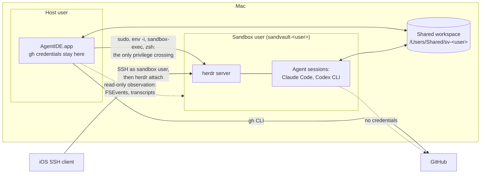
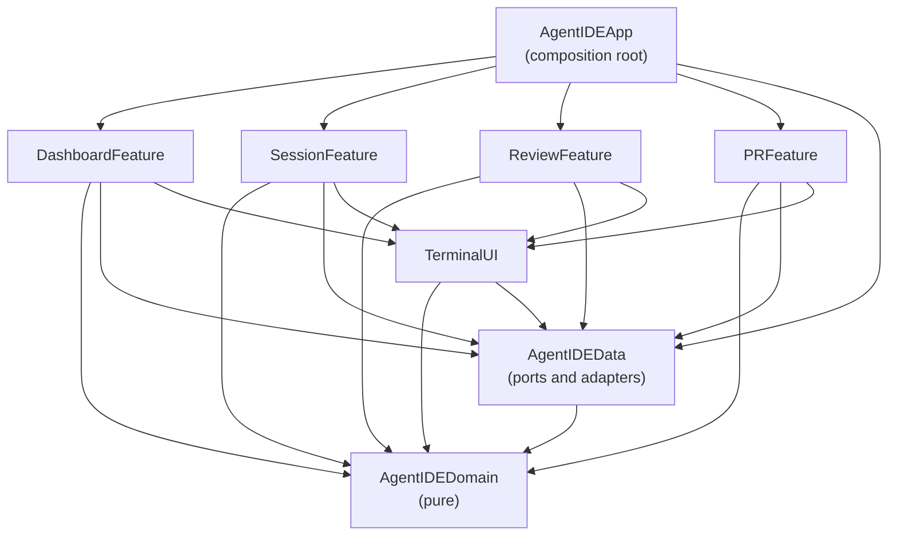

# AgentIDE Architecture

How AgentIDE works under the hood. [README.md](README.md) owns what it does
and why; this document owns the system design. The feature groups referenced
here (Start work, Watch and steer, Review, Ship, Tidy up and Resilience) are
the README's Features subsections.

## Overview

AgentIDE is a native SwiftUI macOS app (macOS 27 or later, Swift 6.4,
AGPL-3.0) that runs, steers and reviews sandboxed AI coding agents in
parallel git worktrees. Its user supervises rather than types, so the
window is arranged around the agent loop, not around an editor, and one
window covers what four apps used to. It is developed readme-first: the
README describes behaviour before the code exists and this document
describes the design that delivers it.

The architectural thesis, referenced throughout: **AgentIDE holds no
session-critical state**. Agents run as the sandvault sandbox user inside a
[herdr](https://herdr.dev) server that AgentIDE introduces. The app derives
its entire view of the world from herdr, git, agent transcripts and
GitHub, and persists only its own metadata in SQLite. Killing, crashing or
updating the app therefore loses nothing (Resilience).

## System context



Boundary facts the design relies on:

- The sandbox may write only to the shared workspace, its own home, `/tmp`,
  `/var/folders` and `/dev`. The host user's home is unreadable from inside
  and keychains are denied.
- The shared workspace is writable by both users through inheriting ACLs; it
  is the data plane for code, prompts and events.
- The sandbox has no GitHub credentials: `gh` is unauthenticated there and
  agent settings deny `git push`. Pushing and everything credentialled
  happens host-side.
- Credentials never cross the boundary in either direction.

## Guiding principles

1. **P1: Derive, don't own.** herdr, git, transcripts and GitHub are the
   sources of truth. The app reconciles from them on every launch.
2. **P2: Unprivileged glue.** The only privilege crossing is the sudoers path
   sandvault already configured. AgentIDE never widens it.
3. **P3: Compiler-enforced boundaries.** Clean architecture mapped onto SPM
   targets; an illegal dependency is a build failure, not a review comment.
4. **P4: Approachable strict concurrency.** MainActor by default in UI
   targets, nonisolated core, `@concurrent` for heavy leaf work, structured
   tasks everywhere.
5. **P5: Agents are pluggable.** One `AgentRunner` seam; agent-specific logic
   lives only in adapters. Sessions created elsewhere are still shown.
6. **P6: One client per external system.** git speaks through `GitClient`,
   GitHub through `gh` in `GitHubClient` and herdr through `HerdrClient`;
   nothing else shells out to them.
7. **P7: Agent output is hostile input.** Every host-side touch of
   guest-writable data is hardened accordingly.

## Process model and lifecycles

Two independent lifecycles:

- **The app process** is ephemeral. It can quit, crash or update at any time
  and holds nothing that cannot be rebuilt (P1).
- **Sessions** are herdr workspaces owned by the sandbox user's herdr
  server. They survive app restarts, app updates and host-user logout, but
  not reboot. Reboot recovery is worktree plus transcript plus resume (see
  State and persistence).

### Launching into the sandbox

sandvault's sudoers rules let the host user run exactly `/bin/zsh`,
`/usr/bin/env` and `/usr/bin/true` as the sandbox user without a password, so
every sandbox interaction is built on one launch shape, assembled in exactly
one place (`SandvaultLauncher`):

```bash
sudo --login --set-home --user="sandvault-${USER}" /usr/bin/env -i \
  HOME="/Users/sandvault-${USER}" USER="sandvault-${USER}" SHELL=/bin/zsh \
  TERM=xterm-256color COLORTERM=truecolor \
  INITIAL_DIR="${WORKTREE}" SHARED_WORKSPACE="/Users/Shared/sv-${USER}" \
  SV_SESSION_ID="$(uuidgen)" AGENTIDE_SESSION="${SESSION_NAME}" \
  LANG=en_US.UTF-8 \
  PATH=/opt/homebrew/bin:/usr/local/bin:/usr/bin:/bin:/usr/sbin:/sbin \
  GIT_CONFIG_COUNT=1 GIT_CONFIG_KEY_0=safe.directory \
  GIT_CONFIG_VALUE_0="/Users/Shared/sv-${USER}/*" \
  /usr/bin/sandbox-exec -f "/var/sandvault/sandbox-sandvault-${USER}.sb" \
  /bin/zsh -c "${PAYLOAD}"
```

This is byte-compatible with how sandvault launches sessions; AgentIDE only
substitutes the payload. Notable parts: `env -i` gives a clean environment,
the `GIT_CONFIG_*` variables inject `safe.directory` (shared repositories are
owned by the other user) and `sandbox-exec` applies sandvault's generated
profile to everything downstream, including the herdr server.

### herdr

herdr is installed by the Brewfile and introduced by AgentIDE; sandvault
does not use it itself. It is a client-server terminal workspace manager: a
background server owns real terminal panes grouped into workspaces, detects
the coding agent running in each pane and exposes everything over a
schema'd, newline-delimited JSON socket API that the `herdr` CLI wraps.
There is no daemon and no launchd unit: the server starts lazily inside the
sandbox the first time a session is created, with a payload of:

```bash
export HERDR_SESSION=agentide
herdr api snapshot && exit 0
cd ~ && ~/configure
source ~/.zshenv && source ~/.zprofile && source ~/.zshrc
herdr server &> ~/.config/herdr/agentide-server.log &!
until herdr api snapshot; do sleep 0.1; done
```

The server detaches through zsh's `&!` with its output redirected:
this launch context has no controlling terminal to hang up from, and
macOS's nohup refuses to run at all without one ("can't detach from
console"). When the server never answers, the payload prints that log
before failing, so a refused start reports its reason rather than a
bare exit code.

- `HERDR_SESSION` names the herdr session, whose socket and state live
  under `~/.config/herdr/sessions/<name>/` in the sandbox user's home,
  owner-only, so nothing lives in world-writable `/tmp` and every
  invocation finds the same server. Development builds and test runners
  (anything but the installed /Applications/AgentIDE.app) use the
  `agentide-dev` session instead, and tests relocate herdr entirely with
  `XDG_CONFIG_HOME` into throwaway per-run scratch directories, so
  building, testing and development can never list or kill the installed
  app's sessions.
- Shortcuts and Siri reach the same funnel through App Intents
  (`App/AgentIDEShortcuts.swift`): repository and worktree entities resolve
  from the dashboard's in-memory groups, so no git runs to answer a
  query; Start Agent Session calls `DashboardModel.createSession` with
  the model and effort last chosen anywhere; Show Worktree and Open
  Pull Requests select the row and write the utility tab onto the
  storage bus; What Needs Me answers without opening the app. The
  intents reach the app through `AppDependencies.shared`, the one
  instance, since the system invokes them outside any view. They are
  tested through `AppIntentsTesting` from the `AgentIDEIntentTests`
  UI testing bundle (`Tests/AgentIDEIntentTests`), out of process the
  way Siri reaches them: the reading intents run, the queries are
  asked, and Start Agent Session is checked to exist with its
  parameters rather than run, since a test must not launch an agent.
- A session can also be started from outside the app entirely:
  `agentide new`, the same command as the editor shim, asks for the
  repository, agent, effort, model and prompt, each defaulting to what
  was last chosen anywhere. Neither surface has a default model or effort:
  until one has been picked the form refuses to start and the question
  refuses to move on, and afterwards the last pick is what both come back
  to. That memory is `agentide/session-defaults` in the shared workspace,
  `key=value` lines because the sandbox has no JSON tool, written by
  whichever surface starts a session and merged rather than replaced by
  both, with the app publishing what only it can know (the repositories,
  and each agent's discovered models and efforts) on every poll. The
  discovered models are asked of every CLI at once after the first
  reading and kept in the metadata store under the CLI's version, read
  from the host in milliseconds, so they are asked for again only when
  the CLI has changed: `claude models` is a twenty-second sandbox launch,
  which no relaunch should wait on. The model
  and effort are kept under their agent's name, since the form keeps one
  pair and Codex's model means nothing to Claude. An
  answer that is neither a number nor a name is asked again rather than
  taken, in Homebrew's own idiom of blue arrows, bold labels and green
  defaults, plain whenever the output is not a terminal. It then makes the worktree, writes the prompt file, creates the
  labelled workspace and attaches, which is how a phone over SSH starts
  work; run from a pane already inside herdr (`HERDR_PANE_ID` set) it
  focuses the new workspace instead, since herdr refuses a nested client.
  Its option lists pack one row when it fits the terminal and go one per
  line when it would wrap. Run as the host user it runs itself as the
  sandbox user through
  the same sudo, `env -i` and `sandbox-exec` shape the app uses, since only
  that user can reach the server's socket, and it defaults the session to
  `agentide` so a terminal on the Mac needs no setup at all. A workspace
  that cannot be made takes its half-built worktree, branch and prompt file
  with it, so the same prompt can simply be asked again. Nothing is
  installed for it: the command is aliased from the app bundle, which the
  sandbox can read. The same command speaks to a running
  app through the edit spool, whose requests now say what they are: an
  `edit` holds the command until the file is saved (what `EDITOR` needs and
  the only kind judged by whether its process still lives), an `open` hands
  a file over and returns, and a `select` names a checkout or worktree for
  the window to switch to. A directory is walked up until it is one of
  those rows, a name under `repositories` or two under `worktrees`, so
  `agentide .` anywhere inside a tree selects the worktree holding it, and
  a path with no row above it is refused rather than guessed at. It
  computes the branch, label and paths by the rules below rather than
  reading anything the app owns, so the app needs telling nothing: every
  session it shows is derived from herdr and git. What it cannot do is
  host-only: no on-device branch naming, no GitHub, and no recorded
  prompt or CLI version until that session is next started from the Mac.
- Each agent conversation is one herdr workspace whose single pane runs a
  login shell; the agent command is submitted to that shell (`pane run`)
  behind `export TMPDIR="$(mktemp -d)"`, the per-session temporary
  directory sandvault's own launcher gives every session, because a
  server born through sudo resolves no usable one of its own and Codex's
  execution host exited during its handshake in panes without it.
  `AGENTIDE_SESSION` and `INITIAL_DIR` are set as workspace environment.
  A finished agent therefore leaves the shell at its prompt with the
  whole scrollback inspectable, and whether an agent is running comes
  from herdr's own agent detection
  confirmed by the pane's foreground process, not from exit codes, which
  nothing displayed anyway.
- herdr's official agent integrations are deliberately not installed:
  the Codex one flips Codex's own hooks feature on, which broke command
  execution in fresh Codex sessions here, and the app's transcript-based
  resume already covers what their native restore would add. Installing
  them by hand works and survives; the app neither adds nor removes
  them.
- Workspace labels follow `agentide--<repo>--<branch-slug>--<agent>`. Slugs
  collapse `-` runs so the `--` separator stays unambiguous, collisions
  append `-2` to the branch component and `.` and `:` are replaced. Labels
  are a human-readable fallback for the herdr sidebar over SSH; the
  authoritative record is the app's metadata store. Anything not matching
  the full shape is treated as foreign.
- herdr is pre-1.0 and would normally fail the dependency rule below; it is
  admitted as an explicit exception because it is a runtime tool behind one
  adapter, never linked, its socket protocol is versioned and schema'd
  (`herdr api schema`), and its agent-state model replaces machinery this
  app otherwise builds itself.

### Terminals

Agent panes attach to herdr as terminal controllers (`herdr terminal
session control <pane> --takeover`, newline-delimited JSON over pipes)
rather than drawing a remote screen over a PTY. herdr streams rendered
output as `terminal.frame` records carrying base64 ANSI bytes, opening
with a full repaint that restores the pane's terminal modes, which the
pane decodes (`HerdrTerminal` in Domain, `HerdrTerminalChannel` in
DataAccess) and feeds into a local SwiftTerm view; keystrokes and pastes
go back as `terminal.input` commands, resizes as `terminal.resize` and
the wheel as `terminal.scroll`, so scrollback lives in herdr and the
wheel pages through it whatever is on screen. Because the screen is
rendered locally, selection, copying and pasting behave like a native
text view while the sessions still outlive the app; agent panes
additionally reflow multi-line copies for prose and Option-drag copies a
rectangle with gutter marks trimmed. A paste is the one input the pane
must shape itself: the frames carry the rendered screen and never the
private modes the agent set, so the local terminal never learns that
bracketed paste is on, and left alone it sent a paste as keystrokes,
every newline submitting the lines before it. A herdr-backed pane
therefore wraps a paste in the bracketed-paste markers itself
(`PaneTerminalView.bracketsPastes`) and sends it as one write; a local
shell pane owns its PTY, sees the modes and needs nothing. Scrollback
never reaches the local buffer, so no
scrollbar can exist for it; agent panes hide the scroll indicator for
that reason, and SwiftTerm gives the reserved width back to the
terminal. A known limitation follows from that: resizing a pane resizes
the pane's PTY, so the agent redraws its live screen at the new width,
but herdr does not rewrap lines already in its scrollback, which keep
the width they were written at. tmux rewrapped its history and the
previous design seeded it into the local buffer, which SwiftTerm
reflows itself; the equivalent here would seed the local buffer from
`pane read --source recent-unwrapped --format ansi` on attach and keep
wheel scrolling local whenever herdr's scroll metrics say the pane is
not on the alternate screen.

Two visually unmistakable terminal flavours:

- **Sandbox terminal**: the launch shape with payload
  `exec herdr terminal session control <pane> --takeover`. The attaching
  client runs inside the sandbox too; herdr sockets are owner-only, so no
  attach path can skip sudo. Closing the view releases the controller and
  never kills the session. `--takeover` replaces a controller leaked by an
  earlier app run, which would otherwise own the pane's input forever;
  full herdr clients (SSH, Moshi) attach independently of controllers and
  are never dropped by the app's panes.
- **Host terminal** (Review): a plain login shell on the pane's own
  PTY as the host user, no sudo, no sandbox, full `gh` credentials, the
  editor variables pointing at the app's own shim and no server at all:
  shells live and die with the app, a deliberate trade after
  server-backed shells kept wedging their control clients. The pane a
  shell runs in stays mounted whatever else the window shows, as the
  panes section above describes, and the tab bar's Close shell ends
  one instantly.

Both terminals share one theme (black on white in light mode, white on
black in dark), with one deliberate exception: an agent pane is pinned
to the appearance its session was launched under, recorded in the
metadata at launch. Agent TUIs read the terminal's colours once at
startup (OSC 10/11) and style their own chrome for them forever, so a
pane that re-themed on a macOS appearance switch left the composer white
on white; the pinned palette keeps the answer the agent cached true for
the session's whole life, relaunches of the app included. What separates
the two flavours visually is position, the agent pane on the left and
the shell in the utility pane.

The agent pane's menu also copies its whole recent output, read back
from herdr unwrapped (`pane read --source recent-unwrapped`), since the
local buffer holds only the rendered screen and a selection can never
reach what was scrolled past. Copies from the agent pane are reflowed
for pasting into prose, block by block rather than by the copy as a
whole: a paragraph loses the terminal's hard wraps, while a run of lines
that opens like a command keeps every one of them, so an answer that
explains, then gives a script, then explains again pastes with the
script still runnable. Option-drag copies a rectangle, and the marquee
is drawn on the character grid rather than at the pointer, since half a
character is neither in a selection nor out of it as far as the eye can
tell. Cmd-K clears the shell pane the way a terminal app's clear does,
screen and local scrollback wiped and the prompt redrawn; agent panes
ignore it, so an agent's conversation can never be cleared from view by
a stray shortcut.

Remote access is SSH to the Mac as the sandbox user from an iOS client,
which lands on the same herdr server the app drives; `script/attach`
covers the host user and sessions inside the sandbox. No picker ships
here: one `herdr` attach presents every workspace with herdr's own
navigation, and a picker of ours would be a second implementation of
something the server's UI already does. It needs only the session name,
which the sandbox user's shell configuration exports
(`export HERDR_SESSION=agentide`, synced into the sandbox home from the
shared workspace's `user/` template), since a login from outside the app
inherits none of the sandbox's own environment; sshd's own `SetEnv` hands
that login the shared workspace path alone.

Remote Login must be enabled in macOS settings first, for that account
alone: the sandbox user is hidden, so it never appears in the Sharing
pane's list and is added to `com.apple.access_ssh` with `dseditgroup`
instead. An SSH session is
isolated by user permissions rather than sandbox-exec whichever account it
targets, but attaching connects it to the sandboxed herdr server, so agent
processes stay confined either way.

### Reconciliation and notifications

On every launch the app rebuilds state, in order, from: `herdr api
snapshot` (through the launch shape, tolerating "no server running"),
`git worktree list` across tracked repositories, transcript directory
scans and finally its own metadata store. Unmatched
sessions stay off the sidebar: a row that cannot be entered and
steered like a worktree's is noise rather than information. The
session manager's pane listing is where everything the server runs,
matched or not, stays visible.

Deriving is not the same as trusting one reading. A reading that loses a
worktree or a repository is never taken as proof it went away: its listing
can fail, and `git worktree list` reports a worktree as detached rather than
on a branch for the whole of a rebase. A row the newest reading dropped is
kept while its directory is there, and only its removal from disk takes the
row away. This is a display rule, not a cache: nothing is persisted and the
next reading that lists the worktree wins. It matters because a row holds
its worktree's panes open, and a pane holds a running shell (P1 still
applies; disk is one of the sources).

There is no separate notification daemon in v1, and no windowless
resident mode: the app quits when its last window closes. Everything
that must survive lives outside the process, herdr sessions and their
agents keep running, and because the event spool is durable files a
quit app delays notifications rather than losing them; the next launch
reads them. A login-item helper via `SMAppService` is the documented
later option if delayed notifications prove annoying.

## Package architecture

One root `Package.swift` defines every library target; a thin app shell in
`App/` is generated into an Xcode project by XcodeGen (`project.yml` is
committed, the `.xcodeproj` is gitignored).



- **AgentIDEDomain**: entities (`Repository`, `Worktree`,
  `RepositoryGroup`, `AgentSession`, `AgentKind`, `PullRequestSummary`,
  `ReviewThread`, `BranchStack`, `TranscriptSession`, `DiffFile` with its
  hunks and lines) and pure logic (`DiffParser`, `PatchBuilder`,
  `SessionName`, `HerdrTerminal` frame decoding, `SyntaxHighlighter`'s
  keyword tokenizer, `FuzzyMatcher` and `Wrapping`). Foundation value
  types (Date, URL and Data) are allowed; process, file, network and
  database APIs are banned.
- **AgentIDEData**: the adapters: `GitClient`, `GitHubClient` (every
  GitHub question through the host user's `gh`), `SandvaultLauncher`,
  `HerdrClient`, `HerdrTerminalChannel` (a live `herdr terminal session
  control` client on pipes), `TranscriptReader` and `CodexTranscriptIndex`,
  `EventSpool`, `MetadataStore` (one JSON file), `PullRequestStore`,
  `ProcessRunner` (Foundation `Process`), `WorkspaceWatcher` (FSEvents),
  `FoundationModelClient` (the on-device Apple foundation model behind one
  reusable summarisation seam) and `AgentRunner` with `ClaudeCodeRunner`
  and `CodexRunner`, composed by `SessionService`. One module, split only
  if boundary violations appear.
- **Feature targets** (`DashboardFeature`, `SessionFeature`, `ReviewFeature`
  and `PRFeature`): SwiftUI views and `@Observable` view models, MainActor by
  default, given the service via injection. `SessionFeature` owns the
  WKWebView browser, the transcript log and the session manager;
  `ReviewFeature` owns the diff and editor surfaces (SwiftUI text and an
  attributed NSTextView).
- **TerminalUI**: shared UI components, not a feature: the SwiftTerm
  wrapper (a `herdr terminal session control` argv in, a locally rendered
  pane out, via DataAccess's terminal channel), markdown rendering, the
  AppKit-backed tooltips, `LinkOpener`, `BusyButton`, `LaunchProgress`
  and the syntax highlighting engine. Highlighting parses with
  tree-sitter grammars and falls back to a pure-Swift line tokenizer in
  the Domain for text without a loaded grammar, such as fragmentary diff
  lines the parser cannot classify.
- **AgentIDEApp**: builds adapters, injects the service, owns navigation,
  Settings and the App Intents. No logic.

Third-party imports are confined (P3):

| Dependency | Only importable in |
|---|---|
| SwiftTerm, swift-markdown, SwiftTreeSitter and grammars | TerminalUI |
| WebKit | SessionFeature |
| FoundationModels | AgentIDEData |

### The AgentRunner seam

`AgentRunner` (P5) covers exactly: building the launch and resume
commands for a prompt file, model, effort and extra arguments; locating
the agent's transcripts (per working directory, or one flat tree an index
attributes by the directory each rollout records); the models and efforts
it offers, its version and its model listing command. At startup the app
asks the installed CLI what models it offers and falls back to a curated
list when the command fails, so the pickers track the binaries rather
than hardcoded names. Whether an agent is working, idle, done or blocked
comes from herdr's own detection, the same for every agent, so no runner
detects anything. Discovering foreign sessions is reconciliation logic in
`AgentIDEData`, deliberately outside the protocol.

## Concurrency model

| Target | Default isolation | Notes |
|---|---|---|
| AgentIDEDomain | nonisolated | Sendable value types by construction |
| AgentIDEData | nonisolated | `@concurrent` on parsing and subprocess work |
| Features, TerminalUI | MainActor | `@Observable` MainActor view models |
| AgentIDEApp | MainActor | wiring only |

All targets build with `SWIFT_DEFAULT_ACTOR_ISOLATION` set per the table,
`SWIFT_APPROACHABLE_CONCURRENCY=YES` and the Swift 6 language mode.

The nuance that matters most: under approachable concurrency, `nonisolated
async` functions run on the caller's actor. Quick awaited I/O therefore
stays plain `nonisolated async`; only CPU-bound or blocking leaf work
(transcript decoding, diff parsing and subprocess output pumping) is
marked `@concurrent` to move off the caller.

Events flow as `AsyncStream`s (file watches, herdr agent waits, poll ticks
and GitHub results) consumed by view models via `.task`, so cancellation
follows view lifetime. Fan-out uses task groups. Unstructured `Task {}`
appears only at enumerated app-lifecycle roots. Three actors are
sanctioned, each guarding one mutable resource: `HerdrTerminalChannel`
(the pipes of one control client), `StackCache` and `RepositoryFacts`
(memoised git answers); any further actor needs a written justification
here. `@unchecked Sendable` and `nonisolated(unsafe)` are banned.

## Key data flows

### Create a worktree and launch an agent (Start work)

1. Input: a typed prompt, or an issue or pull request number with optional
   extra context, plus a target repository, agent, model and effort. The
   form is a middle-pane action on its repository, so opening it (from a
   repository's plus button, a worktree's new session action or Cmd-N and
   the picker) selects that repository's main checkout in the sidebar
   without closing the form. The agent, model and effort come back as
   they were last time; the pickers re-validate the pair on appearance
   as well as on change, since a persisted model of one agent must never
   launch another (a Codex id once reached Claude that way). Submitting
   inserts a greyed placeholder row under a provisional name into the
   repository the instant the click lands and selects it, with the
   primary pane narrating creation step by step (`LaunchProgress`, a
   step log the service and the herdr client report into: the branch
   name, the worktree, the prompt file, the server check, the workspace,
   the command submitted and what is being waited on) under a clock of
   the launch's elapsed time and a dot a second on the newest step, so a
   step that reports nothing while it waits still shows the app working,
   the whole block pinned near the top of the pane so it grows downwards
   rather than shifting every line each time a step arrives. It is drawn
   ticking every second, which is what every waiting pane looks like; the version probe runs beside the naming and the worktree
   and asks the host's own copy of the CLI (Homebrew's prefix is one
   place for both users), since a sandbox launch wraps a sudo, an
   environment scrub and a sandbox-exec around one line of output; a
   resume does not ask at all, the first launch having recorded the
   answer. A kill that closed nothing skips the listing that would
   confirm it, and a resume checks for a live session with one pane
   listing rather than a whole overview. So a slow step names
   itself rather than showing a blank pane; resuming narrates the same
   way, one line per command tried. The narration stays until herdr
   detects the agent's interface (`awaitReady`, bounded at a minute), so
   the pane never appears before the agent can take input. The real
   worktree replaces the row on the refresh that follows, and a failure
   removes it and returns to the form. An issue's title and body become the prompt. A pull request instead gets a
   detached worktree that `gh pr checkout` (host-side) turns into the pull
   request's own branch, so pushes and pulls track it directly.
2. The branch name summarises the prompt: the on-device Apple foundation
   model (behind `FoundationModelClient`, one reusable client so later
   features can summarise commits or draft pull request bodies) answers a
   short underscore-separated name; when the model is unavailable the
   prompt's first words serve in the same style. No prefix.
3. Host-side `GitClient` fetches, then runs `git worktree add` under
   `/Users/Shared/sv-<user>/worktrees/<repository>/<branch>`, a layout
   the app owns outright now that the tooling which minted uuid
   containers there is retired. Worktrees in that older
   `worktrees/<uuid>/<branch>` layout keep working, since everything
   derives from `git worktree list` (P1); the friendly symlinks earlier
   releases kept beside them are no longer created and are removed with
   their worktrees. Sessions always launch from the real path because
   agent transcripts are keyed by cwd. The app also keeps herdr's own
   `[worktrees] directory` pointed at this layout, written once per
   run only when the config has no such section so a hand edit wins
   forever, which is what makes `herdr worktree create` land where
   the sidebar looks. Each poll also scans the
   `worktrees/<repository>` container for checkouts the canonical
   listing does not know: an agent may clone a base of its own (a
   huge repository wants a partial clone) and cut worktrees from it,
   and those are adopted with the owning clone as their repository
   path, so sessions, pull requests, shells and deletion land on the
   clone that actually holds the branch.
4. The prompt is written to
   `/Users/Shared/sv-<user>/agentide/prompts/<session>.md`, readable in the
   sandbox through the workspace ACLs.
5. Deploy keys: none; the agent works offline against the local clone and
   pushing is host-side.
6. `AgentRunner` builds the agent command, with any per-session extra
   arguments appended verbatim (sandvault's wrappers add the agent's
   permission-skipping flag inside the sandbox), and the session launches
   through the herdr payload above.
7. The prompt travels inside the launch command, read from its file as the
   agent starts (`"$(cat …)"` evaluated in the sandbox, the file path
   shell-quoted): pasting it as
   terminal input after launch raced the agent's terminal setup, which
   flushed pending input and lost the prompt. The accepted trade-offs: the
   expanded prompt appears in the agent process's own argv, visible to
   `ps` on the machine, and prompts are bounded by the kernel's
   argument-size limit.
   The pane's `INITIAL_DIR` is
   pinned to the worktree so the sandbox's zshenv cannot redirect the agent
   elsewhere.
8. The session is recorded in the metadata store, with the agent-native
   resume id captured as soon as the transcript appears.

### Event pipeline (Watch and steer)

1. AgentIDE manages the Claude Code settings template at
   `/Users/Shared/sv-<user>/user/.claude/settings.json`, which sandvault
   rsyncs into the sandbox home at each session start. AgentIDE adds its hook
   entries alongside any existing notifier hooks (removing others only when
   their app is retired), covering UserPromptSubmit, Stop, StopFailure,
   PostToolUse, PostToolUseFailure, PermissionRequest, SessionStart and
   SessionEnd, each in the defensive `[ -x ... ] && ... || true` shape.
2. The hook command is a small script shipped through the same template
   directory. It appends one JSON line to
   `/Users/Shared/sv-<user>/agentide/events/<session>.jsonl`, keyed by
   `AGENTIDE_SESSION` with `SV_SESSION_ID` as fallback so sessions launched
   outside AgentIDE feed the dashboard too, and it no-ops when neither is
   set. Appends are single-writer and small; the reader tolerates a torn
   last line.
3. Host-side, `EventSpool` reads each session's file modification time
   on every poll, the one fact the spool feeds in: when the agent last
   did anything. A worktree is unread when its spool events or its
   transcripts are newer than its per-worktree seen time; viewing it
   records that time, and a context menu marks it unread again until next
   viewed. herdr keeps no output timestamp, so raw terminal output that
   reaches neither a hook nor a transcript no longer counts, a deliberate
   trade: the spool and transcripts already cover every agent message.
4. herdr's agent lifecycle (working, idle and blocked, from its screen
   detection) covers every agent equally, hooks or none, and arrives
   as events: the dashboard keeps one `herdr agent wait` per running
   agent, asking for every state but the current one, so a change
   refreshes the sidebar at once where the poll noticed it within its
   interval; the poll stays for git and as the safety net. The sidebar
   flags an agent waiting on input, and notifications fire when an agent
   finishes a turn or needs input, each event with its own toggle
   and chime chosen in Settings' Notifications pane: the system's
   sound directories, any audio file the open panel's audio-type
   filter admits, or silence, the chosen paths riding the storage
   bus so no audio ships in the repository, every chime played as an
   alert so the system's alert volume and accessibility flash apply.
   An exit posts nothing of its own: the stop icon and the unread
   dot carry it. The sidebar and
   pane distinguish herdr's working, idle, done and blocked states
   (idle owes nothing, done has an answer waiting), and the Dock
   badge counts the worktrees needing attention, each contribution
   behind its own Settings toggle: waiting on input, a done turn
   not yet viewed, or unread output anywhere but the
   pane being read.
5. If the app is fully quit, events accumulate in the spool and notifications
   arrive on next launch.

### Review and per-line rejection (Review)

1. `GitClient` produces diffs (`git diff`, `git diff --cached` and ranges)
   with rename detection; the pure `DiffParser` turns them into file, hunk
   and line values. The scope toggles between the last commit (or
   uncommitted changes when there are any) and the whole branch against
   its merge base: the open pull request's base branch when one exists,
   otherwise the default branch. Per-line rejection and message
   amendment apply only to the last commit scope. In the multi-commit
   scopes each line of the commit listing links to that commit alone
   (`git show`), which the pane then reviews with its message shown
   read-only: only the tip can be amended, and a listing that stayed
   one text block keeps selection running across its lines.
2. Generated files (lockfiles and the like, by path fragment) are hidden
   by default, one click to reveal.
3. Rendering highlights with tree-sitter grammars (Swift, Ruby, Bash,
   Python, JSON, TypeScript and JavaScript, C, C++, Go, Rust, Java, PHP,
   HTML, CSS, regular expressions and ERB), a word list for the formats
   worth no grammar (YAML, Markdown, Dockerfile, git's own editable files
   and a keys-and-sections mode covering `.gitconfig`, `.ini`, `.toml`,
   `.env` and their kin), and for anything else that is text a generic
   pass finding strings, numbers and whichever comment introducer the
   line opens with, so no file reads as dead; pictures and archives are
   left alone. With line numbers
   and visible whitespace in both the diff (tabs and trailing whitespace
   carry a background tint, so copied diff text stays character-exact)
   and the editor (substitute glyphs). Diff lines wrap to the pane's
   width as the editor's do, each line beside its own gutter entry so
   the numbers keep their places; a hunk's context menu copies its
   lines whole, since wrapping ends the drag across a single text
   block. The branch's commit listing wraps for the same reason.
4. Rejecting selected lines builds a minimal reverse patch with
   `PatchBuilder` (pure, with recalculated hunk offsets), validates it with
   `git apply --check`, applies it with `git apply -R --index` so index and
   worktree stay consistent, then runs `git commit --amend` (with `-m` when
   the message was edited too). Uncommitted changes skip the amend, and
   their lines can be edited in place instead: the diff's context and
   added lines are text fields, a removed line is history and is not,
   and a file that was never committed can be deleted after a prompt.
5. Manual edits happen in the same editor surface; saves trigger a diff
   refresh via file watches. Every text surface in the app has macOS text
   substitution turned off, in the app's own defaults for the SwiftUI fields
   and on the editor's text view directly: curly quotes and em dashes are
   wrong in code, commit messages and pull request bodies alike.
6. Cmd-F goes to whatever holds focus. The editor is an `NSTextView` and both
   terminals answer `performTextFinderAction`, so they get the system find
   bar, Cmd-G and Cmd-Shift-G for free. A diff is a list of views rather than
   one text view, so when nothing on the responder chain takes the action the
   menu falls back to the storage bus and the review pane opens its own bar:
   it tints every match in place and walks the hunks holding one, since a
   hunk is the smallest thing the list can scroll to.

### Panes that outlive what is on screen (Review)

Shells and browser pages die with their pane, so panes are mounted for as
long as the thing inside them should live, not for as long as it is visible:

1. Every running shell and every browser page opened so far stays mounted
   whichever tab, worktree or middle page is on screen, with only the
   selected worktree's shown and taking keys. The middle pages cover the
   split rather than replacing it for the same reason.
2. A shell ends when its Close button ends it, when the shell itself exits,
   when its worktree is destroyed or when the app quits. A browser page ends
   the same way, and its address is remembered per worktree, so a page closed
   deliberately or lost to a restart opens again where it was.
3. Because they accumulate, the session manager lists them beside the agent
   sessions: each browser page with what it is showing, the CPU and memory of
   the web content process rendering it, and a Close. WebKit does not name
   that process in public API, so it is asked for through the runtime only
   when the view answers to the question, and a page it will not name shows
   no figures rather than wrong ones.

4. Displays are not fixed either. Unplugging the display a fullscreen
   window is on leaves the window black on a space with nothing behind it,
   and coming out of fullscreen restores the frame it had on the display
   that has gone, which the remaining screen can neither show nor let the
   user drag smaller. A fullscreen window that macOS moves to a surviving
   screen keeps the frame of the one that went, drawing its content outside
   the new screen so only the black behind it shows, which is why fitting
   covers fullscreen too: the frame is set to the screen the window is now
   on, and a redraw asked for, on entering and leaving fullscreen, on
   changing screen and on any change to the displays themselves, each
   fitted twice since those transitions animate. Only the display the
   window was on going away sets a fullscreen frame by hand, though:
   AppKit owns the frame of a window in a fullscreen space, and setting it
   while a space merely moved between two live displays left both screens
   black until the app was killed. Screen parameters change for
   resolution, scaling and arrangement too, and a fullscreen space is live
   through all of those, so the display the window was last seen on is
   remembered by its `CGDirectDisplayID` and the manual path is taken only
   when that display is absent from `NSScreen.screens`. Such a move posts no screen-parameter change and does not
   always announce the screen change, so the window's own move is watched
   as well, in fullscreen only (fitting a dragged window would stop it
   being pulled past a screen edge on purpose), and all it does is lay
   the content out again for the size AppKit gave it. A settled
   fullscreen window whose frame still does not match its screen says so
   once in the messages pane, since that frame is the one fact a window
   needing fullscreen toggled by hand can offer. A window left with no
   screen at all leaves fullscreen, and then
   fits its frame back inside whichever screen it lands on, and the panes
   fit the width it ends up with: the utility pane narrows first, then the
   sidebar, and a window too narrow for all three hides the utility pane
   for the layout only, so it comes back with the room rather than being
   forgotten.

### Editing what a command is waiting on (Review)

Commands run in a shell pane regularly want an editor: `git rebase -i` for
its todo list, `git commit` for a message. They get the app's own, through a
shim rather than a protocol:

1. The shim is `bin/agentide` in the repository, shipped as a folder
   reference inside the app bundle, so the script a shell runs is always the
   one the running app was built with and the linters cover it like any other
   script. A shell pane starts with that directory on `PATH`, `EDITOR`,
   `VISUAL` and `GIT_EDITOR` naming it with `--wait`, `AGENTIDE=1` and
   `AGENTIDE_EDITS` pointing at the spool to use. `GIT_SEQUENCE_EDITOR` is
   deliberately left alone, so a `sequence.editor` chosen in git config still
   wins for rebase todo lists. A login shell rebuilds `PATH` and re-exports
   its own editor variables after all this, which is what `AGENTIDE` is for:
   shell configuration can test for it and defer to the app. Dev builds hand
   their panes their own spool, so a build under test never answers the
   installed app's shells.
2. The shim spools one request per file into the spool it was given, or
   `~/.agentide/edits` when it was run from an ordinary terminal: a JSON file
   named for a fresh uuid, carrying the file, the physical working directory
   and its own process id, written to one side and renamed into place so the
   app never reads half of one. Nothing inside the sandbox can reach that
   directory, so an agent cannot queue an edit or see what is being edited.
3. The window watches the spool directory with a dispatch source, so a
   request is read the moment its file lands rather than on a poll; a
   slow safety tick covers a lost event, and a faster one runs only
   while requests are waiting, to sweep those whose command has gone.
   A request brings the app forward, selects the worktree the command
   ran in, opens the utility pane on its editor tab and shows the
   file, then writes an `.open` file. An unclaimed request is how the shim knows no app is running:
   it says so and exits non-zero rather than hanging.
4. Saving and closing writes a `.done` file holding the exit status the shim
   takes: zero when the file was saved, non-zero when the edit was cancelled,
   which is how git is told to abort a rebase. The shim removes the files it
   read, and a request whose process has gone is swept instead, so a shell
   closed mid-rebase leaves nothing behind.
5. The editor is the same one the review pane uses, with git's own files
   highlighted by name rather than extension: rebase todo lists colour their
   commands and commits, and commit messages colour the block git strips.
   The file itself is regularly outside every worktree, since git keeps a
   linked worktree's rebase state in the repository's own `.git` directory.

### Pull request dashboard (Ship)

1. Every GitHub question goes through the host user's `gh`, so the app
   never holds a token of its own (P6).
2. Each worktree branch is polled with its own narrow query for its pull
   request's mergeable state, review decision and check rollup;
   repository-wide queries timed out GitHub's gateway on very large
   repositories. The branch shows its open pull request, or its most
   recent one once that merged, so a branch reads as merged until its
   worktree is tidied. Membership of a merge queue is asked of the
   queue itself, once per repository: no pull request field reports it
   (`isInMergeQueue` does not exist, `mergeStateStatus` has no queued
   state), and an unknown field fails the whole listing. A pull
   request that merged or closed more than thirty days ago is
   ignored: branch names are reused, and an old pull request
   matching one is a name collision rather than the branch's work.
   No cached answer is ever treated as final, however green: an
   approved, passing pull request is exactly the one about to
   merge, and skipping it froze rows as open forever. Refresh, on
   the context menu of every sidebar row and repository header,
   drops the waits for the repository right-clicked and asks about
   its branches and its merge queue at once, including during an
   outage the poll is riding out; one repository rather than all of
   them, since asking about everything is how a rate limit
   arrives.
3. Every pull request question the app asks goes through one gate,
   `PullRequestStore`, which owns both the answers and the moments they
   arrived: listings, enriched headers, conversations, review threads,
   merge queues. A branch's listing, the question the sidebar asks
   most, goes through REST rather than `gh pr list`'s GraphQL, because
   REST answers carry entity tags: the last one travels back as
   `If-None-Match`, GitHub answers an unchanged listing with a 304 that
   costs no rate limit and no body, and the cache stands. A tag is only
   ever sent while the listing it stamped is still cached, and is
   dropped with it: the caches are capped and age out, the tags do not,
   and a 304 answering for a listing the app no longer holds reported a
   branch as having no pull request at all for as long as GitHub's own
   answer stayed the same. The other
   scopes stay GraphQL, which has no tags, and the merge queues of every
   repository are one aliased GraphQL query a minute rather than one
   each. The pull request tab polls by
   attention like the sidebar does: the worktree in front of you at the
   minute floor, one kept mounted behind another every five minutes. One pull request is never asked about twice inside a
   minute however much is clicked, and because the timers live in the
   metadata file beside the answers, quitting and relaunching does not
   restart the asking. Acting on a pull request (merging, queueing,
   pushing, resolving a thread) clears its stamp so the truth shows at
   once; looking never does. On top of that floor the poll's cadence is
   tiered by attention: the selected worktree refreshes most often, then
   its repository's other worktrees, then other expanded repositories;
   repositories collapsed in the sidebar poll rarely, and a failed poll
   keeps the cached answer. A pull request in flight jumps every tier:
   checks still running will pass or fail, and a queued one will merge
   or leave the queue within the hour, so both are asked about every
   half minute, the one question allowed under the minute floor. A
   push looks again a minute afterwards, from the store's timers
   outwards: asked at once, GitHub answers with the checks as they
   were before it and the store then holds that stale green or red
   for a minute more, where a minute's wait finds the run the push
   started and the row goes yellow. The
   store remembers when a pull request's checks were first seen running;
   past an hour the row goes back to its tier, since a run that long is
   a stalled check or GitHub down, and an outage must not be polled at
   twice a minute. The
   branch listing (conditional REST) carries no checks, review or
   mergeability, so each open pull request's state comes from the
   one-pull-request query on its own stamp, which is also what keeps
   the sidebar's icons true between selections. The sidebar's git reading is driven by the
   file system rather than the clock: one FSEvents stream over the
   repository and worktree roots (`WorkspaceWatcher`) remembers what
   changed, and a reading asks git only about repositories something
   moved under, with safety re-reads at a minute for the selected
   repository and five for the rest in case an event was lost (the
   old time-based cadence returns if the stream cannot start). Rows
   are kept between readings with only their sessions brought up to
   date from the pane listing already in hand (`GitReadScope`);
   twenty-nine repositories at four git calls per worktree every five
   seconds was most of everything the app did, and an idle workspace
   now reads almost nothing. What is left of those four is one: a repository's
   branches all answer at once through `git for-each-ref` with
   `%(ahead-behind:)`, `%(upstream:track)` and `%(committerdate:unix)`,
   nine milliseconds for a repository against three processes per
   worktree, and only a worktree on a detached head asks about itself.
   Uncommitted work stays the one question a worktree answers alone.
   Every read passes `--no-optional-locks`, so nothing the app asks
   waits on the index lock an agent's own git is holding. Which
   branch a worktree holds is read from the `HEAD` file git keeps it
   in rather than through `symbolic-ref`, since the stack asks it of
   every worktree on every reading and a file is a hundredth of a
   millisecond against a process; the command still answers when the
   file is not where it should be. A repository's full name comes from its remote's URL, a
   local read, never from `gh repo view`, which was a network round trip
   per repository per poll; that name and the branch merges are judged
   against are read once and remembered until a fetch, since only a
   rename or a change of default branch moves either and reading them
   again per row per poll was thousands of shell-outs an hour. Everything the store holds paints instantly,
   on pane switches and across restarts, before any fetch refreshes it,
   and a branch whose cache holds one pull request opens that one there
   and then: selecting only once the fetch answered made every move
   between worktrees wait on GitHub for what was already in hand.
   A listed pull request and its opened conversation share one header
   view, padding, height and browser button included, with the back
   chevron merely dimmed in the list, so opening and closing one moves
   no text; the entries of a stack are warmed as soon as one of them
   loads, so moving between its pull requests is a paint, never a load.
4. Pushing asks GitHub what the viewer may do here (`viewerPermission`)
   before choosing a remote. Write access pushes to the repository; anything
   less pushes to the viewer's own fork, created with its remote on first
   use by `gh repo fork`, which picks whatever protocol the checkout already
   uses. The pull request then names its branch `owner:branch`, since it
   belongs to the repository it is opened against rather than the one
   holding the branch. An unanswerable permission question keeps the
   repository, which is what every push did before asking was possible.
5. When the branch has no open pull request, the worktree scope shows a
   creation form instead of the list: title, body and the repository's
   `.github/PULL_REQUEST_TEMPLATE.md` as three editable fields, each
   saved to the metadata store as it is typed and each restored on its
   own. A saved draft only ever fills a field that is empty, so the
   reloads that pushing and rebasing trigger cannot take back what is
   being written, and a commit message never refills a form whose draft
   was deliberately emptied. The row and the pane never disagree about
   a pull request's state: both read the one enriched-summary cache,
   written by whichever side fetched last, the pane taking it up on
   every rows update and the sidebar told to repaint at once, through
   the storage bus, whenever the pane caches a changed state. Open PR
   dims until the branch is pushed, then runs `gh pr create` with the
   template appended below the body after an empty line and one
   `--label` per label picked from the repository's own (`gh label
   list`, read once per form and kept with the draft), and an open
   conversation shows the same row over its timeline, each toggle one
   `gh pr edit --add-label` or `--remove-label` at once; while the form
   shows, revisiting the tab does not re-poll for a pull request that
   cannot exist yet. Open PR sits in the
   footer as the primary action (Cmd-Return), after fetch, rebase and
   push in click order. Blank fields fill from the branch's commits,
   blank meaning empty or whitespace alone whatever a saved draft
   holds, since neither has anything to lose:
   a one-commit branch defaults to that commit's own message, and a
   generate button inside the title field summarises several through
   the on-device model, locking the fields while it drafts; typed
   text is never overwritten. A commit's body arrives unwrapped: commit
   messages are hand-wrapped to a narrow column, which a pull request
   reflows for its own width, so the hard wraps read as broken bullets
   until the continuations are joined back on. A repository without a
   template shows no template field, and with one the generate button
   also completes the template from the commits.
6. Stacked branches live in one worktree, and the stack is derived rather
   than recorded: the branches sharing a fork point beyond the default
   branch, ordered by where each forks and how far it has come; two
   branches at one commit are one entry, the checked-out name standing
   for the pair, since that is a rename that left its old name behind
   or a branch cut by mistake, and a restack must not replay the same
   commits twice. What the
   default branch has done since is beside the point: demanding that it
   still be every branch's ancestor threw away each stack cut before the
   last few merges landed, which is the one case a restack exists for. Reading a stack needs no checkout
   (`git diff parent...branch`), so the strip retargets the panes and
   leaves the worktree where it is, and an entry that is not checked out
   reviews read-only. Restacking records every tip first, then rebases
   bottom up with `--onto <parent> <the parent's recorded tip>` so only a
   branch's own commits replay, signing each; a branch already on its
   parent is skipped rather than rewritten, since renaming commits for
   nothing is its own damage. The stack's two actions sit where a lone
   branch's Rebase and Push sit, in the footer's left, icon-only with
   their words in the hover help, and dim when they would do nothing:
   nothing out of place, nothing the remote lacks, or a branch whose
   tip is unsigned, which the hook would turn away exactly as it does
   a lone branch's. Both report as their counterparts do, a line in
   the footer and the sidebar told what moved, and a failure opens the
   messages rather than being left in them. Moving between a
   stack's entries asks git nothing at all, since every entry shares one
   worktree: the listing paints from the cache and every entry's listing
   is fetched in the background as soon as one of them loads, so the
   strip moves like a tab switch rather than a load. A
   stacked branch's pull request opens against the branch below it, which
   is one `--base` flag. Both ends are always named, and the types
   require it: `gh` left to work either out takes whatever the
   worktree has checked out as the head, which in a stack is rarely
   the entry being looked at, and infers a base from the remote. The
   base is the branch below, or the default branch as git has it,
   or, for a clone whose remote was never given a head, as GitHub
   itself has it. Every shelled command names what it acts on for the
   same reason: a rebase names its branch, a reset names the ref.
   Only an entry opening against another branch is stacked work: the
   bottom of a stack opens against the default branch exactly
   as a lone branch does, and keeps the lone branch's Rebase and Push
   rather than the stack's three buttons, however many branches sit
   above it. Every rebase fetches first, a branch's own and the
   stack's alike, since rebasing onto a remote nobody has read is the
   one thing the button must not do; a fetch inside the minute is
   reused, so pressing Rebase after a Fetch and Reset, or after
   another entry's rebase, does not wait on the network twice
   (`gitFetchedAt` in the metadata store, stamped by every fetch the
   app makes). Push and Rebase both act on the entry in view, and count
   it: Push shows the commits that entry has above its base, which is
   what a push sends and what its pull request carries, and the
   stack's Push shows the same number for the same entry rather than
   a count of branches; Rebase shows how far it sits behind that
   base. That branch's tip is whose signature Push waits for, and
   Rebase checks the entry out to rebase
   it, puts the worktree back where it was, and takes the branches
   above it along: left where they were they fork from the default
   branch rather than from the entry that moved, which is no stack at
   all, and the tab then lost the entry it had just rebased and showed
   whichever branch was checked out instead. Leaving Rebase to the
   checked-out branch alone deadlocked every other entry, since one
   whose tip was unsigned could then be neither signed nor pushed.
   Its form fills from the entry's own span
   (`parent..branch`, not `origin/HEAD..HEAD`) on every entry switch, the
   symbolic `origin/HEAD` resolved through the same default-base lookup
   the sidebar uses, since a worktree whose remote never had its head
   set cannot resolve it and git then listed the branch back to the root,
   every merged pull request included, and the span starts at the
   branch's merge-base with that remote default, since a local `main`
   left behind it dragged its missing commits in; merge commits never
   count. The entry in view is one per worktree, on the `@AppStorage`
   bus (`StackSelection`), so the review and pull request tabs keep the
   same branch, opening on the first entry that could have a pull
   request rather than the top, which often cannot yet. Read-only text
   (a stack entry's commit message, a blocked form) is never
   `.disabled`, which takes selection with editing: its binding drops
   writes and the view dims, so it can always be copied. And
   cannot be listed at all while any branch below it is not on the
   remote or has no open pull request, since a pull request cannot
   target a base GitHub has no pull request for: the strip keeps those entries out of reach in the pull request
   tab (the review strip still shows them), and the first unpushed entry
   lists so it can be pushed and opened from its own form. A disclosure for a session launched on the pickers' defaults
   names those defaults, the runner's first model and its default
   effort, since a default launch writes no flags to read back. Inference cannot tell a branch that belongs to
   the work in hand from an old one that merely shares a fork point, so
   the sidebar's Stack popover lists what it found and drops any branch
   named there from the stack, remembered per worktree in the metadata
   store and applied wherever a stack is derived. The checked-out branch
   is never droppable, being the one branch the worktree undeniably
   holds. The popover also cuts a new branch on top, which is how a
   stack grows. A stack's pull requests are opened one at a time, from
   the same form and with the same review as any other, and each one
   links what is open: `gh stack link` with every open pull request's
   number bottom-up, GitHub's own extension, whenever one opens. That
   is what makes them a stack on GitHub rather than pull requests that
   happen to chain, and a pull request opened into a branch GitHub has
   not been told about otherwise shows its own "this can be stacked"
   notice instead. The numbers are asked of GitHub directly, since a
   minute-old cache does not know about the pull request just opened,
   and linking adds to a stack it already knows without ever removing
   from one, so repeating it is safe. Only that step is
   GitHub-specific, and it keeps no local tracking of its own, so what
   a stack is here stays derived from ancestry and nothing else. A
   stacked entry's merge action is the stack's: one word, and
   `gh stack merge <number> --yes --merge-method <method>`, which
   merges that pull request and every one below it in one
   all-or-nothing operation, or puts them in the queue where the base
   branch has one. It links the stack first, which is idempotent and
   covers a bottom pull request opened anywhere else, so nothing
   GitHub does not hold as a stack can be merged as one, and a link
   that fails takes the merge with it. Merging one out of order would
   land its parent's commits under another pull request's name, so
   the button also waits for the whole chain below it to be open and
   ready: every pull request below mergeable, its checks green and
   its review approved wherever one is required, read from the
   enriched summaries the stack's prefetch warms, since a stack
   merges all at once and one that is not ready would take the rest
   with it. What makes them a stack at all is every branch's pull
   request being based on the branch below, read from the listings
   the tab has already cached. That reading is derived rather than asked, because
   `gh stack view` knows only stacks it created and tracked locally
   and calls a linked one "not part of a stack" while GitHub itself
   shows it as one. The sidebar says where a row stands in its
   stack (`2/3`) from the pull request chain the app knows: the poll's
   per-branch answers plus every listing the shared store has cached,
   since a stack's other branches have no worktree and their pull
   requests only arrive through the tab. It names
   what it is built on and how much rides on it. That chain says nothing
   until the pull requests are open and based on each other, which is
   every stack before its pull requests are open, so a chain of one
   falls back to
   the stack derived from the worktree itself (persisted with the
   sidebar snapshot and fresh for one interval on launch, since
   deriving every one was a hundred `merge-base` calls in the first
   second of every start), a few worktrees per
   refresh on a minute's rota to keep the git calls off the poll's
   critical path. A derivation asks git about every branch's fork
   point and how far it has come, thirty processes for a repository
   of a few branches, so the answer is kept against the one line that
   decides it: where every branch and every remote-tracking ref
   points, which branch is checked out and which are excluded, read
   in a single `for-each-ref`. The remotes are in it because every
   fork point is measured against the default branch: a fetch that
   moves it changes what a stack is while every local branch stays
   where it was. A
   worktree whose branches have not moved is answered from that
   rather than derived again, and the performance log says which
   (`stack#<path>`). A failure resets what moved, returns to the
   branch it started on and reports which branch conflicted. Pushing goes
   bottom up so a base is on the remote before the branch pointing at it.
7. The listing and the footer act on the branch actually checked out in the
   worktree, asked of git on each reload, because agents sometimes switch
   branches inside a worktree. Every scope asks GitHub for ten pull
   requests and no more, and the default branch is not asked about at all:
   a repository with thousands open (the Homebrew taps) spent seconds on
   every reload to answer questions the branch itself already answers. The
   template is read from the working copy and, failing that, from git: the
   taps are sparse checkouts that track a template without materialising
   it, which is why their form had no template box. Fill template
   ticks every unticked box and, where the template asks about AI,
   writes the harness with the model and effort the session was
   started with, worded as the pickers word them, followed by local
   review and testing, replacing any sentence it wrote before: the box
   claims a disclosure and the disclosure answers it, so the two are
   one button rather than two. It writes
   into the template only: a ticked AI box with nothing under it is the
   one lie that button could tell.
8. Each pull request row offers the last mile as small actions: copy the
   unresolved review conversations to the clipboard for pasting into an
   agent (each file named once above its threads, each thread opened
   by its line), and one failing-checks button: a click copies the tail of
   every failing Actions run's failed-step log (`gh run view
   --log-failed`, the runs found in the failing checks' links, the
   last two hundred lines of each condensed to what a prompt needs:
   the job and step `gh` repeats on every line named once in a
   heading, timestamps, byte order marks and colour codes stripped,
   the button busy until the clipboard has it), while a modifier read at the click
   opens the one failing check or the checks page instead, Cmd in the
   browser and Shift in the Browser tab, the split `LinkOpener`
   already makes. Every
   in-app link,
   a markdown link in a conversation or pull request body included,
   takes one route (`LinkOpener.action`, installed as the window's
   `openURL`): web links go to the Browser tab, or the system browser
   with the command key, and anything without a web scheme and host is
   refused with a message, since handing those to the system opener
   produced an unhelpful "error -50" dialog. The terminal takes the
   same care: SwiftTerm resolves a click on any detected token, a bare
   file path included, to a link and asks the delegate to open it, so
   the delegate opens web links only (`LinkOpener.openWeb`) and leaves
   a path to be selected and copied rather than handing it to Finder
   for the same dialog mid-selection. Conversations
   resolve individually through the GraphQL API, on the conversation
   page and inline on the review tab under the files they anchor to,
   each entry naming its file and line; resolving refreshes the pull
   request's header and row immediately.
9. Pushing a branch whose history has been rewritten, by an amend or a
   rebase, leases the push (`--force-with-lease`) rather than being
   refused as a non-fast-forward. The lease is what makes that safe: it
   still refuses if the remote moved since the last fetch. A branch whose
   remote ref is still an ancestor pushes plainly, as before. The app
   fetches constantly, so the bare lease always matches what was last
   fetched; `--force-if-includes` is the real protection, refusing a
   remote tip that was never integrated locally. That refusal is
   retold and resolved in the app: the rebase integrates the remote's
   commits, and when they conflict with this branch's it sets the
   remote's version aside instead, rebasing onto origin/HEAD and
   remembering the conflicting tip so the next push replaces it with
   an explicit lease naming that tip, which is exactly the
   confirmation the check exists to demand. Fetch and Rebase, then
   Push; never a terminal step.
10. Push and rebase together enforce that every pushed commit is GPG
   signed: agents in the sandbox cannot sign or push and a local hook
   blocks unsigned pushes, so the host is where signatures happen. Push
   dims until the tip commit verifies and the service refuses regardless.
   All of it sits behind Settings' Require signed commits, on by
   default: switched off nothing signs or checks, rebases drop
   `--gpg-sign` and pushes skip the tip check, for repositories
   without a signing hook.
   The signed rebase (`--force-rebase --gpg-sign` after a fetch) picks its
   base to sign the minimum: the branch's own origin ref when it exists,
   is still an ancestor of the branch, every commit unique to it verifies
   and only new local commits need signatures, keeping pushed history's
   hashes; otherwise origin/HEAD, re-signing the whole branch. The
   ancestor test is what keeps an amended branch out of that path:
   amending a pushed commit leaves the pushed one behind as a stale twin
   rather than a parent, and rebasing on it replays the amended work on
   top of what it replaced. A remote that moved instead, to a tip this
   branch never had, is rebased on rather than around, `git pull
   --rebase` in effect: the leased push refuses to overwrite commits
   that were never integrated, so the rebase is what integrates them,
   and the branch's reflog is what tells such commits from an amend's
   stale twin, which was once the branch's own tip.

### Cleanup (Tidy up)

1. Cleanup after a merge runs from three places through one path: the
   in-app Merge button, the worktree's context menu (Clean up after
   merge, at any time) and the pull request poll, which fires it by
   itself when a branch's pull request that was open at the last poll
   is found merged, so a merge made on GitHub or elsewhere is tidied
   on the next refresh without being noticed first. Cleanup is
   merge-safe by construction: a real worktree's branch is deleted
   with `git branch -d`, which git refuses for an unmerged branch, and
   a dirty worktree is refused before anything runs; the main checkout
   is tidied in place instead: back to the default branch, brought level
   with origin (a reset when the local default carries nothing of its
   own, a signed rebase when it does, so nothing local is thrown away),
   then every branch already merged into it deleted with the same safe
   `-d`, not only the branch that prompted the cleanup. Each step's
   outcome, including anything it could not do, goes to the messages
   pane rather than happening silently. A refusal reports why rather than forcing.
   Only the explicit Delete worktree action force-deletes (`--force`,
   `git branch -D`), and it confirms first with a dialog naming exactly
   what would be lost (uncommitted changes, unmerged commits); the poll
   never prompts and never forces, and never cleans up on a merely
   missing pull request (a stale cache or a branch that never had one),
   only on an observed open-to-merged transition.
2. Deletion records the session's agent-native resume id, closes the herdr
   workspace, then runs `git worktree remove`, `git worktree prune` and
   `git branch -D` and removes any symlink an earlier release left.
   Nothing is archived:
   the branch and any uncommitted files are gone. A whole repository
   goes the same way from its sidebar header, but only when nothing
   could be lost: `RepositoryGroup.deletionBlocker` names the first of
   a remaining worktree, a running agent, uncommitted or untracked
   files and a checkout ahead of or behind origin's default branch, the
   menu item is disabled with that reason while one holds, and the
   service re-reads the rule from a fresh overview before removing the
   checkout (as the sandbox user when its files are owned there), the
   repository's empty worktree container and the home directory
   symlink that pointed at it.
3. Canonical transcripts in the sandbox home are never deleted and the
   metadata store keeps the session names it recorded per worktree path,
   so every conversation stays attributed to its repository.
4. The window opens where and how it was left: the autosaved frame is
   applied rather than merely named, on the display it was closed on
   (remembered by that display's own identity, since numbers move), and
   fullscreen again when it was closed fullscreen, toggled only once the
   frame is placed. With nothing saved, or a saved frame too small for
   three panes, it fills whichever screen it lands on less a margin,
   rather than a fixed size that is too big for a laptop or too small for
   a desk.
5. The window opens on what the last run knew. The sidebar, its
   repositories, their worktrees, each row's branch, uncommitted state and
   commit counts, the default branch and the selected worktree all come
   from the metadata store before anything is read, so the frame is
   furnished rather than empty; the listings, conversations, enriched pull
   request headers and review threads paint from their own caches the same
   way, in their models' initialisers rather than on a first reload, and
   the review, editor and pull request surfaces stay mounted while the
   utility tabs switch, so returning to one costs nothing. Only what herdr owns arrives late, and a row the cache says had an
   agent running waits for herdr rather than claiming its session ended.
6. Directories of your own are listed under a repository and marked as
   such (`Worktree.isHostDirectory`), which is what the sidebar row, the
   pane and the menus all branch on: a laptop icon with the path where a
   branch would be and the branch below it, in the same face and size as
   any other row; the editor in the pane an agent would have taken, hidden
   from the utility pane so there is one editor with one set of shortcuts
   wherever it shows; no session strip controls; and a menu offering only
   Copy path, Forget (which touches no file), Fetch, and Checkout and pull
   default branch, which fast-forwards only, so a diverged local branch
   stops rather than being merged behind your back. The app publishes the list
   as `agentide/host-directories`, so `agentide .` from inside one selects
   it the way it selects a worktree. They are kept in the metadata store
   per repository, since they are configuration rather than anything
   derivable. Every launch passes
   through one function, which refuses a path outside the shared
   workspace: the sandbox user can often read such a directory, and must
   never be given a reason to write to one.
7. The repository page, the main checkout's permanent sidebar entry, lists
   every conversation attributable to the repository, from live and
   deleted worktrees alike, resumes any of them into a fresh worktree and
   starts a fresh session on the default branch in the checkout itself,
   with no new worktree, for a job that does not need one.

### Close and reopen a session

Closing a session closes the herdr workspace and everything in it,
retrying when the polite close does not take, so the button ends the agent
rather than asking it to stop. The worktree, transcripts and metadata
(including the resume id) remain, and the deliberate close is recorded so
the automatic resumes below leave that worktree alone until a session
starts there again.

Reopening builds the agent's resume command (`claude --resume <id>`, or the
Codex equivalent) through the normal launch shape in the same canonical cwd,
restoring the full prior conversation. Resuming fails in ways that look like
success, though: an agent handed a conversation it has rolled away, or one a
newer version will not read, exits at once back to the pane's shell, so the
label is taken and the terminal attaches to an empty prompt.
Reopening therefore works through the ways in until one is still running a
moment later: the recorded conversation, then the newest conversations the
worktree's own transcripts name, then a fresh session there. Each attempt
closes whatever holds the workspace label first, and creation never reuses
an existing workspace: a start meant to be fresh would go on talking to the
old agent process,
which after a CLI upgrade is one whose own files have been deleted beneath
it. herdr is how a session survives the app quitting, crashing or updating;
it is not how an agent survives its own upgrade, so everything the user asks
for by hand (starting, closing, resuming) replaces the process, while
reattaching to what is already running is left to the app reopening. Each
start first clears `com.apple.quarantine` from every file in the agent's
Homebrew install (`Quarantine`): casks can leave it on, and macOS then
kills those files at exec from any app without the Developer Tools
privilege, which cannot be requested, while Terminal holds it and so hid
the problem; Codex's command host was the case found. Each
start also asks the CLI its version and records it under the session name,
and the pane's strip shows that rather than the agent's family alone, with
the session name after it, since that is the workspace label herdr shows
and the two can then be matched by eye: a
session that outlived an upgrade is the one worth spotting, and the number
it started with is the only place that shows. Relaunching with the original
prompt is never among them, since it would re-run the whole task against the
already modified worktree.

While agents or shells run, the app holds a system activity that defers
idle sleep (`SleepInhibitor`; closing the lid still sleeps), and sessions
that were running at sleep and died with it resume automatically on wake. Deleting a worktree composes with this: its conversations stay
listed on the repository page and resume into fresh worktrees.

Beyond the one live session, every earlier conversation in a worktree is
discovered by listing its transcript directory, whoever created it, and
shown as an inactive session tab with a readable log: Markdown rendered,
code fences highlighted and tool steps showing the actual command run.
The same list starts a fresh session in that worktree, since a worktree
with conversations otherwise only offered to continue one; the form it
opens is the one an empty worktree shows, with the way back beside it.
An inactive session resumes either in place or into a fresh worktree and
branch; in the latter case the transcript is first copied into the new
working directory's transcript directory, because agents look
conversations up by cwd. Agents whose transcripts are scoped per
working directory list that way directly; Codex keeps one flat date
tree instead, so an index attributes each rollout by the working
directory embedded in its metadata line. A rollout's identity is its
file name stem, never the embedded session id, which subagent
rollouts share with their parent thread and which would break list
selection; the embedded id is kept separately as what resume passes
to Codex, and subagent rollouts stay hidden as a turn's internal
machinery rather than conversations.

Every repository also lists its main checkout as a permanent entry, so a
repository with no worktrees still shows. Selecting it opens the
repository page: every conversation attributable to the repository,
across live and deleted worktrees, newest first, with the selected log
below and a resume button that continues it in a fresh worktree. The
session names recorded at launch attribute each orphaned transcript
directory to its repository, and every transcript directory whose
encoded name extends one of the repository's `worktrees/<repository>`
containers (or an older release's `worktrees/<uuid>` one) is scanned
too, so conversations from worktrees created and deleted by other
tooling still appear.

### Conversations outside the sandbox

Everything the app derives from can be rebuilt except one thing: the
conversations. Worktrees and git objects live in the shared workspace and on
GitHub, herdr is ephemeral by design, agent credentials can be obtained again
and configuration comes from the `user/` template. Transcripts live only in
the sandbox user's home, which is disposable by design and was emptied by
accident once, taking finished conversations with it.

Each worktree's newest conversation is therefore copied out of the sandbox at
the moments it is about to matter: when a session is closed, when one is
resumed, and hourly while one runs. The hourly copy rides the poll that
already reads the world, skips a transcript that has not moved on and records
when it last ran in the metadata store, so a session running for a day is
never more than an hour stale. The copy goes to iCloud Drive when it is set up, and to the app's
own directory when it is not, one file per worktree with a small index beside
it naming the worktree, branch, agent and resume id, since a transcript alone
says none of that. Deleting a worktree, or cleaning it up after a merge,
takes its copy with it: the conversation is being thrown away deliberately
and a backup nobody asked to keep is clutter. Only the conversation is
copied, never the code or anything the agent read, because git and GitHub
already hold the first and the second is not ours to put in anyone's cloud.

## State and persistence

| Fact | Source of truth | The app's role |
|---|---|---|
| Session liveness, scrollback, agent state | herdr | observe via the launch shape |
| Code, branches, diffs, worktrees | git in the shared workspace | operate host-side, hardened |
| Conversation history, final message | agent transcripts | read-only tail |
| Pull request, CI and review state | GitHub | poll, cache in memory |
| Earlier conversations per worktree | agent transcript directories | list and parse read-only |
| Unread markers, spool offsets, prompt history, per-repository settings, per-worktree session names and resume ids, window state, last sidebar snapshot for instant launch | metadata store | sole owner |

The metadata store lives at
`~/Library/Application Support/AgentIDE/state.json`, one JSON file
encoded compactly with sorted keys, deliberately outside the shared
workspace so agents can neither read nor corrupt it. Deleting it loses
only unread state, prompt history, settings and the attribution of
conversations to worktrees that no longer exist; everything else
re-derives from the system (P1).

Every change to it goes through `MetadataStore.update`, which loads,
changes and saves under one lock. The file is written whole, so loading
it, changing a copy and saving that copy back kept only the last
writer's version: a poll that read the file before a slow request and
saved it afterwards silently erased whatever the launch, the draft or
another poll had written in between, which is how a branch's cached pull
requests and a worktree's recorded session went missing while the app
was busy.

One decoded copy stays in memory per file: nothing but the app writes
the file, so every load after the first is a dictionary read rather
than a whole-file JSON decode, which views were paying per sidebar row
on the main thread. A save whose value equals the copy in memory
writes nothing, and most poll ticks change nothing.

Repository icons are GitHub owner avatars, cached one per owner (not per
repository) in `~/Library/Application Support/AgentIDE/Avatars`, so a
sidebar of many repositories under a few owners fetches a few times and a
GitHub outage leaves the icons showing. A failed fetch is silent: the icon
is decoration and the messages pane is for what the user can act on. An
owner with no avatar is remembered for the run, so a redrawing sidebar
never retries the fetch per frame.

The one file the app writes outside its own support directory is the
performance log, and only when asked for: with `AGENTIDE_PERFORMANCE_LOG`
set, or the `performance-log` marker file `script/performance-log on`
creates (and `off` removes; off by default), every process the app
runs, every `gh` call and every cache hit or miss of the pull request
store is appended as one line to
`/Users/Shared/sv-<user>/tmp/agentide/performance.log`, a directory both
users can read since either may be the one reading it back. The gate is
off by default, so a build by anyone else writes nothing anywhere, and
`script/test` points the log into the test scratch, since the tests run
every process the app does and once wrote thousands of scratch lines
into the real one. Lines older than a day are swept on the next write,
and once the file passes a hundred megabytes its oldest half goes at
once, since a day of heavy use fills that much between sweeps. The
metadata store's dated caches (listings, headers, conversations,
threads) age out at a week on every save, beside their count caps, and
a listing's entity tag is dropped with the listing it stamped. Logging and caching are
otherwise the host user's: the metadata store and the avatars live in the
host's Application Support, and the sandbox user writes no cache of its
own.

## Security model

Trust boundaries, numbered:

1. **Host to sandbox**: the sudoers surface is exactly `/bin/zsh`,
   `/usr/bin/env` and `/usr/bin/true` as the sandbox user, plus root-level
   whole-user teardown (`launchctl bootout` of the sandbox uid and `pkill -9`
   of the sandbox user). AgentIDE uses the zsh path for everything and
   never the teardown pair.
2. **Sandbox to network**: no GitHub credentials and `git push` denied by
   agent settings.
3. **App to GitHub**: `gh`'s own credentials, read by `gh` alone, never
   in any launch environment.
4. **Host to guest-written data** (P7): every host git invocation goes
   through `GitClient`, which always prepends
   `-c core.fsmonitor= -c core.sshCommand= -c core.hooksPath=/dev/null -c
   core.pager=cat -c protocol.ext.allow=never` so a compromised repository
   cannot execute code as the host user. Raw `git` outside `GitClient` is
   banned.
5. **Transcript exposure**: sandvault's session export applies inheriting
   group-read ACLs to agent transcript directories; AgentIDE relies on read
   access and never widens it.

The embedded WKWebView browser uses the shared persistent data store,
so a GitHub login survives tab switches and restarts. Agent-authored
pages are untrusted content: the web view holds no app state and no
GitHub API token, only whatever the user logs into it.

Never-do list:

- Never modify sudoers or the sandbox profile.
- Never run credentialled commands inside the sandbox.
- Never write secrets or app-critical state into the shared workspace.
- Never execute agent-suggested commands as the host user without an explicit
  user action.
- Never bypass `GitClient` hardening.
- Never widen transcript ACLs beyond read.

## Dependencies and toolchain

Dependency admission rule: more than 1,000 GitHub stars and a stable release
in 2026, or an explicitly recorded exception for packages owned by an
official language or project organisation.

| Package | Role | Note |
|---|---|---|
| SwiftTerm | terminal emulator views | |
| swift-markdown | markdown parsing | official-organisation exception (swiftlang) |
| swift-tree-sitter | syntax highlighting runtime | official-organisation exception |
| tree-sitter-* grammars (ruby, bash, python, json, typescript, c, cpp, go, rust, java, php, html, css, regex, embedded-template) | syntax highlighting | official organisation, each pinned to the latest ABI 14 release the runtime accepts, except Swift, as below |
| tree-sitter-swift (alex-pinkus) | Swift grammar | the grammar the tree-sitter ecosystem standardises on; no official-organisation build exists |

System frameworks (WebKit, UserNotifications and FSEvents) and runtime tools
(herdr, installed by Homebrew and never linked) sit outside the table. There
is no updater among them: releases ship as a Homebrew cask, so `brew
upgrade` updates the app alongside the tools it already installs, rather
than the app carrying an update framework of its own or living in the Mac
App Store, whose sandbox forbids everything this app does.
Versions are pinned by `Package.resolved`. The Swift grammar's generated-files
tag supplies the parser sources omitted from the ordinary tag for the same
release, and is pinned to that tag's revision so Dependabot does not mistake
it for an older version. Python 0.25.0's manifest checks for its external
scanner relative to the root package instead of its own directory, so the
root `src/scanner.c` sentinel makes SwiftPM include the scanner from the
dependency checkout.

Toolchain: Xcode 27, the macOS 27 SDK and Swift 6.4. XcodeGen generates the
app project from `project.yml`; the `.xcodeproj` is gitignored. SwiftLint and
SwiftFormat run with every rule enabled; disagreements are disabled per line
with a reason, and configuration excludes only rules that conflict with other
enabled rules or tools, each with a recorded reason. SwiftLint requires the
full Xcode toolchain selected via xcode-select; CommandLineTools alone cannot
load SourceKit.

Scripts follow the `script/` convention: `bootstrap` (Homebrew dependencies,
then XcodeGen project generation), `build` (the app via xcodebuild, or
`swift build` in the sandbox), `install` (build, then copy into
/Applications), `test` (unit and integration tests via `swift test`, then
the App Intents bundle on the host), `analyze` (static analysis),
`style [--fix]` (all linters), `performance-log` (the installed app's
process log on or off) and `attach [workspace]` (attach the current
terminal to the sandboxed herdr session). Agent-driven builds inside the
sandbox cannot nest macOS sandboxes, so build scripts gate on `SV_SESSION_ID`
and pass `SWIFTPM_DISABLE_SANDBOX=1`, `SWIFT_BUILD_USE_SANDBOX=0` and the
`-IDEPackageSupportDisable*Sandbox` xcodebuild flags. They also disable
Xcode's inner package-plug-in execution sandbox for the already-sandboxed
user. Package plug-in validation is skipped only in Sandvault and CI, where
the outer sandbox or ephemeral runner remains the trust boundary.

The guardrails are layered so a mistake is caught as early as possible:
Swift 6 strict concurrency and the type system at compile time; SwiftLint and
SwiftFormat with every rule enabled at `script/style`; SwiftLint's analyzer
(`unused_import`) plus periphery for dead code at `script/analyze`; and a
test suite split into two tiers. Unit tests cover Domain's pure functions
(`DiffParser`, `PatchBuilder`, `SessionName`), Data decoders over fixtures
and the feature view models, whose fetch and file-system calls are stored
closures the tests replace with fakes, so listing, pagination, caching and
button availability test without GitHub, transcripts or a window.
Integration tests exercise the real adapters end to end against
real `git` repositories, a real `herdr` server on a private config home and
temporary workspaces, because the bugs that reach manual testing live in the
seams: worktree listing under path canonicalisation, reverse-patch
application, herdr snapshot parsing and directory pinning, prompt delivery, and
deletion keeping every conversation attributed to its repository. View rendering is checked with headless
`ImageRenderer` snapshots. periphery drives its own build so it runs on the
host and in CI only, not inside the sandbox.

CI ("GitHub Actions CI" in `.github/workflows/tests.yml`) runs the style
checks on every push and pull request. The build-and-test job and the
analyze job run in parallel on GitHub's Xcode 27 public-preview image
(`runs-on: xcode-27`, arm64 only), sharing one cache of the Swift package
dependency checkouts keyed on `Package.resolved` (Homebrew formulae install
uncached: the prefix is so large that saving and restoring it costs more
than `brew install`), and both assert Xcode 27 is present, failing rather
than skipping, so a green run
always means the app built, the tests passed and static analysis was
clean (R2). The preview image boots an older macOS than the SDK it builds
with, so AgentIDEData weak-links FoundationModels: a hard link aborted
every test bundle at load over symbols the runner's OS lacks, while the
client already guards every call on the model's availability.

## Potential future plans

Not scheduled, recorded so the pieces already built line up with
them:

- A CI fix loop: the pull request poll already sees checks change,
  so a failure becoming a failure (a transition, never a repeat) can
  gather the logs the copy button gathers, write them into a prompt
  and hand it to the worktree's running agent through `herdr agent
  prompt --wait`, or start a session when none runs; one attempt per
  checks run, never on the default branch, the push always left to
  the human. A setting decides ask-first or automatic per repository.
- Copilot review comments addressed automatically: the unresolved
  conversations the copy button already gathers, sent the same way
  once the reviewer's comment lands, resolving each thread when the
  agent's commit answers it.
- Scheduled jobs: a per-repository list of cadence, agent and prompt
  template, each run in a worktree named by date so a failed run is
  inspectable and merge cleanup disposes of it; the agent's own
  scheduled tasks surfaced for cadences inside a live session.
- An Answer Agent intent, once herdr's key sending has a wrapper
  beside `typeText`, so a blocked question can be answered from a
  notification or a phone.

## Risks and open questions

| # | Risk | Mitigation |
|---|---|---|
| R1 | herdr is validated under sandbox-exec on this machine: headless server, owner-only sockets, named sessions, workspace and pane control, the terminal control stream with mode-restoring replay, takeover, process-tree kills on close and `XDG_CONFIG_HOME` isolation; it is pre-1.0, so releases may change behaviour | the socket protocol is versioned and schema'd; integration tests run against the real server so drift fails loudly; app-owned PTYs are not acceptable because they forfeit Resilience |
| R2 | the `xcode-27` runner image is a public preview that may change or lag Xcode 27 betas | the build and test job asserts Xcode 27 and fails loudly rather than skipping; a self-hosted runner remains the fallback |
| R4 | agent transcript formats drift across releases | tolerant decoders, per-release fixtures and adapter capability flags |
| R5 | sandvault updates could change paths, profile or sudoers | `SandvaultLauncher` is the single construction point, so a changed shape is one edit |
| R6 | event spool append atomicity | small single-writer lines; readers tolerate a torn tail |
| R7 | older worktrees live in the uuid layout inherited from retired tooling | everything derives from `git worktree list`, so both layouts work; new worktrees use the owned `worktrees/<repository>/<branch>` shape |
| R8 | resume ids depend on transcript internals | record defensively; fall back to a fresh session in the same worktree pointing at the old transcript |
