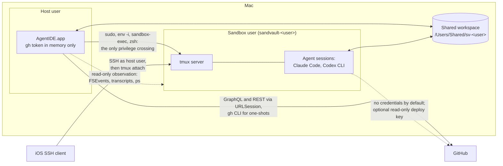
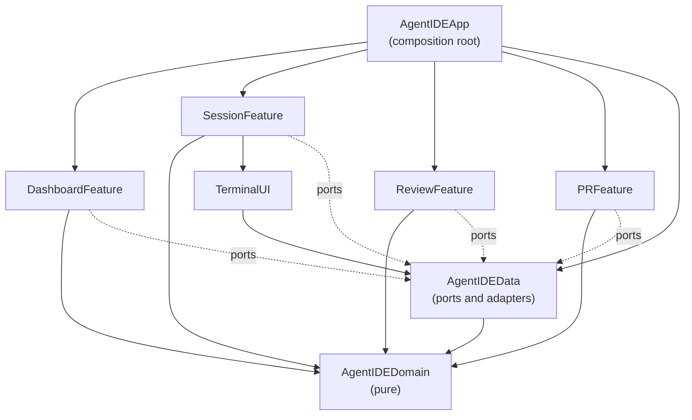

# AgentIDE Architecture

How AgentIDE works under the hood. [README.md](README.md) owns what it does
and why; this document owns the system design. The feature groups referenced
here (Start work, Watch and steer, Review, Ship, Tidy up and Resilience) are
the README's Features subsections.

## Overview

AgentIDE is a native SwiftUI macOS app (macOS 27 or later, Swift 6.4,
AGPL-3.0) that runs, steers and reviews sandboxed AI coding agents in
parallel git worktrees. It is developed readme-first: this document describes
the target system and slices of it land in the order given in the README's
Status section.

The architectural thesis, referenced throughout: **AgentIDE holds no
session-critical state**. Agents run as the sandvault sandbox user inside a
tmux server that AgentIDE introduces. The app derives its entire view of the
world from tmux, `ps`, git, agent transcripts and GitHub, and persists only
its own metadata in SQLite. Killing, crashing or updating the app therefore
loses nothing (Resilience).

## System context



Boundary facts the design relies on:

- The sandbox may write only to the shared workspace, its own home, `/tmp`,
  `/var/folders` and `/dev`. The host user's home is unreadable from inside
  and keychains are denied.
- The shared workspace is writable by both users through inheriting ACLs; it
  is the data plane for code, prompts and events.
- The sandbox has no GitHub credentials: `gh` is unauthenticated there, agent
  settings deny `git push` and the only remote access is an optional
  per-repository read-only deploy key. Pushing and everything credentialled
  happens host-side.
- Credentials never cross the boundary in either direction.

## Guiding principles

1. **P1: Derive, don't own.** tmux, git, `ps`, transcripts and GitHub are the
   sources of truth. The app reconciles from them on every launch.
2. **P2: Unprivileged glue.** The only privilege crossing is the sudoers path
   sandvault already configured. AgentIDE never widens it.
3. **P3: Compiler-enforced boundaries.** Clean architecture mapped onto SPM
   targets; an illegal dependency is a build failure, not a review comment.
4. **P4: Approachable strict concurrency.** MainActor by default in UI
   targets, nonisolated core, `@concurrent` for heavy leaf work, structured
   tasks everywhere.
5. **P5: Agents are pluggable.** One `AgentRunner` seam; agent-specific logic
   lives only in adapters. Sessions created elsewhere are still shown.
6. **P6: Native for state, shell for one-shots.** Anything polled or rendered
   uses native URLSession clients; fire-and-forget conveniences shell out.
7. **P7: Agent output is hostile input.** Every host-side touch of
   guest-writable data is hardened accordingly.

## Process model and lifecycles

Two independent lifecycles:

- **The app process** is ephemeral. It can quit, crash or update at any time
  and holds nothing that cannot be rebuilt (P1).
- **Sessions** are tmux sessions owned by the sandbox user. They survive app
  restarts, app updates and host-user logout, but not reboot. Reboot recovery
  is worktree plus transcript plus resume (see State and persistence).

### Launching into the sandbox

sandvault's sudoers rules let the host user run exactly `/bin/zsh`,
`/usr/bin/env` and `/usr/bin/true` as the sandbox user without a password, so
every sandbox interaction is built on one launch shape, assembled in exactly
one place (`SandvaultLauncher`):

```bash
sudo --login --set-home --user="sandvault-${USER}" /usr/bin/env -i \
  HOME="/Users/sandvault-${USER}" USER="sandvault-${USER}" SHELL=/bin/zsh \
  TERM=xterm-256color COLORTERM=truecolor \
  INITIAL_DIR="${WORKTREE}" SHARED_WORKSPACE="/Users/Shared/sv-${USER}" \
  SV_SESSION_ID="$(uuidgen)" AGENTIDE_SESSION="${SESSION_NAME}" \
  LANG=en_US.UTF-8 \
  PATH=/opt/homebrew/bin:/usr/local/bin:/usr/bin:/bin:/usr/sbin:/sbin \
  GIT_CONFIG_COUNT=1 GIT_CONFIG_KEY_0=safe.directory \
  GIT_CONFIG_VALUE_0="/Users/Shared/sv-${USER}/*" \
  /usr/bin/sandbox-exec -f "/var/sandvault/sandbox-sandvault-${USER}.sb" \
  /bin/zsh -c "${PAYLOAD}"
```

This is byte-compatible with how sandvault launches sessions; AgentIDE only
substitutes the payload. Notable parts: `env -i` gives a clean environment,
the `GIT_CONFIG_*` variables inject `safe.directory` (shared repositories are
owned by the other user) and `sandbox-exec` applies sandvault's generated
profile to everything downstream, including the tmux server.

### tmux

tmux is installed by the Brewfile and introduced by AgentIDE; sandvault does
not use it itself. There is no daemon and no launchd unit: the tmux server
starts lazily inside the sandbox the first time a session is created, with a
payload of:

```bash
export TMUX_TMPDIR=~/.agentide/tmux
mkdir -p "${TMUX_TMPDIR}" && chmod 700 "${TMUX_TMPDIR}"
printf 'set -g remain-on-exit on\n...' > "${TMUX_TMPDIR}/agentide.conf"
cd ~ && ~/configure
source ~/.zshenv && source ~/.zprofile && source ~/.zshrc
exec tmux -f "${TMUX_TMPDIR}/agentide.conf" \
  new-session -A -d -s "${SESSION_NAME}" "${AGENT_COMMAND}"
```

- `TMUX_TMPDIR` is pinned to a fixed directory in the sandbox user's home,
  so every invocation finds the same server socket and nothing lives in
  world-writable `/tmp`. Development builds and test runners (anything
  but the installed /Applications/AgentIDE.app) use
  `~/.agentide/tmux-dev` and a `-dev` host shell name prefix instead,
  and tests use throwaway per-run sockets, so building, testing and
  development can never list or kill the installed app's sessions.
  The config is written by that same payload: a
  file written by the host user would be unreadable across the sudo
  boundary. Its newlines travel as printf escapes, because `sudo --login`
  rebuilds the command line and collapses literal newlines.
- The config sets `remain-on-exit on`, so a finished agent leaves a dead
  pane whose exit status and scrollback remain inspectable, `mouse on`,
  so the wheel scrolls tmux's history, and a 50000-line history limit.
- Session names follow `agentide--<repo>--<branch-slug>--<agent>`. Slugs
  collapse `-` runs so the `--` separator stays unambiguous, collisions
  append `-2` to the branch component and tmux's forbidden `.` and `:` are
  replaced. Names are a human-readable fallback for `tmux ls` over SSH; the
  authoritative record is the app's metadata store. Anything not matching
  the full shape is treated as foreign.

### Terminals

Both terminal panes attach to tmux as control mode clients
(`tmux -C attach-session`, the textual protocol in tmux(1)'s CONTROL
MODE section) rather than drawing a remote screen over a PTY. tmux
streams pane output as `%output` events which the pane decodes
(`TmuxControlParser` in Domain, `TmuxControlChannel` in DataAccess) and
feeds into a local SwiftTerm view; keystrokes, pastes and resizes go
back as `send-keys -H` and `refresh-client -C` commands. On attach the
pane seeds its local buffer from `capture-pane -S -`, then nudges the
client size so full-screen interfaces repaint. Because the screen and
scrollback are local, selection, copying, the mouse wheel and
scrollback behave like a native text view while the sessions still
outlive the app; agent panes additionally reflow multi-line copies for
prose and Option-drag copies a rectangle with gutter marks trimmed.
Programs that request the mouse get it, matching every terminal:
Claude Code scrolls its own internal transcript (which never reaches
scrollback, so no scrollbar can exist for it; agent panes hide the
scroll indicator for that reason, and SwiftTerm gives the reserved
width back to the terminal) and pagers scroll natively, with Shift bypassing to local selection and scrolling;
programs that leave the mouse alone, Codex and plain shells included,
select and scroll natively with no modifier.

Two visually unmistakable flavours ride that one client:

- **Pasting into an agent**: a paste goes into a tmux buffer and is pasted
  from there (`set-buffer`, appending for anything long, then `paste-buffer
  -d -p`), never typed in as keys. tmux brackets it when the pane's own
  application asked for bracketed paste, which is knowledge the local
  terminal does not reliably have: it learns modes from output it has seen,
  and a pane attached mid-session never saw bracketed paste being enabled.
  Without the markers an agent read a multi-line paste as several lines of
  typing, which is how the cursor ended up inside the pasted text. Typing
  still travels as `send-keys -l`.
- **Sandbox terminal**: the launch shape with payload
  `exec tmux -C attach-session -t <name>`. The attaching client runs
  inside the sandbox too; tmux sockets are owner-only, so no attach
  path can skip sudo. Closing the view detaches and never kills the
  session.
- **Host terminal** (Review): a plain login shell on the pane's own
  PTY as the host user, no sudo, no sandbox, full `gh` credentials, the
  editor variables pointing at the app's own shim and no tmux at all:
  shells live and die with the app, a deliberate trade after
  tmux-backed shells kept wedging their control clients. The pane a
  shell runs in stays mounted whatever else the window shows, as the
  panes section above describes, and the tab bar's Close shell ends
  one instantly. Both
  terminals share one theme (black on white in light mode, white on
  black in dark). Copies from the agent pane are reflowed for pasting
  into prose, block by block rather than by the copy as a whole: a
  paragraph loses the terminal's hard wraps, while a run of lines that
  opens like a command keeps every one of them, so an answer that
  explains, then gives a script, then explains again pastes with the
  script still runnable. Option-drag copies a rectangle, and the
  marquee is drawn on the character grid rather than at the pointer,
  since half a character is neither in a selection nor out of it as
  far as the eye can tell; what separates them visually is position, the agent
  pane on the left and the shell in the utility pane. External attaches
  to agent sessions (SSH, `script/attach`) still get tmux-native mouse
  scrolling and OSC 52 copying from the server config. An agent pane
  attaching detaches any other client of its session (`-d`): clients
  leaked by an earlier app run would otherwise linger forever, so an
  SSH viewer is dropped when the app's pane (re)attaches and simply
  reattaches when wanted. Cmd-K clears the shell pane the way a
  terminal app's clear does, screen and local scrollback wiped and the
  prompt redrawn; agent panes ignore it, so an agent's conversation
  can never be cleared from view by a stray shortcut.

Remote access is SSH to the Mac as the host user from an iOS client, then
`script/attach <session>` (which also works from inside sandbox sessions).
A session picker for that shell is a later slice: today the session name
must be known or listed by hand.
Remote Login must be enabled in macOS settings first. An SSH session is
isolated by user permissions rather than sandbox-exec whichever account it
targets, but attaching connects it to the sandboxed tmux server, so agent
processes stay confined either way.

### Reconciliation and notifications

On every launch the app rebuilds state, in order, from: `tmux ls` (through
the launch shape, tolerating "no server running"), a `ps` scan for session
ids in process arguments, `git worktree list` across tracked repositories,
transcript directory scans and finally its own metadata store. Unmatched
sessions surface as foreign rather than being hidden.

Deriving is not the same as trusting one reading. A reading that loses a
worktree or a repository is never taken as proof it went away: its listing
can fail, and `git worktree list` reports a worktree as detached rather than
on a branch for the whole of a rebase. A row the newest reading dropped is
kept while its directory is there, and only its removal from disk takes the
row away. This is a display rule, not a cache: nothing is persisted and the
next reading that lists the worktree wins. It matters because a row holds
its worktree's panes open, and a pane holds a running shell (P1 still
applies; disk is one of the sources).

There is no separate notification daemon in v1. The app switches to accessory
activation policy when its last window closes, staying resident in the menu
bar with file watchers and `UNUserNotificationCenter` delivery alive. Because
the event spool is durable files, a fully quit app delays notifications
rather than losing them. A login-item helper via `SMAppService` is the
documented later option if delayed notifications prove annoying.

## Package architecture

One root `Package.swift` defines every library target; a thin app shell in
`App/` is generated into an Xcode project by XcodeGen (`project.yml` is
committed, the `.xcodeproj` is gitignored).



- **AgentIDEDomain**: entities (`Repository`, `Worktree`, `AgentSession`,
  `AgentKind`, `SessionEvent`, `PullRequest`, `CheckRun`, `ReviewThread`,
  `DiffFile`, `DiffHunk` and `DiffLine`) and pure logic (`DiffParser`,
  `PatchBuilder`, `SessionName` and transcript event decoding). Foundation
  value types (Date, URL and Data) are allowed; process, file, network and
  database APIs are banned.
- **AgentIDEData**: protocol ports with adapter implementations: `GitClient`,
  `GitHubClient` (`gh` shell-outs today, native URLSession GraphQL for hot
  paths later), `SandvaultLauncher`, `TmuxClient`, `TmuxControlChannel`
  (a live `tmux -C` client on pipes), `TranscriptReader`,
  `EventSpool`, `MetadataStore` (a JSON file today, GRDB when metadata
  outgrows it), `ProcessRunner` (Foundation `Process` today, Subprocess
  later), `FoundationModelClient` (the on-device Apple foundation model
  behind one reusable summarisation seam) and `AgentRunner` with
  `ClaudeCodeRunner` and `CodexRunner`. One module, split only if boundary
  violations appear.
- **Feature targets** (`DashboardFeature`, `SessionFeature`, `ReviewFeature`
  and `PRFeature`): SwiftUI views and `@Observable` view models, MainActor by
  default, given ports via injection. `SessionFeature` owns the WKWebView
  preview; `ReviewFeature` owns the diff and editor surfaces (SwiftUI text
  and an attributed NSTextView today, STTextView as the review slice
  deepens).
- **TerminalUI**: shared UI components, not a feature: the SwiftTerm
  wrapper (a `tmux -C` argv in, a locally rendered pane out, via
  DataAccess's control mode channel), the AppKit-backed
  tooltips and the syntax highlighting engine. Highlighting parses with
  tree-sitter grammars and falls back to a pure-Swift line tokenizer in
  the Domain for text without a loaded grammar, such as fragmentary diff
  lines the parser cannot classify.
- **AgentIDEApp**: builds adapters, injects ports, owns navigation and the
  activation-policy switch. No logic.

Third-party imports are confined (P3):

| Dependency | Only importable in |
|---|---|
| GRDB, Subprocess | AgentIDEData |
| SwiftTerm | TerminalUI |
| STTextView, SwiftTreeSitter and grammars | ReviewFeature |
| Sparkle | AgentIDEApp |
| WebKit | SessionFeature |

### The AgentRunner seam

`AgentRunner` (P5) covers exactly: building the launch payload for a
worktree, prompt file and optional resume token; locating and decoding the
agent's transcript into `SessionEvent` values; detecting completion and
stalls (capability flags `supportsHooks` and `supportsResume` select
hook-based or polling strategies); building the resume command; and
extracting the final message for review. Each runner also declares its
model listing command: at startup the app asks the installed CLI what
models it offers and falls back to a curated list when the command
fails, so the pickers track the binaries rather than hardcoded names. `ClaudeCodeRunner` uses hooks and
cwd-keyed JSONL transcripts; `CodexRunner` proves the seam with
directory-based transcripts and silence-based detection. Discovering foreign
sessions is reconciliation logic in `AgentIDEData`, deliberately outside the
protocol.

## Concurrency model

| Target | Default isolation | Notes |
|---|---|---|
| AgentIDEDomain | nonisolated | Sendable value types by construction |
| AgentIDEData | nonisolated | `@concurrent` on parsing and subprocess work |
| Features, TerminalUI | MainActor | `@Observable` MainActor view models |
| AgentIDEApp | MainActor | wiring only |

All targets build with `SWIFT_DEFAULT_ACTOR_ISOLATION` set per the table,
`SWIFT_APPROACHABLE_CONCURRENCY=YES` and the Swift 6 language mode.

The nuance that matters most: under approachable concurrency, `nonisolated
async` functions run on the caller's actor. Quick awaited I/O (URLSession and
GRDB's async API) therefore stays plain `nonisolated async`; only CPU-bound
or blocking leaf work (JSONL decoding, diff parsing and subprocess output
pumping) is marked `@concurrent` to move off the caller.

Events flow as `AsyncStream`s (file watches, transcript tails, poll ticks and
GitHub results) consumed by view models via `.task`, so cancellation follows
view lifetime. Fan-out uses task groups. Unstructured `Task {}` appears only
at enumerated app-lifecycle roots. Exactly one actor is sanctioned:
`ProcessRegistry` in `AgentIDEData`, owning live PTY and child-process
handles; any further actor needs a written justification here. `@unchecked
Sendable` and `nonisolated(unsafe)` are banned.

## Key data flows

### Create a worktree and launch an agent (Start work)

1. Input: a typed prompt, or an issue or pull request number with optional
   extra context, plus a target repository, agent, model and effort. The
   form is a middle-pane action on its repository, so opening it (from a
   repository's plus button, a worktree's new session action or Cmd-N and
   the picker) selects that repository's main checkout in the sidebar
   without closing the form. The agent, model and effort come back as
   they were last time; the pickers re-validate the pair on appearance
   as well as on change, since a persisted model of one agent must never
   launch another (a Codex id once reached Claude that way). Submitting
   inserts a greyed placeholder row under a provisional name into the
   repository the instant the click lands and selects it, with the
   primary pane showing creation progress; the real worktree replaces
   the row on the refresh that follows, and a failure removes it and
   returns to the form. An issue's title and body become the prompt. A pull request instead gets a
   detached worktree that `gh pr checkout` (host-side) turns into the pull
   request's own branch, so pushes and pulls track it directly.
2. The branch name summarises the prompt: the on-device Apple foundation
   model (behind `FoundationModelClient`, one reusable client so later
   features can summarise commits or draft pull request bodies) answers a
   short underscore-separated name; when the model is unavailable the
   prompt's first words serve in the same style. No prefix.
3. Host-side `GitClient` fetches, then runs `git worktree add` under
   `/Users/Shared/sv-<user>/worktrees/<uuid>/<branch>`. This layout is kept
   byte-compatible with what existing tooling already creates: the
   repository's existing `<uuid>` directory is discovered via
   `git worktree list` and reused; a new one is minted only when the
   repository has none. The uuid map is cached in the metadata store and
   always re-derivable.
4. A human-friendly symlink
   `/Users/Shared/sv-<user>/agentide/worktrees/<repo>/<branch>` points at the
   canonical path. Sessions always launch from the resolved real path because
   agent transcripts are keyed by cwd; UUIDs appear nowhere else in
   user-visible naming.
5. The prompt is written to
   `/Users/Shared/sv-<user>/agentide/prompts/<session>.md`, readable in the
   sandbox through the workspace ACLs.
6. Deploy keys: none by default; the agent works offline against the local
   clone. A per-repository opt-in provisions a read-only key through
   sandvault's `sv-clone -k` mechanism. Write keys are never provisioned;
   pushing is host-side.
7. `AgentRunner` builds the agent command, with any per-session extra
   arguments appended verbatim (sandvault's wrappers add the agent's
   permission-skipping flag inside the sandbox), and the session launches
   through the tmux payload above.
8. The prompt travels inside the launch command, read from its file as the
   agent starts (`"$(cat …)"` evaluated in the sandbox, the file path
   shell-quoted): pasting it as
   terminal input after launch raced the agent's terminal setup, which
   flushed pending input and lost the prompt. The accepted trade-offs: the
   expanded prompt appears in the agent process's own argv, visible to
   `ps` on the machine, and prompts are bounded by the kernel's
   argument-size limit.
   The pane's `INITIAL_DIR` is
   pinned to the worktree so the sandbox's zshenv cannot redirect the agent
   elsewhere.
9. The session is recorded in the metadata store, with the agent-native
   resume id captured as soon as the transcript appears.

### Event pipeline (Watch and steer)

1. AgentIDE manages the Claude Code settings template at
   `/Users/Shared/sv-<user>/user/.claude/settings.json`, which sandvault
   rsyncs into the sandbox home at each session start. AgentIDE adds its hook
   entries alongside any existing notifier hooks (removing others only when
   their app is retired), covering UserPromptSubmit, Stop, StopFailure,
   PostToolUse, PostToolUseFailure, PermissionRequest, SessionStart and
   SessionEnd, each in the defensive `[ -x ... ] && ... || true` shape.
2. The hook command is a small script shipped through the same template
   directory. It appends one JSON line to
   `/Users/Shared/sv-<user>/agentide/events/<session>.jsonl`, keyed by
   `AGENTIDE_SESSION` with `SV_SESSION_ID` as fallback so sessions launched
   outside AgentIDE feed the dashboard too, and it no-ops when neither is
   set. Appends are single-writer and small; the reader tolerates a torn
   last line.
3. Host-side, `EventSpool` watches the events directory with FSEvents and
   tails each file from its stored offset, emitting `SessionEvent` values
   that drive unread state and notifications (on Stop and
   PermissionRequest). A worktree is unread when its spool events, its
   tmux session's activity clock or its transcripts are newer than its
   per-worktree seen time; viewing it records that time, and a context
   menu marks it unread again until next viewed.
4. Agents without hooks, and foreign sessions, fall back to tmux dead-pane
   detection for completion and a transcript-mtime timeout on a 30 second
   tick for stalls. `tmux monitor-silence` is a documented later refinement.
5. If the app is fully quit, events accumulate in the spool and notifications
   arrive on next launch.

### Review and per-line rejection (Review)

1. `GitClient` produces diffs (`git diff`, `git diff --cached` and ranges)
   with rename detection; the pure `DiffParser` turns them into file, hunk
   and line values. The scope toggles between the last commit (or
   uncommitted changes when there are any) and the whole branch against
   its merge base: the open pull request's base branch when one exists,
   otherwise the default branch. Per-line rejection and message
   amendment apply only to the last commit scope.
2. Generated files are hidden by default via
   `git check-attr linguist-generated` plus heuristics (lockfiles and
   per-repository generated globs), one click to reveal.
3. Rendering highlights with tree-sitter grammars (Swift, Ruby and Bash
   today; JavaScript, TypeScript, Markdown, JSON and YAML as the review
   slice deepens, alongside the move to STTextView), with line numbers
   and visible whitespace in both the diff (tabs and trailing whitespace
   carry a background tint, so copied diff text stays character-exact)
   and the editor (substitute glyphs).
4. Rejecting selected lines builds a minimal reverse patch with
   `PatchBuilder` (pure, with recalculated hunk offsets), validates it with
   `git apply --check`, applies it with `git apply -R --index` so index and
   worktree stay consistent, then runs `git commit --amend` (with `-m` when
   the message was edited too). Failed validation degrades to whole-hunk
   rejection. Uncommitted changes skip the amend.
5. Manual edits happen in the same editor surface; saves trigger a diff
   refresh via file watches. Every text surface in the app has macOS text
   substitution turned off, in the app's own defaults for the SwiftUI fields
   and on the editor's text view directly: curly quotes and em dashes are
   wrong in code, commit messages and pull request bodies alike.
6. Cmd-F goes to whatever holds focus. The editor is an `NSTextView` and both
   terminals answer `performTextFinderAction`, so they get the system find
   bar, Cmd-G and Cmd-Shift-G for free. A diff is a list of views rather than
   one text view, so when nothing on the responder chain takes the action the
   menu falls back to the storage bus and the review pane opens its own bar:
   it tints every match in place and walks the hunks holding one, since a
   hunk is the smallest thing the list can scroll to.
7. The pre-amend commit remains in the reflog and is surfaced as "revert last
   rejection".

### Panes that outlive what is on screen (Review)

Shells and browser pages die with their pane, so panes are mounted for as
long as the thing inside them should live, not for as long as it is visible:

1. Every running shell and every browser page opened so far stays mounted
   whichever tab, worktree or middle page is on screen, with only the
   selected worktree's shown and taking keys. The middle pages cover the
   split rather than replacing it for the same reason.
2. A shell ends when its Close button ends it, when the shell itself exits,
   when its worktree is destroyed or when the app quits. A browser page ends
   the same way, and its address is remembered per worktree, so a page closed
   deliberately or lost to a restart opens again where it was.
3. Because they accumulate, the session manager lists them beside the tmux
   sessions: each browser page with what it is showing, the CPU and memory of
   the web content process rendering it, and a Close. WebKit does not name
   that process in public API, so it is asked for through the runtime only
   when the view answers to the question, and a page it will not name shows
   no figures rather than wrong ones.

4. Displays are not fixed either. Unplugging the display a fullscreen
   window is on leaves the window black on a space with nothing behind it,
   and coming out of fullscreen restores the frame it had on the display
   that has gone, which the remaining screen can neither show nor let the
   user drag smaller. The window leaves fullscreen when its screen goes and
   fits its frame back inside whichever screen it lands on, and the panes
   fit the width it ends up with: the utility pane narrows first, then the
   sidebar, and a window too narrow for all three hides the utility pane
   for the layout only, so it comes back with the room rather than being
   forgotten.

### Editing what a command is waiting on (Review)

Commands run in a shell pane regularly want an editor: `git rebase -i` for
its todo list, `git commit` for a message. They get the app's own, through a
shim rather than a protocol:

1. The shim is `bin/agentide` in the repository, shipped as a folder
   reference inside the app bundle, so the script a shell runs is always the
   one the running app was built with and the linters cover it like any other
   script. A shell pane starts with that directory on `PATH`, `EDITOR`,
   `VISUAL` and `GIT_EDITOR` naming it with `--wait`, `AGENTIDE=1` and
   `AGENTIDE_EDITS` pointing at the spool to use. `GIT_SEQUENCE_EDITOR` is
   deliberately left alone, so a `sequence.editor` chosen in git config still
   wins for rebase todo lists. A login shell rebuilds `PATH` and re-exports
   its own editor variables after all this, which is what `AGENTIDE` is for:
   shell configuration can test for it and defer to the app. Dev builds hand
   their panes their own spool, so a build under test never answers the
   installed app's shells.
2. The shim spools one request per file into the spool it was given, or
   `~/.agentide/edits` when it was run from an ordinary terminal: a JSON file
   named for a fresh uuid, carrying the file, the physical working directory
   and its own process id, written to one side and renamed into place so the
   app never reads half of one. Nothing inside the sandbox can reach that
   directory, so an agent cannot queue an edit or see what is being edited.
3. The window polls the spool (a small directory listing, off the main
   actor), selects the worktree the command ran in, opens the utility pane on
   its editor tab and shows the file, then writes an `.open` file. An
   unclaimed request is how the shim knows no app is running: it says so and
   exits non-zero rather than hanging.
4. Saving and closing writes a `.done` file holding the exit status the shim
   takes: zero when the file was saved, non-zero when the edit was cancelled,
   which is how git is told to abort a rebase. The shim removes the files it
   read, and a request whose process has gone is swept instead, so a shell
   closed mid-rebase leaves nothing behind.
5. The editor is the same one the review pane uses, with git's own files
   highlighted by name rather than extension: rebase todo lists colour their
   commands and commits, and commit messages colour the block git strips.
   The file itself is regularly outside every worktree, since git keeps a
   linked worktree's rebase state in the repository's own `.git` directory.

### Pull request dashboard (Ship)

1. The token comes from a one-shot `gh auth token`, held in memory only and
   refreshed on 401 (P6).
2. Each worktree branch is polled with its own narrow query for its pull
   request's mergeable state, review decision and check rollup;
   repository-wide queries timed out GitHub's gateway on very large
   repositories. The branch shows its open pull request, or its most
   recent one once that merged, so a branch reads as merged until its
   worktree is tidied. Membership of a merge queue is asked of the
   queue itself, once per repository: no pull request field reports it
   (`isInMergeQueue` does not exist, `mergeStateStatus` has no queued
   state), and an unknown field fails the whole listing. A pull
   request that merged or closed more than thirty days ago is
   ignored: branch names are reused, and an old pull request
   matching one is a name collision rather than the branch's work.
   No cached answer is ever treated as final, however green: an
   approved, passing pull request is exactly the one about to
   merge, and skipping it froze rows as open forever.
3. Poll cadence is tiered by attention and cached per branch: the selected
   worktree refreshes most often, then its repository's other worktrees,
   then other expanded repositories; repositories collapsed in the sidebar
   poll rarely. Selecting a worktree jumps its branch to the front, and a
   failed poll keeps the cached answer. Listings, conversations, enriched
   headers and review threads all persist in the metadata store and paint
   from it instantly, on pane switches and across restarts, before the
   fetch refreshes them.
4. Native versus shell: polling, dashboards and review threads are native
   URLSession; `gh pr create`, `gh pr merge --auto` and other one-shots
   shell out as the host user.
5. Pushing asks GitHub what the viewer may do here (`viewerPermission`)
   before choosing a remote. Write access pushes to the repository; anything
   less pushes to the viewer's own fork, created with its remote on first
   use by `gh repo fork`, which picks whatever protocol the checkout already
   uses. The pull request then names its branch `owner:branch`, since it
   belongs to the repository it is opened against rather than the one
   holding the branch. An unanswerable permission question keeps the
   repository, which is what every push did before asking was possible.
5. When the branch has no open pull request, the worktree scope shows a
   creation form instead of the list: title, body and the repository's
   `.github/PULL_REQUEST_TEMPLATE.md` as three editable fields, each
   saved to the metadata store as it is typed and each restored on its
   own. A saved draft only ever fills a field that is empty, so the
   reloads that pushing and rebasing trigger cannot take back what is
   being written, and a commit message never refills a form whose draft
   was deliberately emptied. Open PR
   dims until the branch is pushed, then runs `gh pr create` with the
   template appended below the body after an empty line; while the form
   shows, revisiting the tab does not re-poll for a pull request that
   cannot exist yet. Open PR sits in the
   footer as the primary action (Cmd-Return), after fetch, rebase and
   push in click order. Blank fields fill from the branch's commits,
   blank meaning empty or whitespace alone whatever a saved draft
   holds, since neither has anything to lose:
   a one-commit branch defaults to that commit's own message, and a
   generate button inside the title field summarises several through
   the on-device model, locking the fields while it drafts; typed
   text is never overwritten. A commit's body arrives unwrapped: commit
   messages are hand-wrapped to a narrow column, which a pull request
   reflows for its own width, so the hard wraps read as broken bullets
   until the continuations are joined back on. A repository without a
   template shows no template field, and with one the generate button
   also completes the template from the commits.
6. The listing and the footer act on the branch actually checked out in the
   worktree, asked of git on each reload, because agents sometimes switch
   branches inside a worktree.
7. Each pull request row offers the last mile as small actions: copy the
   unresolved review conversations, or the failing checks with their
   failed steps' actual log output, to the clipboard for pasting into
   an agent, and open the page in the Browser tab. A failing check names
   its own job, and that job is what is read (`gh run view --job`),
   since a run of fifty jobs where one failed would otherwise paste the
   other forty-nine; while the run is still going `gh` refuses its logs,
   so the job's log comes from the API instead. Conversations
   resolve individually through the GraphQL API, on the conversation
   page and inline on the review tab under the files they anchor to,
   each entry naming its file and line; resolving refreshes the pull
   request's header and row immediately.
8. Pushing a branch whose history has been rewritten, by an amend or a
   rebase, leases the push (`--force-with-lease`) rather than being
   refused as a non-fast-forward. The lease is what makes that safe: it
   still refuses if the remote moved since the last fetch. A branch whose
   remote ref is still an ancestor pushes plainly, as before.
9. Push and rebase together enforce that every pushed commit is GPG
   signed: agents in the sandbox cannot sign or push and a local hook
   blocks unsigned pushes, so the host is where signatures happen. Push
   dims until the tip commit verifies and the service refuses regardless.
   The signed rebase (`--force-rebase --gpg-sign` after a fetch) picks its
   base to sign the minimum: the branch's own origin ref when it exists,
   is still an ancestor of the branch, every commit unique to it verifies
   and only new local commits need signatures, keeping pushed history's
   hashes; otherwise origin/HEAD, re-signing the whole branch. The
   ancestor test is what keeps an amended branch out of that path:
   amending a pushed commit leaves the pushed one behind as a stale twin
   rather than a parent, and rebasing on it replays the amended work on
   top of what it replaced.

### Cleanup (Tidy up)

1. Cleanup after a merge runs from three places through one path: the
   in-app Merge button, the worktree's context menu (Clean up after
   merge, at any time) and the pull request poll, which fires it by
   itself when a branch's pull request that was open at the last poll
   is found merged, so a merge made on GitHub or elsewhere is tidied
   on the next refresh without being noticed first. Cleanup is
   merge-safe by construction: a real worktree's branch is deleted
   with `git branch -d`, which git refuses for an unmerged branch, and
   a dirty worktree is refused before anything runs; the main checkout
   is tidied in place instead: back to the default branch, brought level
   with origin (a reset when the local default carries nothing of its
   own, a signed rebase when it does, so nothing local is thrown away),
   then every branch already merged into it deleted with the same safe
   `-d`, not only the branch that prompted the cleanup. Each step's
   outcome, including anything it could not do, goes to the messages
   pane rather than happening silently. A refusal reports why rather than forcing.
   Only the explicit Delete worktree action force-deletes (`--force`,
   `git branch -D`), and it confirms first with a dialog naming exactly
   what would be lost (uncommitted changes, unmerged commits); the poll
   never prompts and never forces, and never cleans up on a merely
   missing pull request (a stale cache or a branch that never had one),
   only on an observed open-to-merged transition.
2. Deletion records the session's agent-native resume id, kills the tmux
   session, then runs `git worktree remove`, `git worktree prune` and
   `git branch -D` and removes the friendly symlink. Nothing is archived:
   the branch and any uncommitted files are gone.
3. Canonical transcripts in the sandbox home are never deleted and the
   metadata store keeps the session names it recorded per worktree path,
   so every conversation stays attributed to its repository.
4. The repository page, the main checkout's permanent sidebar entry, lists
   every conversation attributable to the repository, from live and
   deleted worktrees alike, and resumes any of them into a fresh worktree.

### Close and reopen a session

Closing a session ends the tmux session and everything in it, escalating
past the polite kill when that does not take, so the button ends the agent
rather than asking it to stop. The worktree, transcripts and metadata
(including the resume id) remain, and the deliberate close is recorded so
the automatic resumes below leave that worktree alone until a session
starts there again.

Reopening builds the agent's resume command (`claude --resume <id>`, or the
Codex equivalent) through the normal launch shape in the same canonical cwd,
restoring the full prior conversation. Resuming fails in ways that look like
success, though: an agent handed a conversation it has rolled away, or one a
newer version will not read, exits at once, and `remain-on-exit` keeps the
dead pane, so the name is taken and the terminal attaches to a corpse.
Reopening therefore works through the ways in until one is still running a
moment later: the recorded conversation, then the newest conversations the
worktree's own transcripts name, then a fresh session there. Each attempt
kills whatever holds the session name first. Relaunching with the original
prompt is never among them, since it would re-run the whole task against the
already modified worktree.

While agents or shells run, the app holds a system activity that defers
idle sleep (`SleepInhibitor`; closing the lid still sleeps), and sessions
that were running at sleep and died with it resume automatically on wake. Deleting a worktree composes with this: its conversations stay
listed on the repository page and resume into fresh worktrees.

Beyond the one live session, every earlier conversation in a worktree is
discovered by listing its transcript directory, whoever created it, and
shown as an inactive session tab with a readable log: Markdown rendered,
code fences highlighted and tool steps showing the actual command run.
An inactive session resumes either in place or into a fresh worktree and
branch; in the latter case the transcript is first copied into the new
working directory's transcript directory, because agents look
conversations up by cwd. Agents whose transcripts are scoped per
working directory list that way directly; Codex keeps one flat date
tree instead, so an index attributes each rollout by the working
directory embedded in its metadata line. A rollout's identity is its
file name stem, never the embedded session id, which subagent
rollouts share with their parent thread and which would break list
selection; the embedded id is kept separately as what resume passes
to Codex, and subagent rollouts stay hidden as a turn's internal
machinery rather than conversations.

Every repository also lists its main checkout as a permanent entry, so a
repository with no worktrees still shows. Selecting it opens the
repository page: every conversation attributable to the repository,
across live and deleted worktrees, newest first, with the selected log
below and a resume button that continues it in a fresh worktree. The
session names recorded at launch attribute each orphaned transcript
directory to its repository, and every transcript directory whose
encoded name extends one of the repository's `worktrees/<uuid>`
containers is scanned too, so conversations from worktrees created and
deleted by other tooling still appear.

### Conversations outside the sandbox

Everything the app derives from can be rebuilt except one thing: the
conversations. Worktrees and git objects live in the shared workspace and on
GitHub, tmux is ephemeral by design, agent credentials can be obtained again
and configuration comes from the `user/` template. Transcripts live only in
the sandbox user's home, which is disposable by design and was emptied by
accident once, taking finished conversations with it.

Each worktree's newest conversation is therefore copied out of the sandbox at
the moments it is about to matter: when a session is closed, when one is
resumed, and hourly while one runs. The hourly copy rides the poll that
already reads the world, skips a transcript that has not moved on and records
when it last ran in the metadata store, so a session running for a day is
never more than an hour stale. The copy goes to iCloud Drive when it is set up, and to the app's
own directory when it is not, one file per worktree with a small index beside
it naming the worktree, branch, agent and resume id, since a transcript alone
says none of that. Deleting a worktree, or cleaning it up after a merge,
takes its copy with it: the conversation is being thrown away deliberately
and a backup nobody asked to keep is clutter. Only the conversation is
copied, never the code or anything the agent read, because git and GitHub
already hold the first and the second is not ours to put in anyone's cloud.

## State and persistence

| Fact | Source of truth | The app's role |
|---|---|---|
| Session liveness, scrollback, exit codes | tmux | observe via the launch shape |
| Code, branches, diffs, worktrees | git in the shared workspace | operate host-side, hardened |
| Conversation history, final message | agent transcripts | read-only tail |
| Pull request, CI and review state | GitHub | poll, cache in memory |
| Agent process existence | `ps` | scan |
| Earlier conversations per worktree | agent transcript directories | list and parse read-only |
| Unread markers, spool offsets, prompt history, per-repository settings, repository-to-uuid map, per-worktree session names and resume ids, window state, last sidebar snapshot for instant launch | metadata store (GRDB) | sole owner |

The metadata store lives at
`~/Library/Application Support/AgentIDE/agentide.sqlite` (WAL mode, migrated
with `DatabaseMigrator`), deliberately outside the shared workspace so agents
can neither read nor corrupt it. Deleting it loses only unread state, prompt
history, settings and the attribution of conversations to worktrees that no
longer exist; everything else re-derives from the system (P1).

Repository icons are GitHub owner avatars, cached one per owner (not per
repository) in `~/Library/Application Support/AgentIDE/Avatars`, so a
sidebar of many repositories under a few owners fetches a few times and a
GitHub outage leaves the icons showing. A failed fetch is silent: the icon
is decoration and the messages pane is for what the user can act on.

## Security model

Trust boundaries, numbered:

1. **Host to sandbox**: the sudoers surface is exactly `/bin/zsh`,
   `/usr/bin/env` and `/usr/bin/true` as the sandbox user, plus root-level
   whole-user teardown (`launchctl bootout` of the sandbox uid and `pkill -9`
   of the sandbox user). AgentIDE uses the zsh path for everything; the
   teardown pair backs a confirmed "Emergency stop all agents" action only.
2. **Sandbox to network**: no GitHub credentials, `git push` denied by agent
   settings and optional read-only per-repository deploy keys as the only
   remote path.
3. **App to GitHub**: token from `gh auth token`, in memory only, never on
   disk and never in any launch environment.
4. **Host to guest-written data** (P7): every host git invocation goes
   through `GitClient`, which always prepends
   `-c core.fsmonitor= -c core.sshCommand= -c core.hooksPath=/dev/null -c
   core.pager=cat -c protocol.ext.allow=never` so a compromised repository
   cannot execute code as the host user. Raw `git` outside `GitClient` is
   banned.
5. **Transcript exposure**: sandvault's session export applies inheriting
   group-read ACLs to agent transcript directories; AgentIDE relies on read
   access and never widens it.

The embedded WKWebView browser uses the shared persistent data store,
so a GitHub login survives tab switches and restarts. Agent-authored
pages are untrusted content: the web view holds no app state and no
GitHub API token, only whatever the user logs into it.

Never-do list:

- Never modify sudoers or the sandbox profile.
- Never run credentialled commands inside the sandbox.
- Never write secrets or app-critical state into the shared workspace.
- Never execute agent-suggested commands as the host user without an explicit
  user action.
- Never bypass `GitClient` hardening.
- Never widen transcript ACLs beyond read.

## Dependencies and toolchain

Dependency admission rule: more than 1,000 GitHub stars and a stable release
in 2026, or an explicitly recorded exception for packages owned by an
official language or project organisation.

| Package | Role | Note |
|---|---|---|
| SwiftTerm | terminal emulator views | |
| GRDB | metadata store | planned; a JSON file serves today |
| STTextView | diff and editor text surface | TextKit 2; planned |
| swift-tree-sitter | syntax highlighting runtime | official-organisation exception |
| tree-sitter-ruby, tree-sitter-bash | grammars | official organisation; pinned to the latest ABI 14 releases the runtime accepts |
| tree-sitter-swift (alex-pinkus) | Swift grammar | the grammar the tree-sitter ecosystem standardises on; no official-organisation build exists |
| swift-subprocess | process spawning | official-organisation exception (swiftlang); planned, Foundation `Process` serves today |
| Sparkle | app updates | later slice |

System frameworks (WebKit, UserNotifications and FSEvents) and runtime tools
(tmux, installed by Homebrew and never linked) sit outside the table.
Versions are pinned by `Package.resolved`; the two exceptions are pinned
exactly.

Toolchain: Xcode 27, the macOS 27 SDK and Swift 6.4. XcodeGen generates the
app project from `project.yml`; the `.xcodeproj` is gitignored. SwiftLint and
SwiftFormat run with every rule enabled; disagreements are disabled per line
with a reason, and configuration excludes only rules that conflict with other
enabled rules or tools, each with a recorded reason. SwiftLint requires the
full Xcode toolchain selected via xcode-select; CommandLineTools alone cannot
load SourceKit.

Scripts follow the `script/` convention: `bootstrap` (Homebrew dependencies,
then XcodeGen project generation), `build` (the app via xcodebuild),
`test` (unit and integration tests via `swift test`), `analyze` (static
analysis), `style [--fix]` (all linters) and `attach <session>` (attach the
current terminal to a sandboxed tmux session). Agent-driven builds inside the
sandbox cannot nest macOS sandboxes, so build scripts gate on `SV_SESSION_ID`
and pass `SWIFTPM_DISABLE_SANDBOX=1`, `SWIFT_BUILD_USE_SANDBOX=0` and the
`-IDEPackageSupportDisable*Sandbox` xcodebuild flags, letting agents build
AgentIDE itself.

The guardrails are layered so a mistake is caught as early as possible:
Swift 6 strict concurrency and the type system at compile time; SwiftLint and
SwiftFormat with every rule enabled at `script/style`; SwiftLint's analyzer
(`unused_import`) plus periphery for dead code at `script/analyze`; and a
test suite split into two tiers. Unit tests cover Domain's pure functions
(`DiffParser`, `PatchBuilder`, `SessionName`), Data decoders over fixtures
and the feature view models, whose fetch and file-system calls are stored
closures the tests replace with fakes, so listing, pagination, caching and
button availability test without GitHub, transcripts or a window.
Integration tests exercise the real adapters end to end against
real `git` repositories, a real `tmux` server on a private socket and
temporary workspaces, because the bugs that reach manual testing live in the
seams: worktree listing under path canonicalisation, reverse-patch
application, tmux pane parsing and directory pinning, prompt delivery, and
deletion keeping every conversation attributed to its repository. View rendering is checked with headless
`ImageRenderer` snapshots. periphery drives its own build so it runs on the
host and in CI only, not inside the sandbox.

CI ("GitHub Actions CI" in `.github/workflows/tests.yml`) runs the style
checks on every push and pull request. The build-and-test job and the
analyze job run in parallel on GitHub's Xcode 27 public-preview image
(`runs-on: xcode-27`, arm64 only), sharing one cache of the Swift package
dependency checkouts keyed on `Package.resolved` (Homebrew formulae install
uncached: the prefix is so large that saving and restoring it costs more
than `brew install`), and both assert Xcode 27 is present, failing rather
than skipping, so a green run
always means the app built, the tests passed and static analysis was
clean (R2). The preview image boots an older macOS than the SDK it builds
with, so AgentIDEData weak-links FoundationModels: a hard link aborted
every test bundle at load over symbols the runner's OS lacks, while the
client already guards every call on the model's availability.

## Risks and open questions

| # | Risk | Mitigation |
|---|---|---|
| R1 | tmux is validated under sandbox-exec on this machine: daemonised server, /tmp socket, separate clients, capture, dead panes with exit statuses, sudo-launched bring-up shared with in-sandbox clients and interactive attach and detach via `script/attach`; only long-run stability remains unobserved | watch stability through the core loop slice; fallback ladder is screen then a minimal PTY-holder process; app-owned PTYs are not acceptable because they forfeit Resilience |
| R2 | the `xcode-27` runner image is a public preview that may change or lag Xcode 27 betas | the build and test job asserts Xcode 27 and fails loudly rather than skipping; a self-hosted runner remains the fallback |
| R3 | per-line selection and diff gutters on STTextView are non-trivial | prototype early in the Review slice; interim read-only diff |
| R4 | agent transcript formats drift across releases | tolerant decoders, per-release fixtures and adapter capability flags |
| R5 | sandvault updates could change paths, profile or sudoers | pin the sandvault version; `SandvaultLauncher` is the single construction point; bootstrap asserts the expected shape |
| R6 | event spool append atomicity | small single-writer lines; readers tolerate a torn tail |
| R7 | the worktree uuid layout is a compatibility choice, not ours | keep byte-compatibility while other tooling uses it; the friendly symlinks isolate everything user-facing; own the layout later |
| R8 | resume ids depend on transcript internals | record defensively; fall back to a fresh session in the same worktree pointing at the old transcript |

Open questions: the iOS SSH account model (host user with a wrapper versus
SSH directly to the sandbox user), the default branch template,
notification preference granularity and how deep stacked pull request
support goes in v1.
