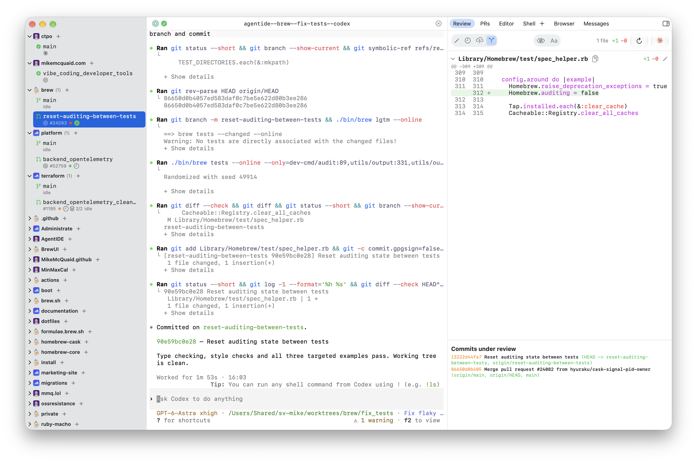

# AgentIDE

🪪 IDE for Agents: prompt a worktree, review another, ship a third, repeat



A native macOS app for running, steering and reviewing sandboxed AI coding
agents in parallel git worktrees, from problem statement to merged pull
request. The window is built around that loop rather than around a text
editor: the editor is here for the fixes review turns up, the terminals
are the agents' own, and everything a task passes through, worktree,
conversation, diff, pull request and CI, is one window rather than four
apps you keep in sync by hand. Built with SwiftUI on top of
[sandvault](https://github.com/webcoyote/sandvault),
[`herdr`](https://herdr.dev) and the
[`gh`](https://cli.github.com) CLI.

## 💡 Motivation

My agentic coding setup, described in
[Sandboxes and Worktrees: My secure Agentic AI Setup](https://mikemcquaid.com/sandboxed-agent-worktrees-my-coding-and-ai-setup-in-2026/),
previously spanned four apps: an agent manager to run agents in worktrees, a
git client to review their work, a code editor to fix it and a terminal for
everything else. AgentIDE replaces all four with a single native app designed
around that workflow rather than four apps adapted to it, with no web-tech
wrappers. Agents run inside a sandvault sandbox with no GitHub credentials so
they can run wild without babysitting permission prompts or endangering the
rest of my machine. Sessions live in a `herdr` server owned by the sandbox user
so nothing is lost when the app quits, crashes or updates.

## ✨ Features

In workflow order; the loop from prompt to review repeats as often as needed
before shipping.

### 🚀 Start work

- **Creates** or clones repositories into the sandvault shared workspace, symlinks
  them into your home directory and bootstraps them (so your user and the
  sandbox share one checkout with nothing to keep in sync)
- **Creates** a worktree and branch from a typed problem statement or an existing
  issue or pull request, narrating each step and the command it is waiting
  on as a terminal writing itself out, a character at a time on a dark
  panel with a blinking cursor and a clock, and staying on that page
  until
  the agent's interface is up, the same when a conversation resumes (so
  starting work is one prompt, not a git ritual, a slow step is never a
  blank pane and the pane never appears before the agent does)
- **Starts** the agent of your choice in `herdr` inside the sandvault sandbox, with
  Claude Code and Codex CLI supported first and more pluggable later, first
  clearing Gatekeeper's quarantine from the agent's Homebrew install, which
  otherwise kills helpers such as Codex's command host when an app rather
  than Terminal starts them (so agents run unattended with no permission
  prompts, no access to your credentials and no "shell host exited" riddles)

### 👀 Watch and steer

- **Shows** every agent's state on one dashboard, working, waiting for
  input or finished straight from `herdr`'s own agent detection, including
  sessions started outside AgentIDE (so one window tells you who needs
  attention)
- **Lists** directories of your own under a repository, `/opt/homebrew`
  under brew or your dotfiles under theirs: a laptop icon and the path
  where a branch would be, its checked-out branch below, the editor in the
  pane an agent would have taken, and the diff, browser, shell and pull
  requests where they always are, with the same ahead, behind, unpushed
  and uncommitted marks every row carries, and a menu to fetch or to check
  out and fast-forward the default branch; `agentide .` from inside one
  selects it (so the places you work on by hand live beside the ones
  agents work on, and no agent ever runs in them)
- **Groups** worktrees by repository, showing unread terminal and agent activity
  since each was last viewed, open pull requests, mergeability and
  uncommitted or unpushed work, and a worktree can be marked unread to
  revisit, with a right-click Refresh that asks GitHub about that
  repository's branches at once; worktrees agents made for themselves
  in the same containers are adopted on the next poll, ready for
  sessions, pull requests, shells or deletion like any other, and the
  app keeps herdr's own worktree create pointed at that same layout
  (so you always know where you are needed)
- **Watches** what is about to change: a pull request whose checks are
  still running, or that is sitting in the merge queue, is asked about
  every half minute whatever its row's place in the sidebar, until
  checks have been running a full hour, which is a stalled run or
  GitHub itself rather than a result on its way (so the amber dot
  turns green or red, and a queued pull request merges, about as soon
  as GitHub knows, and an outage does not cost two calls a minute)
- **Says** what a branch is doing in GitHub's own icons: green for an open
  pull request or a repository's own branch, purple once merged, orange
  while it actually sits in the merge queue, grey for a draft; then its
  number, a CI dot, a review that has approved, asked for changes or not
  happened yet, any unresolved conversations, and its commit counts last
  (so one glance across the sidebar says where everything stands)
- **Notifies** you when an agent finishes its work, needs your input or
  stalls, badges the Dock with how many need attention, and plays a
  chime per event picked in Settings: macOS's own sounds, any audio
  file of your own or silence (so you never sit polling a terminal and
  ship no audio files either)
- **Configures** itself in one Settings window (Cmd-,): default agent,
  model and effort, per-event notifications and sounds, the external
  editor, the Cmd-click browser, the repositories and worktrees
  locations, the shared monospace font, refresh cadences and whether
  commits must be signed at all (so preferences
  live where macOS puts them rather than in menus and hidden defaults)
- **Renders** terminals locally from `herdr`'s terminal control stream, so
  selecting, copying and pasting behave like any other text on your Mac
  while the sessions keep running in `herdr` (so native terminal feel
  costs no session survival)
- **Reflows** multi-line copies from agent terminals only where the
  lines prove they are prose, by their capitals and sentence punctuation:
  those lose their indentation, gutter marks and hard line breaks while
  paragraphs and lists survive, and every other line is kept exactly as
  copied, since a command wrongly joined is broken and a sentence left
  wrapped is merely untidy; Option-drag copies a rectangle (so a copied
  script always still runs, and answers still paste cleanly into chat)
- **Commits** work the agent forgot to commit, clearly authored as such (so
  nothing is stranded in a worktree and review still sees everything)
- **Lets** you SSH into every session from an iOS SSH client, with
  [Moshi](https://getmoshi.app) the one to reach for: one `herdr` attach
  presents every agent workspace with its own navigation, and `mosh`
  survives a phone changing network, so nothing is needed on this side
  beyond Remote Login for the sandbox account (so you can steer or add
  context away from your Mac)
- **Starts** work from a terminal or that phone: `agentide new` takes no
  arguments and asks for repository, agent, effort, model and prompt in
  turn, each offering what was last chosen in either place, so four taps
  of Enter and a sentence make the worktree, start the agent and attach to
  it, or switch to it when the terminal is already inside herdr, under the
  same names the app uses; the questions list one option per line on a
  narrow screen (so a thought on the bus becomes a branch without a
  keyboard, and it is waiting in the sidebar later)

### 🔍 Review

- **Takes** a pasted file or screenshot the way it takes a dropped one:
  staged into the shared workspace, where the sandbox can read it, and
  its path typed into the agent (so Cmd-V after Cmd-Shift-4 is enough)
- **Presents** the agent's conversation beside a pull-request-style review of its
  diff, syntax highlighted through tree-sitter for sixteen languages and a
  word list for the rest, with keys-and-sections files (`.gitconfig`,
  `.ini`, `.toml`, `.env`) understood as such and anything else still
  finding its strings, numbers and comments, with per-file and total diffstats, generated files
  hidden, a whitespace-only-change toggle and the open pull request's
  conversations inline under their files, resolvable in place (so you review
  what matters the way you would on GitHub)
- **Opens** any commit under review on its own: click a line of the
  commit listing and the pane shows that commit's diff and message, the
  way the last commit reads, only read-only since amending reaches the
  tip and nothing else (so a branch of ten commits reviews commit by
  commit without leaving the pane)
- **Rejects** individual lines to amend the commit, edits commit messages and
  edits files directly in a built-in syntax-highlighted editor, with a
  Markdown file rendering inline at the press of its own button (so small
  fixes and reading what the agent wrote need no other app)
- **Follows** the page in its embedded browser: click a link or land on
  a redirect and the address bar says where you are, and that is the
  address the worktree remembers (so the bar is never a lie about the
  page under it)
- **Previews** web pages and rendered Markdown in an embedded browser and opens an
  embedded terminal running as your own user (so you can verify behaviour and
  use `git`, `gh` and other CLI tools without leaving the window)
- **Keeps** each worktree's page loaded as you work in other worktrees,
  remembers its address for the next time and lists every loaded page in
  the session manager with what it costs and a Close (so a dev server stays
  logged in and mid-flow, and a page eating memory is easy to find and end)
- **Finds** with Cmd-F wherever you are: the editor and both terminals get
  the system find bar, and the diff gets its own with match highlighting and
  Cmd-G walking the matches; nothing anywhere turns your quotes curly or your
  dashes long (so code and commit messages survive being typed)
- **Edits** whatever that terminal's commands open, a `git rebase -i` todo list
  or a commit message, in the same editor with their own highlighting, because
  an `agentide` command on its `PATH` blocks until you save and close when
  asked to with `--wait`, which is how `EDITOR`, `VISUAL` and `GIT_EDITOR`
  there name it; without that it hands the file over and returns, and given a
  directory instead it switches the window to the worktree or checkout
  holding it (so interactive
  rebasing needs no terminal editor, cancelling aborts the rebase as `:cq`
  would, and `agentide .` is how you get from a terminal back to the window)

### 🚢 Ship

- **Stacks** branches in one worktree: a sidebar popover shows which
  branches it reckons are stacked there, drops any that are nothing to do
  with the work in hand and cuts a new branch on top of the one you are
  on, the review and pull request tabs show the stack
  as `main ← lower ← upper` with each entry's own diff a click away, and
  the sidebar says where a branch stands in its stack, from git before
  its pull requests are open and from them afterwards, each opening
  against the branch below it (the bottom one against the default
  branch, with the lone branch's buttons and behaviour, however many
  sit above it) with a form filled from that entry's own
  commits (one commit's message, or the first subject over the rest
  listed, counted from where the branch forked off the remote's default
  branch), entries above a branch not yet pushed and opened out of
  reach in the pull request tab (they still review, and every name in
  the strip copies from its menu), the review and pull request tabs
  keeping the same entry in view and opening on the first that could
  have a pull request, read-only text everywhere still selectable,
  the stack's own Rebase and Push standing exactly where a lone
  branch's do, putting every branch back on the one below it and
  pushing them bottom up, signing every commit they replay and leaving
  alone any branch already where it belongs, and each pull request
  opened one at a time telling GitHub the stack it belongs to (so a
  stack is one checkout, one session and no bookkeeping, and a branch
  on its own looks exactly as it always did)
- **Remembers** every answer GitHub gives about a pull request, with
  when it arrived and the entity tag it came with, in one shared store:
  no pull request is asked about twice inside a minute however much you
  click around, relaunching the app included, a branch's listing is
  asked for conditionally so an unchanged answer costs no rate limit at
  all, the worktree in front of you refreshes far more often than the
  ones behind it, and acting on one (merging, pushing, resolving) is
  what refreshes it at once, and every repository's merge queue is one
  query rather than one each (so the tabs paint instantly and the rate
  limit is spent on questions whose answers could actually have changed)
- **Pushes** branches, showing how many commits each push sends and naming
  whether a rebase would move the base, sign commits or both, then opens
  pull requests from an in-app form that fills in the project's own
  template below your title and body and attaches any of the
  repository's labels you pick, defaulting the text from a single
  commit, unwrapped from the narrow column commit messages are written
  to, or drafting them from many with the on-device model (so shipping
  needs no retyping)
- **Pushes** to your own fork when the repository is not yours to write to,
  creating it and its remote the first time and opening the pull request from
  it (so working in someone else's repository needs no setup and no thinking
  about where the branch goes)
- **Fills** a pull request's title and body from the branch's commits,
  drafts them with the on-device model at the press of the sparkles
  button, and resets them to the commit message from the button beside
  it, asking first when something is typed, and toggles labels on an
  open pull request from its conversation (so the form is never stuck
  on a draft you no longer want)
- **Discloses** the agent that wrote a branch whenever you press Fill
  template, which is also what ticks the template's boxes: the harness
  with the model and effort it ran at,
  the pickers' defaults when the launch named none, worded as the
  pickers word them, followed by local review and testing,
  written into the template's own AI section where there is one (so an
  honest disclosure is not a thing you retype, and ticking that box never
  leaves the section empty)
- **Copies** unresolved review comments straight into a prompt, copies
  the tail of every failing Actions run's log the same way, jumps to
  the failing check (or the checks page when several fail), resolves
  conversations one by one, resolves merge conflicts and enables
  automerge or merges,
  each with one click (so the last mile is not the slowest)

### 🧹 Tidy up

- **Deletes** a worktree and its branch once the pull request merges,
  whether you merged in the app, picked Clean up after merge from the
  worktree's menu or the next refresh simply notices the merge happened
  on GitHub (so finished work disappears without ceremony)
- **Deletes** a repository's checkout from its sidebar menu, offered only
  while it has no worktrees, no running agent, nothing uncommitted or
  untracked and is level with origin's default branch, with the menu
  saying which of those holds it back otherwise (so a repository you are
  done with leaves as easily as a worktree, and never with work in it)
- **Keeps** every conversation a repository has ever run browsable and
  resumable from the repository's own page, whichever worktree it used and
  even after that worktree is deleted, and starts a fresh session in a
  worktree from the same list, or one on the default branch in the
  checkout itself without a new worktree (so tidying up never loses a
  conversation and a quick job needs no worktree)

### 🛟 Resilience

- **Keeps** agent sessions in a `herdr` server owned by the sandbox user rather
  than the app (so agents survive AgentIDE quitting, crashing or
  updating, expectedly or not; the host shell tab deliberately does not,
  living and dying with the app)
- **Keeps** a copy of each worktree's newest conversation in iCloud Drive,
  hourly while it runs and whenever it is closed or resumed, the conversation
  only, and drops it when the worktree is deleted (so the sandbox user is
  disposable: its transcripts are the one thing git and GitHub do not hold)
- **Fits** itself to whatever display it is on: unplugging the monitor a
  fullscreen window is on drops it back onto the screen that is left, at a
  size that screen can show, with the panes narrowed to match, and a
  fullscreen window sent to another monitor lays itself out again for it,
  and the panes give way far enough that the window shrinks to the size
  a small screen has room for (so a window is never stranded larger than
  the display under it)
- **Keeps** every running shell alive while you move around the app and
  keeps a worktree listed until it is really gone, rebases and failed
  listings included (so only closing a shell or destroying its worktree
  ends it)
- **Defers** idle sleep while agents or shells run and resumes sessions the
  sleep killed when the Mac wakes (so a long response survives you
  walking away; closing the lid still sleeps)
- **Waits** in proportion: a wait under half a second shows nothing,
  one under a few seconds a spinner, and only a wait that can run long
  narrates its steps
- **Waits** out loud: any pane whose data takes a moment, the first
  reading of your worktrees, a diff, a pull request list or the session
  manager, shows what it is waiting on with a clock ticking every second,
  then snaps to the finished view (so an empty state is only ever shown
  once it has been proven empty, never while the answer is still coming)
- **Keeps** every sidebar row on its two lines: nothing wraps, a row
  too long for the sidebar runs under its edge and is hidden there,
  and the sidebar cannot be dragged narrower than a full row (so a
  branch name is a name and a pull request number is a number, never
  a column of digits)
- **Reads** the whole sidebar in parallel: every repository at once,
  every worktree within one at once and each worktree's handful of
  git questions at once, on a machine built for exactly that, and
  asks git about the selected repository every tick but an idle one
  only every half minute, keeping its rows meanwhile (so a wide
  sidebar refreshes in the time its slowest worktree takes, and
  twenty-nine repositories nothing is happening in cost nothing)
- **Times** every process it runs, every GitHub call and every cache
  hit or miss into a plain performance log, but only when asked:
  `script/performance-log on` (off by default and off again with
  `off`; `AGENTIDE_PERFORMANCE_LOG` in the environment does the same),
  the log living in `/Users/Shared/sv-<user>/tmp/agentide` so both
  users can read it, and lines older than a week are swept (so a slow resume can be read back rather than guessed at,
  and a build of the app by anyone else writes nothing anywhere)
- **Collects** every failure and status message into a Messages utility tab
  that is always there, and shows failures inline on screens without the
  utility pane (so nothing is lost to a status line that scrolled past or
  a log you were not watching)

## 🚫 Out of Scope Features

- Being a general-purpose IDE (the built-in editor is for review-time fixes;
  use your preferred editor for long editing sessions)
- Windows or Linux support (being a native macOS app is the point)
- Replacing sandvault (AgentIDE drives sandvault; sandboxing policy stays
  there)
- Running agents outside the sandbox (the agents' own dangerous flags exist if
  you must)
- Team, multi-user or hosted features (one developer, one Mac)
- An agent marketplace or bundled models (bring your own Claude Code, Codex
  CLI or other supported agent)
- A native iOS app (remote access is SSH into `herdr` from any iOS SSH
  client)

## 📋 Requirements

- **macOS** Golden Gate (27) or later
- [Homebrew](https://brew.sh) (installs the dependencies below)
- [sandvault](https://github.com/webcoyote/sandvault) (creates the sandbox
  user and shared workspace)
- [`gh`](https://cli.github.com) authenticated as you (it stays with your user;
  agents never see it)
- [`herdr`](https://herdr.dev) and
  [`mosh`](https://mosh.org) (installed by `script/bootstrap` via the
  `Brewfile`; `mosh` is only needed to reach sessions from a phone over a
  connection that comes and goes)
- **Xcode** 27 or later (only needed to build from source)

## 🖥️ Usage

After cloning:

```bash
git clone https://github.com/MikeMcQuaid/AgentIDE
cd AgentIDE
script/bootstrap
script/install
open /Applications/AgentIDE.app
```

- **`script/bootstrap`** installs the `Brewfile` dependencies and generates
  the gitignored Xcode project with XcodeGen (`open AgentIDE.xcodeproj` to
  work in Xcode).
- **`script/install`** builds and copies the app into `/Applications`, so the
  copy you run is never the build output a rebuild overwrites in place.
- **`AgentIDE.app`** in the repository root symlinks `script/build`'s output,
  for quick development runs.
- **Features** land slice by slice (see [Status](#-status)); the app launches
  to an empty dashboard until the first slices fill it.
- **Updates** come from Homebrew: releases ship as a cask, so `brew upgrade`
  moves the app on with the rest of your tools. There is no built-in
  updater, and no Mac App Store build: its sandbox forbids running agents
  as another user, which is the whole design.

A shell pane runs your login shell, so anything your shell configuration
exports wins over what the pane was started with. It sets `AGENTIDE=1` and
puts the bundled `agentide` command on `PATH`, so shell files that set an
editor of their own can hand those panes back to the app:

```bash
if [ -n "${AGENTIDE}" ]; then
  export EDITOR="$(command -v agentide) --wait"
  export VISUAL="${EDITOR}"
fi
```

The same command starts sessions from a phone. Nothing installs it, so
alias it wherever you SSH in, in the sandbox user's shell configuration:

```bash
alias an='/Applications/AgentIDE.app/Contents/Resources/bin/agentide new'
export HERDR_SESSION=agentide
```

## 🚧 Status

Unstable and changing daily. AgentIDE is being designed exclusively
for [@MikeMcQuaid](https://github.com/MikeMcQuaid)'s personal
workflow; nothing here promises to suit anyone else's, interfaces
and behaviour break without notice and there is no support.

See [ARCHITECTURE.md](ARCHITECTURE.md) for how AgentIDE is designed and
[AGENTS.md](AGENTS.md) if you are working on this repository, human or agent.

## 📄 Licence

[GNU Affero General Public License v3.0](LICENSE). If you reuse or adapt the
source the AGPL terms apply, including the network-use clause.

[Octicons](https://github.com/primer/octicons) are vendored in
`App/Assets.xcassets` and licensed under the
[MIT License](https://github.com/primer/octicons/blob/main/LICENSE).
